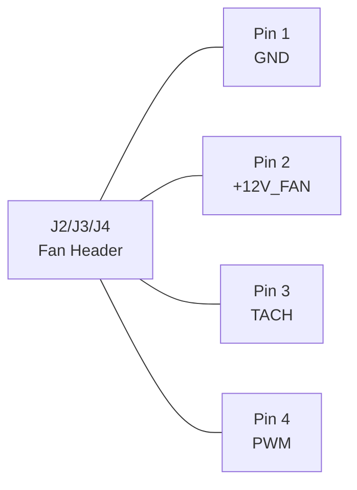
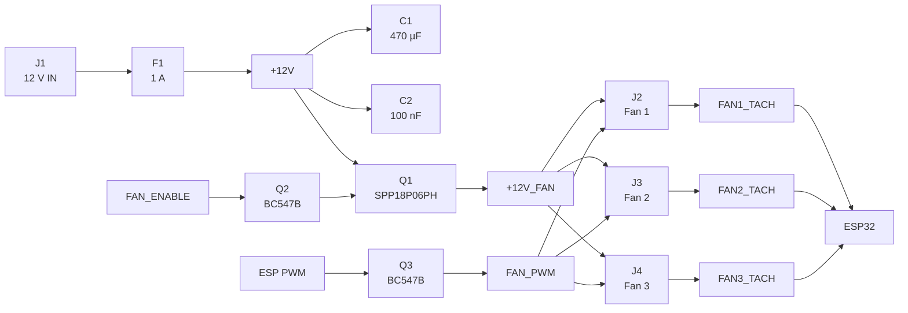

Ja. Für dein Projekt würde ich in KiCad 10 **fast vollständig bei den Standardbibliotheken bleiben**. Die offiziellen Symbolbibliotheken sind inzwischen explizit für KiCad 10.x gepflegt, und insbesondere für den PC-Lüfter gibt es bereits einen erstaunlich passenden Standard-Footprint. ([GitLab][1])

Ich würde die erste Platine außerdem weiterhin weitgehend **THT** auslegen. Bei deinem Strombereich gibt es elektrisch keinen Grund, auf SMD zu gehen, und THT ist angenehmer zu bestücken und zu ändern.

## Empfohlene KiCad-Zuordnung

| Ref     | Bauteil                | KiCad-Symbol                   | KiCad-Footprint                                                 | Bemerkung                                                 |
| ------- | ---------------------- | ------------------------------ | --------------------------------------------------------------- | --------------------------------------------------------- |
| Q1      | **SPP18P06PH**         | `Transistor_FET:Q_PMOS_GDS`    | `Package_TO_SOT_THT:TO-220-3_Vertical`                          | **Sehr passend:** Pin 1=G, 2=D, 3=S                       |
| Q2      | **BC547B** FAN_ENABLE  | `Transistor_BJT:BC547`         | `Package_TO_SOT_THT:TO-92_Inline`                               | Value auf `BC547B` ändern                                 |
| Q3      | **BC547B** FAN_PWM     | `Transistor_BJT:BC547`         | `Package_TO_SOT_THT:TO-92_Inline`                               | Value auf `BC547B` ändern                                 |
| R1      | 10 kΩ Gate Pull-up     | `Device:R`                     | `Resistor_THT:R_Axial_DIN0207_L6.3mm_D2.5mm_P7.62mm_Horizontal` | ¼ W                                                       |
| R2      | 1 kΩ Gate              | `Device:R`                     | gleicher Footprint                                              | ¼ W                                                       |
| R3      | 4,7 kΩ Enable-Basis    | `Device:R`                     | gleicher Footprint                                              | ¼ W                                                       |
| R4      | 100 kΩ Enable Pulldown | `Device:R`                     | gleicher Footprint                                              | ¼ W                                                       |
| R5      | 2,2 kΩ PWM-Basis       | `Device:R`                     | gleicher Footprint                                              | ¼ W                                                       |
| R6      | 100 kΩ PWM-Pulldown    | `Device:R`                     | gleicher Footprint                                              | ¼ W                                                       |
| R7–R9   | 10 kΩ Tacho-Pullups    | `Device:R`                     | gleicher Footprint                                              | je Fan                                                    |
| R10–R12 | 1 kΩ Tacho-Serie       | `Device:R`                     | gleicher Footprint                                              | je Fan                                                    |
| C1      | 470 µF / 25 V          | `Device:C_Polarized`           | `Capacitor_THT:CP_Radial_D8.0mm_P3.50mm`                        | **nur wenn dein Elko wirklich Ø8 mm / 3,5 mm Raster hat** |
| C2      | 100 nF                 | `Device:C`                     | `Capacitor_THT:C_Disc_D5.0mm_W2.5mm_P5.00mm`                    | Standard-Keramik-THT                                      |
| J1      | 12-V-Eingang           | `Connector_Generic:Conn_01x02` | `TerminalBlock:TerminalBlock_bornier-2_P5.08mm`                 | universelle Schraubklemme                                 |
| J2      | Fan 1                  | `Connector_Generic:Conn_01x04` | **`Connector:FanPinHeader_1x04_P2.54mm_Vertical`**              | idealer PC-Fan-Header                                     |
| J3      | Fan 2                  | `Connector_Generic:Conn_01x04` | **derselbe Fan-Footprint**                                      | 3- und 4-Pin                                              |
| J4      | Fan 3                  | `Connector_Generic:Conn_01x04` | **derselbe Fan-Footprint**                                      | 3- und 4-Pin                                              |
| J5      | Verbindung ESP32       | `Connector_Generic:Conn_01x07` | `Connector_PinHeader_2.54mm:PinHeader_1x07_P2.54mm_Vertical`    | falls ESP extern sitzt                                    |
| F1      | optional 1-A-Sicherung | `Device:Fuse`                  | abhängig vom Sicherungshalter                                   | siehe unten                                               |

Der Standard-TO-220-Footprint ist ausdrücklich ein vertikaler 3-Pin-TO-220 mit 2,54-mm-Raster. ([GitLab][2]) Für den BC547 existiert in der aktuellen KiCad-10-Bibliothek ein eigenes `BC547`-Symbol; der TO-92-Inline-Footprint ist ebenfalls Standard. ([GitLab][3])

## Besonders schön: der PC-Fan-Footprint

Hier würde ich **nicht** `Molex_KK-254...` verwenden.

KiCad hat:

```text
Connector:FanPinHeader_1x04_P2.54mm_Vertical
```

Der ist ausdrücklich für **4-Pin-CPU-/PC-Fan-Anschlüsse** vorgesehen und nennt als kompatible Beispiele unter anderem:

```text
Molex 47053-1000
Foxconn HF27040-M1
Tyco 1470947-1
```

([gitlab.com][4])

Das ist genau das, was wir wollen.

Auch ein **3-Pin-Lüfter passt darauf**, wobei Pin 4 einfach unbelegt bleibt.

Die Pinbelegung würde ich im Schaltplan eindeutig beschriften:



Ich würde die Symbole `Conn_01x04` verwenden und die Netze benennen:

```text
FAN1_GND
+12V_FAN
FAN1_TACH
FAN_PWM
```

Wobei natürlich GND nicht wirklich `FAN1_GND` heißen muss — ich würde einfach das globale `GND`-Symbol nehmen.

## SPP18P06PH

Hier brauchst du überhaupt keine externe Bibliothek.

Nimm:

```text
Symbol:
Transistor_FET:Q_PMOS_GDS

Footprint:
Package_TO_SOT_THT:TO-220-3_Vertical
```

Und ändere den Value des Symbols auf:

```text
SPP18P06PH
```

Das ist sogar besser als irgendein heruntergeladenes Herstellersymbol, weil unser MOSFET genau:

```text
Pin 1 = Gate
Pin 2 = Drain
Pin 3 = Source
```

hat.

Dazu passt `Q_PMOS_GDS` semantisch genau. KiCad verwendet solche generischen P-MOS-Symbole selbst als Grundlage für herstellerspezifische Leistungsmosfets. ([GitLab][5])

Ich würde im Symbol zusätzlich den Infineon-Datenblattlink in `Datasheet` hinterlegen.

## BC547B

Hier:

```text
Transistor_BJT:BC547
```

und anschließend:

```text
Value = BC547B
```

Footprint:

```text
Package_TO_SOT_THT:TO-92_Inline
```

Das ist für einen normalen BC547B sehr passend.

Trotzdem eine wichtige KiCad-Regel: **Vor Fertigung immer Symbol-Pinnummern gegen das Datenblatt des tatsächlich bestellten BC547B prüfen.** Gerade bei TO-92-Transistoren existieren viele Typen mit unterschiedlichen C/B/E-Reihenfolgen.

## Widerstände

Für normale ¼-W-THT-Widerstände würde ich durchgehend diesen verwenden:

```text
Resistor_THT:
R_Axial_DIN0207_L6.3mm_D2.5mm_P7.62mm_Horizontal
```

Der DIN0207-Footprint ist für die üblichen etwa 6,3 × 2,5-mm-¼-W-Widerstände gedacht; KiCad hat dafür verschiedene Anschlussabstände. ([GitLab][6])

Ich bevorzuge **7,62 mm** statt 10,16 mm, weil die Platine dadurch kompakter wird, ohne dass man die Beinchen unangenehm eng biegen muss.

Wenn Platz keine Rolle spielt, kannst du auch:

```text
R_Axial_DIN0207_L6.3mm_D2.5mm_P10.16mm_Horizontal
```

nehmen.

## C1 – 470 µF

Beim Elko solltest du den Footprint **erst nach Auswahl des konkreten Kondensators** endgültig festlegen.

Als wahrscheinlich passende Startannahme:

```text
Symbol:
Device:C_Polarized

Footprint:
Capacitor_THT:CP_Radial_D8.0mm_P3.50mm
```

Dieser Standard-Footprint ist für Ø8 mm und 3,5-mm-Pinabstand vorgesehen. ([GitLab][7])

Wenn dein bestellter 470-µF/25-V-Elko beispielsweise Ø10 mm hat, müssen wir entsprechend auf etwa:

```text
CP_Radial_D10.0mm_...
```

wechseln.

**Footprint immer nach Datenblatt, nicht nach Kapazitätswert auswählen.**

## C2 – 100 nF

Bei einem normalen keramischen THT-Kondensator:

```text
Symbol:
Device:C

Footprint:
Capacitor_THT:C_Disc_D5.0mm_W2.5mm_P5.00mm
```

Dieser Footprint existiert aktuell in der KiCad-Standardbibliothek und ist für einen typischen 5-mm-Raster-Keramikkondensator gedacht. ([GitLab][8])

---

## ESP32-Anschluss

Da wir jetzt drei Tachosignale haben, brauchen wir zwischen Lüfterplatine und ESP **7 Verbindungen**, sofern der ESP32 nicht direkt auf derselben PCB sitzt:

| Pin | Signal     |
| --: | ---------- |
|   1 | 3V3        |
|   2 | GND        |
|   3 | FAN_ENABLE |
|   4 | FAN_PWM    |
|   5 | FAN1_TACH  |
|   6 | FAN2_TACH  |
|   7 | FAN3_TACH  |

Dafür:

```text
Symbol:
Connector_Generic:Conn_01x07

Footprint:
Connector_PinHeader_2.54mm:
PinHeader_1x07_P2.54mm_Vertical
```

Der 1×7-THT-Header mit 2,54-mm-Raster ist ebenfalls Standard. ([GitLab][9])

Wenn der **ESP32 direkt auf die Platine soll**, würde ich diesen J5 hingegen weglassen und den exakten Footprint deines ESP32-Boards verwenden. Dafür müsste ich nur wissen, welches genaue ESP32-DevKit du verwendest.

## 12-V-Schraubklemme

Generisch:

```text
Symbol:
Connector_Generic:Conn_01x02

Footprint:
TerminalBlock:TerminalBlock_bornier-2_P5.08mm
```

Der KiCad-Footprint ist ein einfacher zweipoliger THT-Terminalblock mit **5,08-mm-Raster**. ([GitLab][10])

Hier gilt aber dasselbe wie beim Elko: Sobald du die konkrete Reichelt-Schraubklemme ausgesucht hast, würde ich **deren tatsächliches Raster und Gehäusemaß** nehmen. 5,00 und 5,08 mm sehen fast gleich aus, sollten auf einer gefertigten PCB aber nicht verwechselt werden.

## Optionale Sicherung

Wenn du die von mir vorgeschlagene 1-A-Sicherung auf die PCB setzen möchtest, würde ich sie tatsächlich als **5×20-mm-Sicherung im Halter** ausführen:

```text
Symbol:
Device:Fuse
```

Für einen konkreten Schurter-Halter gibt es beispielsweise:

```text
Fuse:
Fuseholder_Cylinder-5x20mm_Schurter_0031_8201_Horizontal_Open
```

KiCad hat auch mehrere andere herstellerspezifische 5×20-mm-Sicherungshalter. ([GitLab][11])

Hier würde ich den Footprint allerdings **erst auswählen, nachdem der Sicherungshalter feststeht**.

---

## So würde ich den Schaltplan strukturieren



### Fremdbibliotheken?

Für **diese Platine würde ich keine verwenden**.

KiCad Standard deckt hier bereits praktisch alles ab, einschließlich des exakt passenden PC-Fan-Headers. Fremdbibliotheken wie SnapEDA/SnapMagic oder Ultra Librarian sind nützlich bei exotischen ICs, aber sie bringen immer das Risiko mit, dass Symbol-Pinnummerierung oder Footprint nicht ganz zum tatsächlich bestellten Bauteil passen.

Bei diesem Projekt würde ich stattdessen im Schaltplan die Felder sauber pflegen:

```text
Value
Manufacturer
MPN
Datasheet
Reichelt Article
```

Das macht die BOM später deutlich brauchbarer.

**Ein Punkt wäre jetzt noch interessant:** Wenn du mir sagst, **welchen genauen ESP32 du verwendest und ob der ESP ebenfalls auf diese PCB soll**, kann ich dir auch dafür den passenden KiCad-10-Footprint auswählen und anschließend die **komplette Symbol-/Footprint-Liste mit Referenzen Q1, R1 usw. passend zu einem fertigen Schaltplan** festlegen.

[1]: https://gitlab.com/kicad/libraries/kicad-symbols/?utm_source=chatgpt.com "KiCad / KiCad Libraries / KiCad Symbols · GitLab"
[2]: https://gitlab.com/kicad/libraries/kicad-footprints/-/blob/cb374ed567a148b8e53b3f89918a2f4ba38dd93f/Package_TO_SOT_THT.pretty/TO-220-3_Vertical.kicad_mod?utm_source=chatgpt.com "Package_TO_SOT_THT.pretty/TO-220-3_Vertical.kicad_mod · cb374ed567a148b8e53b3f89918a2f4ba38dd93f · KiCad / KiCad Libraries / KiCad Footprints · GitLab"
[3]: https://gitlab.com/kicad/libraries/kicad-symbols/-/tree/master/Transistor_BJT.kicad_symdir?utm_source=chatgpt.com "Transistor_BJT.kicad_symdir · master · KiCad / KiCad Libraries / KiCad Symbols · GitLab"
[4]: https://gitlab.com/kicad/libraries/kicad-footprints/-/blob/v7/Connector.pretty/FanPinHeader_1x04_P2.54mm_Vertical.kicad_mod?utm_source=chatgpt.com "Connector.pretty/FanPinHeader_1x04_P2.54mm_Vertical.kicad_mod · v7 · KiCad / KiCad Libraries / KiCad Footprints · GitLab"
[5]: https://gitlab.com/kicad/libraries/kicad-symbols/-/merge_requests/263/commits?utm_source=chatgpt.com "Added Vishay SUD P-Channel Power transistors (!263) · Merge requests · KiCad / KiCad Libraries / KiCad Symbols · GitLab"
[6]: https://gitlab.com/kicad/libraries/kicad-footprints/-/blob/1620b00ac955f965244bd5ee8e7f7dae832f4eb5/Resistor_THT.pretty/R_Axial_DIN0207_L6.3mm_D2.5mm_P10.16mm_Horizontal.kicad_mod?utm_source=chatgpt.com "Resistor_THT.pretty/R_Axial_DIN0207_L6.3mm_D2.5mm_P10.16mm_Horizontal.kicad_mod · 1620b00ac955f965244bd5ee8e7f7dae832f4eb5 · KiCad / KiCad Libraries / KiCad Footprints · GitLab"
[7]: https://gitlab.com/kicad/libraries/kicad-footprints/-/blob/f4600dc450fe318ededaa09b74f753748274b287/Capacitor_THT.pretty/CP_Radial_D8.0mm_P3.50mm.kicad_mod?utm_source=chatgpt.com "Capacitor_THT.pretty/CP_Radial_D8.0mm_P3.50mm.kicad_mod · f4600dc450fe318ededaa09b74f753748274b287 · KiCad / KiCad Libraries / KiCad Footprints · GitLab"
[8]: https://gitlab.com/kicad/libraries/kicad-footprints/-/blob/master/Capacitor_THT.pretty/C_Disc_D5.0mm_W2.5mm_P5.00mm.kicad_mod?utm_source=chatgpt.com "Capacitor_THT.pretty/C_Disc_D5.0mm_W2.5mm_P5.00mm.kicad_mod · master · KiCad / KiCad Libraries / KiCad Footprints · GitLab"
[9]: https://gitlab.com/kicad/libraries/kicad-footprints/-/blob/43ae7184c9649434d91386ff62729f598400a7e9/Connector_PinHeader_2.54mm.pretty/PinHeader_1x07_P2.54mm_Vertical.kicad_mod?utm_source=chatgpt.com "Connector_PinHeader_2.54mm.pretty/PinHeader_1x07_P2.54mm_Vertical.kicad_mod · 43ae7184c9649434d91386ff62729f598400a7e9 · KiCad / KiCad Libraries / KiCad Footprints · GitLab"
[10]: https://gitlab.com/kicad/libraries/kicad-footprints/-/blob/cb374ed567a148b8e53b3f89918a2f4ba38dd93f/TerminalBlock.pretty/TerminalBlock_bornier-2_P5.08mm.kicad_mod?utm_source=chatgpt.com "TerminalBlock.pretty/TerminalBlock_bornier-2_P5.08mm.kicad_mod · cb374ed567a148b8e53b3f89918a2f4ba38dd93f · KiCad / KiCad Libraries / KiCad Footprints · GitLab"
[11]: https://gitlab.com/kicad/libraries/kicad-footprints/-/blob/b5a13a07ddba0cfa73b3db5a5acc4753b25e46e2/Fuse.pretty/Fuseholder_Cylinder-5x20mm_Schurter_0031_8201_Horizontal_Open.kicad_mod?utm_source=chatgpt.com "Fuse.pretty/Fuseholder_Cylinder-5x20mm_Schurter_0031_8201_Horizontal_Open.kicad_mod · b5a13a07ddba0cfa73b3db5a5acc4753b25e46e2 · KiCad / KiCad Libraries / KiCad Footprints · GitLab"
