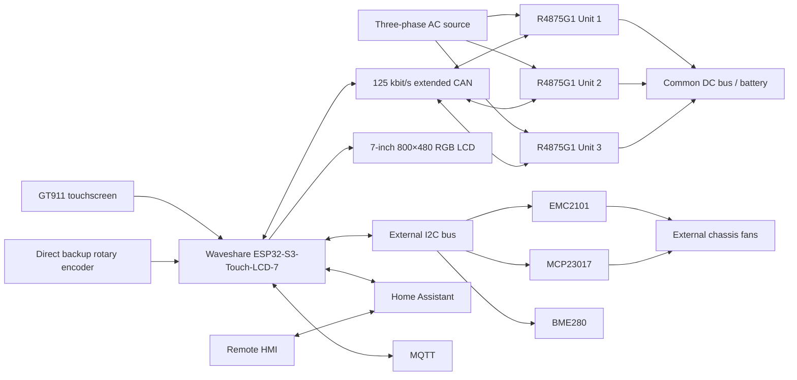
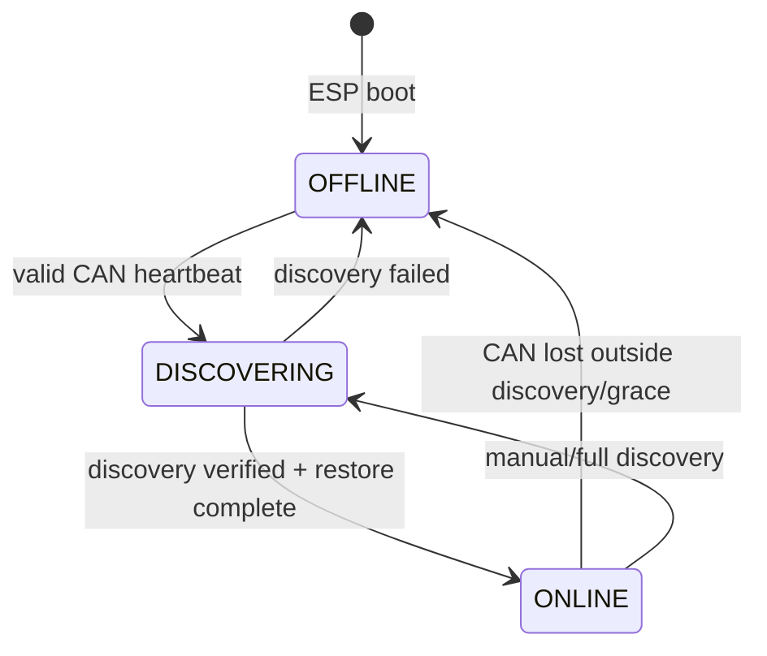
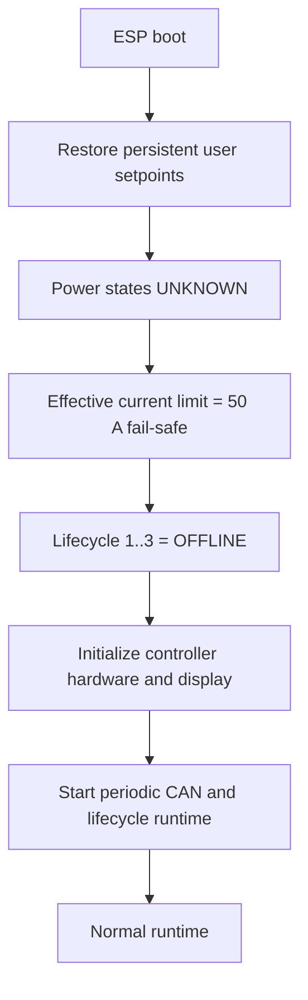
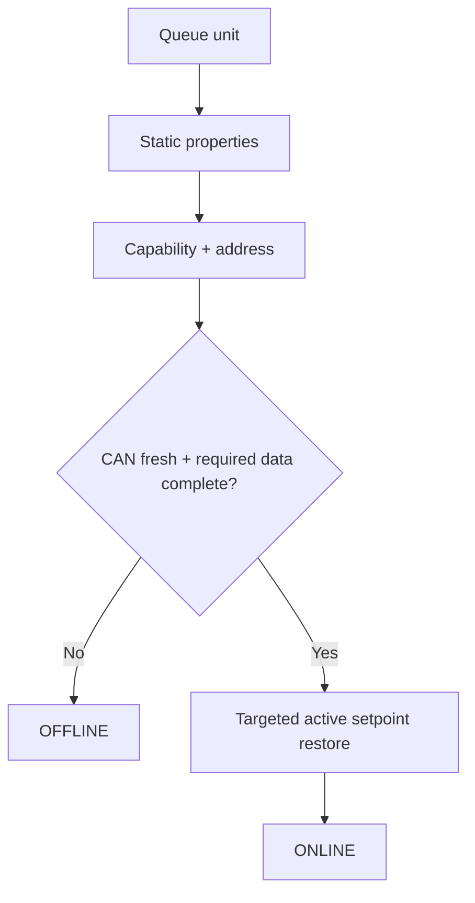

# R4875G1 Three-Phase Charger — Control and Runtime Flows

This document describes the current V6 charger-control, CAN, lifecycle, safety and runtime architecture, including the coordinated Charger Controller and Remote HMI targets.

The firmware version is intentionally not duplicated here. `packages/version.yaml` is the single source of truth.

> **Scope:** behavioral firmware documentation, not an electrical safety specification.

## Runtime constants

| Function | Current value |
|---|---:|
| Project DC current ceiling | 75 A per rectifier |
| Capability fail-safe ceiling | 50 A per rectifier |
| Minimum DC current command | 1 A |
| DC voltage range / default | 49–58 V / 53 V |
| Overtemperature trip / reset | 90 °C / 80 °C |
| Raw CAN watchdog | 3 s ONLINE/OFFLINE; 7 s while DISCOVERING |
| Live telemetry freshness | 5 s |
| Fast polling cycle | 577 ms |
| Offline probe slot / per-unit maximum | 5 s / ≈15 s |
| TWAI recovery check | 2 s |
| Active-setpoint refresh | 30 s |
| Reconnect stabilization | 5 s |
| Property bus quiet period | 500 ms |
| Property / capability attempts | 3 / 10 |
| TWAI RX queue | 64 frames |
| Display resolution | 800×480 landscape |
| LVGL framebuffer | 100%, 16-bit RGB565 |
| Controller battery display refresh | 5 s |

# 1. System architecture



Core charging remains local. Wi-Fi, Home Assistant, MQTT and Internet access are optional for charger control and blackstart.

# 2. Firmware module ownership

The V6 firmware keeps Charger Controller authority, Remote HMI transport, target-neutral UI state and shared LVGL presentation behind explicit ownership boundaries:

| Source | Primary responsibility |
|---|---|
| `r4875g1-3phase-charger.yaml` | Charger Controller composition, substitutions, unit instances, identity, boot sequence and aggregate entities |
| `r4875g1-remote-hmi.yaml` | Remote HMI composition and installation-specific Home Assistant pairing |
| `packages/shared/core.yaml` | target-neutral ESP32-S3 platform, Wi-Fi, API, web, OTA and time services |
| `packages/shared/hardware.yaml` | target-neutral Waveshare onboard I2C, CH422G, touch and local backup-battery hardware |
| `packages/shared/local-diagnostics.yaml` | target-local ESP32, network and runtime diagnostics shared by both V6 targets |
| `packages/shared/ui-model.yaml` | target-neutral charger state consumed by shared HMI code |
| `packages/shared/battery-monitoring.yaml` | shared Home Assistant solar-battery monitoring composition and UI backends |
| `packages/controller/hardware.yaml` | Charger Controller external I2C, MCP23017 fan I/O, direct backup encoder and CAN |
| `packages/controller/encoder.yaml` | network-independent backup encoder setpoint and charger power control state machine |
| `packages/controller/encoder-ui.yaml` | Controller-only LVGL feedback for backup encoder interaction |
| `packages/controller/environment.yaml` | rear-compartment BME280 temperature, humidity and pressure |
| `packages/controller/mqtt.yaml` | Charger Controller MQTT command and state transport |
| `packages/controller/ui-backend.yaml` | authoritative local Controller state mapped into the shared UI model |
| `packages/controller/ui-commands.yaml` | shared UI command intents executed through authoritative local Controller controls |
| `packages/remote-hmi/ha-backend.yaml` | authoritative Charger Controller state imported through Home Assistant |
| `packages/remote-hmi/rectifier-backend.yaml` | per-unit authoritative rectifier state imported through Home Assistant |
| `packages/remote-hmi/ui-commands.yaml` | shared HMI command intents transported through Home Assistant |
| `packages/controls.yaml` | charger-wide controls and setpoints |
| `packages/cooling.yaml` | external chassis-fan control, EMC2101 telemetry, PWM management and RPM monitoring |
| `packages/rectifier-unit.yaml` | parameterized per-unit state, telemetry and discovery |
| `packages/rectifier-shared.yaml` | cross-unit lifecycle, limits, CAN scheduling, recovery and control |
| `packages/rectifier-can/*.yaml` | parameterized CAN receive handlers |
| `packages/display/shared-*.yaml` | shared V6 HMI composition used by both targets |
| `packages/display/pages/*.yaml` | static shared LVGL page layouts |
| `packages/display/{header,command-state,dashboard,rectifiers,rectifier-detail,battery,cooling,system,trends}.yaml` | persistent and page-specific shared display runtimes |

# 3. Rectifier lifecycle



`OFFLINE` units receive no normal fast polling or START. `DISCOVERING` proves hardware identity/capability/address. `ONLINE` is the operationally released state.

# 4. Boot sequence



Initial current command scaling is `1024 / 75`. Capability discovery later recomputes shared scaling.

# 5. CAN transport strategy

**Single-Shot is used only for slow OFFLINE reconnect probes.** Normal telemetry, fan polling, property/capability discovery, active setpoints, reconnect restore, ON/OFF and broadcast configuration use normal ESPHome CAN transmission. TWAI BUS_OFF recovery remains the final controller-level recovery layer.

# 6. Normal fast polling

Every 577 ms, while property discovery is not owning the bus, each lifecycle-`ONLINE` rectifier is queried for cyclic telemetry and then fan telemetry. Units 2 and 3 follow the configured inter-unit gaps. `OFFLINE` and `DISCOVERING` units are excluded.

# 7. Raw CAN watchdog

Valid per-unit traffic refreshes `last_can_rx_x`. Communication is fresh for 3 seconds during normal operation and for 7 seconds while the unit is DISCOVERING, so the intentional 5-second stabilization window cannot expire the watchdog. Loss changes `CAN Communication Unit x` to false, invalidates that unit's capability contribution and eventually demotes lifecycle `ONLINE → OFFLINE`; its published power state becomes `UNKNOWN`.

# 8. Slow OFFLINE probing and reconnect

One unit slot is considered every 5 seconds in round-robin order. Only an `OFFLINE` unit receives a Single-Shot cyclic probe, so a continuously offline unit is probed about every 15 seconds.

A returned heartbeat changes `OFFLINE → DISCOVERING`, clears the previous capability-valid state and starts a 5-second stabilization period before serialized discovery.

# 9. Discovery

Discovery runs one rectifier at a time:



Static property discovery has a 500 ms quiet period and up to 3 attempts. Capability/address discovery has up to 10 attempts. The tested property response contained 56 frames; the TWAI RX queue is 64 frames.

# 10. Effective DC current limit

Only currently CAN-reachable units participate:

```text
no reachable units                       -> 50 A
any reachable capability still unknown  -> 50 A
all reachable capabilities known         -> min(75 A, reachable capabilities)
```

A disconnected unit is removed immediately. A reconnecting unit forces the fail-safe until its capability is freshly rediscovered.

# 11. Current command scaling

The current implementation has **no permanent Unit-1 scaling dependency**:

```text
unknown/incomplete reachable capabilities:
    current_scaling_factor = 1024 / 75

all reachable capabilities known:
    current_scaling_factor = 1024 / highest reachable capability
```

The effective engineering-current ceiling independently uses the **lowest** reachable capability. This combination is deliberately conservative for differing reachable capabilities.

Raw command selection is bounded in protocol space:

```text
requested_raw      = round(requested_A × scaling)
hardware_limit_raw = floor(effective_limit_A × scaling)
thermal_limit_raw  = floor(thermal_limit_A × scaling)
raw_command        = min(requested_raw, hardware_limit_raw, thermal_limit_raw)
```

# 12. Capability mismatch

`Rectifier Capability Mismatch` considers currently reachable units only:

```text
UNKNOWN = fewer than two reachable units or a reachable capability is unknown
OFF     = reachable capabilities match within 0.25 A
ON      = at least two reachable capabilities differ by >0.25 A
```

The diagnostic itself does not inhibit charging; fail-safe current limiting/scaling handles the operational boundary.

# 13. Active setpoints and reconnect restore

Normal active voltage/current changes and the 30-second refresh are sent only to `ONLINE` + CAN-fresh rectifiers. A rediscovered unit receives its current active voltage and current through targeted unit-specific CAN commands before returning to `ONLINE`. Restore does not send ON.

Fallback voltage/current remain broadcast configuration commands.

# 14. Nominal power target

```text
I_each = P_target / (3 × V_DC)
```

The divisor intentionally remains fixed at three. Therefore, before losses/clamping, two active rectifiers deliver roughly 67% and one roughly 33% of the configured nominal three-unit target. The firmware does not automatically increase remaining-unit current when a rectifier disappears.

# 15. Blackstart and local control

Blackstart is implemented independently from Home Assistant, MQTT, Wi-Fi and Internet connectivity.

START evaluates each rectifier independently. A unit must be `ONLINE`, CAN-fresh, explicitly `OFF`, have valid output-temperature telemetry below 90 °C and have no overtemperature lockout. Active setpoints are refreshed before individual ON commands are issued.

STOP remains unrestricted.

The V6 Charger Controller provides touchscreen-based local control through the shared LVGL interface and a separate backup rotary-encoder path for blackstart use.

The encoder is connected directly to the ESP32-S3:

```text
GPIO11 -> Encoder S1 / A
GPIO12 -> Encoder S2 / B
GPIO13 -> Encoder KEY
```

The encoder uses a staged local editor:

```text
short press 1 -> edit DC voltage
rotation      -> adjust voltage in 0.1 V steps
short press 2 -> edit nominal DC sum power
rotation      -> adjust power in 0.1 kW steps
short press 3 -> apply both pending setpoints
15 s idle     -> discard pending edits
```

A long press while the editor is idle requests charger START or STOP. START/STOP and saved setpoints are forwarded through the existing authoritative Charger Controller `ui_command_*` paths, so lifecycle, CAN freshness, thermal protection and START eligibility are not duplicated in the encoder implementation.

The LVGL encoder overlay is feedback-only. Touchscreen input, Home Assistant, MQTT and Internet connectivity are not dependencies of the backup encoder control state machine.

# 16. Thermal derating

The most severe per-unit thermal state determines a shared thermal current ceiling:

| State | Enter | Recovery threshold | Shared limit |
|---|---:|---:|---:|
| `NORMAL` | <70 °C | — | 75 A |
| `WARNING_1` | ≥70 °C | <65 °C | 50 A |
| `WARNING_2` | ≥80 °C | <75 °C | 30 A |
| `LOCKOUT` | ≥90 °C | <80 °C | 30 A + individual OFF |

Applied current is `min(requested, hardware capability limit, thermal limit)`. Derating never overwrites the user's requested current. Stale temperature cannot relax a warning or lockout, and lockout recovery never automatically starts a rectifier.

# 17. Telemetry and aggregate sensors

Cyclic selectors include operating hours (`0x0E`), AC power (`0x70`), frequency (`0x71`), AC current (`0x72`), DC power (`0x73`), DC voltage (`0x75`), configured max DC current (`0x76`), AC voltage (`0x78`), output temperature (`0x7F`), input temperature (`0x80`) and DC current (`0x81`). Most engineering values use `raw / 1024`.

Aggregate AC/DC power, average AC voltage, average AC phase current, DC current, average DC voltage, highest output temperature and efficiency include only CAN-fresh units with valid required telemetry. `Available Units` returns the CAN-reachable rectifier count. `Running Units` returns the number of CAN-reachable rectifiers explicitly reporting their power state as `ON`.

Solar-battery telemetry is imported independently from Home Assistant through `packages/shared/battery-monitoring.yaml`, which composes the source mappings and aggregate/per-unit UI backends. Aggregate bank data and four per-battery data sets are used exclusively for display monitoring. Home Assistant battery availability does not participate in rectifier lifecycle, current limiting, START eligibility or CAN control.

# 18. V6 shared LVGL display behavior

Both V6 targets use the Waveshare ESP32-S3-Touch-LCD-7 with a 7-inch 800×480 RGB display and GT911 capacitive touchscreen. Shared LVGL presentation consumes the target-neutral UI model; the Charger Controller publishes local authoritative state while the Remote HMI imports authoritative state through Home Assistant.

LVGL tracks touchscreen inactivity. After the configured display idle timeout, the firmware pauses LVGL rendering and disables the CH422G-controlled display backlight while non-display runtime continues normally. A touchscreen release wakes the display without activating the control underneath the wake-up touch.

The shared LVGL interface exposes six primary navigation pages:

```text
Dashboard
Rectifiers
Battery
System
Cooling
Trends
```

The Rectifiers page additionally opens one shared hierarchical Rectifier Detail view for Unit 1, Unit 2 or Unit 3.

The current shared display composition is:

```text
display/shared-hmi.yaml
    shared display hardware, theme, UI state, trend history and persistent header

display/shared-dashboard.yaml
display/shared-rectifiers.yaml
display/shared-battery.yaml
display/shared-cooling.yaml
display/shared-system.yaml
display/shared-trends.yaml
    shared page-specific presentation and runtime

display/shared-navigation.yaml
    shared six-page bottom navigation

display/pages/*.yaml
    static shared LVGL page layouts
```

Normal page telemetry is refreshed only while the corresponding page is visible. Persistent header state, command transitions, local backup-battery presentation and trend sampling continue independently.

The Charger Controller additionally composes `controller/encoder-ui.yaml` for local backup-encoder feedback. The Remote HMI does not include charger-side encoder hardware or duplicate charger safety logic.

The display layer does not own charger safety policy. Lifecycle, CAN freshness, thermal protection, command acceptance and START eligibility remain authoritative on the Charger Controller.

# 19. TWAI BUS_OFF recovery

Every 2 seconds the controller checks TWAI state. `BUS_OFF` initiates recovery; `STOPPED` restarts TWAI. This is a final recovery mechanism, not the normal rectifier reconnect path.

# 20. Verified physical reconnect behavior

The 2026-08-27 physical test remains the validated CAN baseline: unplugging CAN while the rectifier stayed powered caused the 3-second watchdog to expire, lifecycle moved to OFFLINE, slow Single-Shot probes continued, reconnect triggered DISCOVERING, the 56-frame property exchange and capability/address discovery completed, active setpoints were restored, and lifecycle returned to ONLINE without an ESP reboot.

The tested reduced-current connector configuration reported a 52 A capability. That trace remains valid protocol evidence because the current V6 HMI and hardware composition does not change the validated rectifier CAN protocol and lifecycle model.

# 21. Safety and behavioral invariants

1. Every rectifier boots `OFFLINE`.
2. Raw CAN reachability is not operational readiness.
3. Only `ONLINE` units receive normal fast polling.
4. Only `ONLINE` + CAN-fresh units receive normal active setpoints.
5. `OFFLINE` units are probed sparsely with Single-Shot.
6. Discovery must verify before `ONLINE` promotion.
7. START requires lifecycle, CAN, power-state and temperature safety checks.
8. STOP is unrestricted.
9. Nominal power always divides by three.
10. Effective current ceiling uses the lowest known reachable capability with a 50 A fail-safe for incomplete discovery.
11. Shared command scaling uses the highest reachable capability once all reachable capabilities are known.
12. Thermal/hardware limits clamp applied current without overwriting requested current.
13. Property discovery is serialized.
14. BUS_OFF recovery is a final recovery layer.
15. LVGL affects presentation only; charger control and safety decisions remain outside the shared display layer.
16. Backup encoder setpoint and START/STOP requests reuse authoritative Charger Controller command paths and do not duplicate CAN or safety policy.
17. Remote HMI commands remain requests transported through Home Assistant; the Charger Controller remains authoritative for acceptance, execution and resulting state.
18. Home Assistant solar-battery telemetry is monitoring-only and cannot affect charger control or safety behavior.

## Source status

This document describes the current V6 implementation from:

```text
r4875g1-3phase-charger.yaml
r4875g1-remote-hmi.yaml
packages/
trend_helpers.h
```

The firmware version is defined only in `packages/version.yaml`.

The physical CAN disconnect/reconnect test from 2026-08-27 remains the validated protocol and lifecycle baseline for reconnect behavior. Current V6 hardware and HMI documentation reflects the coordinated Charger Controller and Remote HMI architecture.
