# R4875G1 Three-Phase Charger — Control and Runtime Flows

This document describes the control flows, lifecycle state transitions, CAN recovery paths, discovery sequence, current-capability handling, setpoint routing, safety checks, telemetry processing, and local user-interface behavior implemented in `r4875g1-3phase-charger.yaml`.

It is synchronized with the `main` branch implementation as of **2026-08-27** and includes behavior verified with physical R4875G1 CAN disconnect/reconnect traces.

> **Scope:** This is behavioral firmware documentation, not an electrical safety specification. Fuses, breakers, contactors, BMS protection, earthing, isolation, conductor sizing and other hardware protection remain independent of the firmware.

---

## Runtime constants

| Function | Current value |
|---|---:|
| Project DC current ceiling | 75 A per rectifier |
| Minimum DC current command | 1 A |
| DC voltage range | 49–58 V |
| Default DC voltage | 53 V |
| Overtemperature trip / reset | 90 °C / 80 °C |
| Raw CAN watchdog | 3 s |
| Lifecycle reconciliation | 1 s |
| Live telemetry freshness | 5 s |
| Fast polling cycle | 577 ms |
| Fan query delay | 27 ms |
| Offline probe slot | 5 s |
| Maximum probe interval per unit | ≈15 s |
| TWAI recovery check | 2 s |
| Periodic active-setpoint refresh | 30 s |
| Reconnect discovery stabilization | 5 s |
| Post-property polling grace | 2 s |
| Property bus quiet period | 500 ms |
| Property / capability attempts | 3 / 10 |
| Discovery retry delay | 1 s |
| TWAI RX queue | 64 frames |
| General protocol scale | 1024 |
| Fan duty scale | 256 counts/% |
| Display refresh / inactivity | 500 ms / 5 min |

---

# 1. System architecture

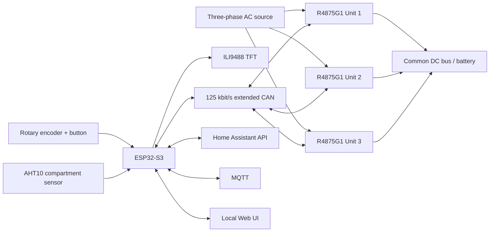
```mermaid
flowchart LR
    AC[Three-phase AC source] --> U1[R4875G1 Unit 1]
    AC --> U2[R4875G1 Unit 2]
    AC --> U3[R4875G1 Unit 3]

    U1 --> DCBUS[Common DC bus / battery]
    U2 --> DCBUS
    U3 --> DCBUS

    ENC[Rotary encoder + button] --> ESP[ESP32-S3]
    AHT[AHT10 compartment sensor] --> ESP
    ESP --> TFT[ILI9488 TFT]

    ESP <--> CAN[125 kbit/s extended CAN]
    CAN <--> U1
    CAN <--> U2
    CAN <--> U3

    ESP <--> HA[Home Assistant API]
    ESP <--> MQTT[MQTT]
    ESP <--> WEB[Local Web UI]
```

Core charger control remains local. Wi-Fi, Home Assistant and MQTT are optional for operation.

---

# 2. Per-unit lifecycle state machine

The operational lifecycle is deliberately separate from raw CAN reachability.

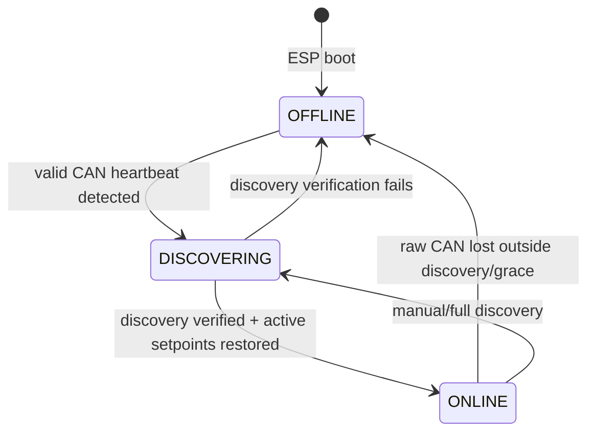
```mermaid
stateDiagram-v2
    [*] --> OFFLINE: ESP boot

    OFFLINE --> DISCOVERING: valid CAN heartbeat detected
    DISCOVERING --> ONLINE: discovery verified + active setpoints restored
    DISCOVERING --> OFFLINE: discovery verification fails
    ONLINE --> OFFLINE: raw CAN lost outside discovery/grace

    ONLINE --> DISCOVERING: manual/full discovery
```

Meaning:

- **OFFLINE** — no operationally released communication; excluded from fast polling and START.
- **DISCOVERING** — communication has been detected, but properties/capability/address and reconnect restore are not yet complete.
- **ONLINE** — discovery completed successfully and the unit is released for normal polling, active setpoint traffic and START decisions.

A unit is not considered operationally ready merely because one CAN frame was received.

---

# 3. Boot and initialization

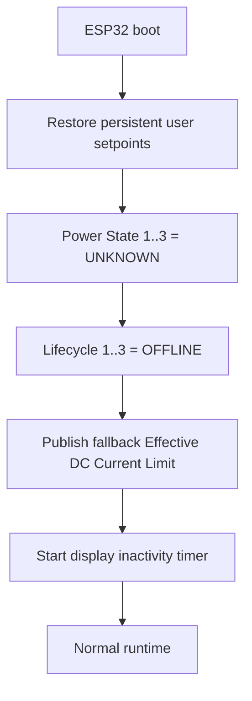
```mermaid
flowchart TD
    A[ESP32 boot] --> B[Restore persistent user setpoints]
    B --> C[Power State 1..3 = UNKNOWN]
    C --> D[Lifecycle 1..3 = OFFLINE]
    D --> E[Publish fallback Effective DC Current Limit]
    E --> F[Start display inactivity timer]
    F --> G[Normal runtime]
```

The shared current command scaling starts with the model fallback:

```text
current_scaling_factor = 1024 / 75
                       ≈ 13.653333
```

Actual Unit 1 capability discovery can replace this factor at runtime.

---

# 4. Network independence

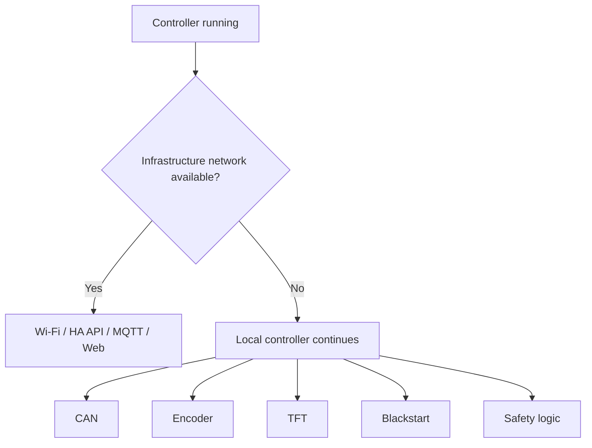
```mermaid
flowchart TD
    A[Controller running] --> B{Infrastructure network available?}
    B -- Yes --> C[Wi-Fi / HA API / MQTT / Web]
    B -- No --> D[Local controller continues]

    D --> E[CAN]
    D --> F[Encoder]
    D --> G[TFT]
    D --> H[Blackstart]
    D --> I[Safety logic]
```

Wi-Fi, API and MQTT reboot timeouts are disabled, so loss of external infrastructure does not reboot the controller.

---

# 5. CAN traffic classes

The firmware intentionally uses different transmission behavior for query traffic and operational control traffic.

## 5.1 Single-Shot query traffic

`send_single_shot_request` uses ESP-IDF TWAI directly with:

```text
TWAI_MSG_FLAG_EXTD | TWAI_MSG_FLAG_SS
```

Single-Shot is used for:

- cyclic telemetry requests,
- fan telemetry requests,
- offline reachability probes,
- static property requests,
- capability/address requests.

If a peer is absent, the hardware does not endlessly retransmit that individual query frame.

## 5.2 Normal operational commands

Normal setpoint changes and ON/OFF control continue to use ESPHome `canbus.send` with the driver's normal transmission semantics.

## 5.3 Reconnect setpoint restore

Reconnect restore is a special case. `send_single_shot_active_setpoint` sends the active voltage/current specifically to the rediscovered unit using Single-Shot CAN. This prevents a reconnect restore from immediately creating another retransmission storm if the peer disappears again while TWAI error counters are still recovering.

---

# 6. Normal fast polling

Fast polling runs every 577 ms only while TWAI is `RUNNING` and no static property response owns the bus.

Only lifecycle-`ONLINE` units participate.

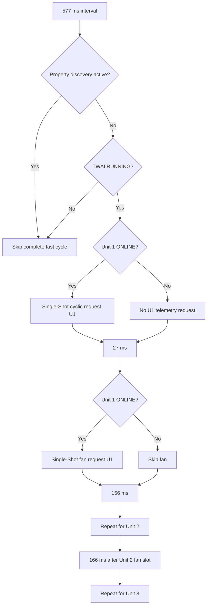
```mermaid
flowchart TD
    A[577 ms interval] --> B{Property discovery active?}
    B -- Yes --> X[Skip complete fast cycle]
    B -- No --> C{TWAI RUNNING?}
    C -- No --> X
    C -- Yes --> U1{Unit 1 ONLINE?}

    U1 -- Yes --> Q1[Single-Shot cyclic request U1]
    U1 -- No --> D1[No U1 telemetry request]
    Q1 --> W1[27 ms]
    D1 --> W1
    W1 --> F1{Unit 1 ONLINE?}
    F1 -- Yes --> FAN1[Single-Shot fan request U1]
    F1 -- No --> G1[Skip fan]

    FAN1 --> GAP2[156 ms]
    G1 --> GAP2
    GAP2 --> U2[Repeat for Unit 2]
    U2 --> GAP3[166 ms after Unit 2 fan slot]
    GAP3 --> U3[Repeat for Unit 3]
```

`OFFLINE` and `DISCOVERING` units are excluded from high-rate polling.

No TX-error-counter threshold gates fast polling anymore. Because all normal read requests are Single-Shot, successful traffic after reconnect is allowed to continue and naturally reduce historical TWAI error counters.

---

# 7. Raw CAN watchdog and lifecycle reconciliation

Each rectifier has a raw connectivity sensor based on `last_can_rx_x`.

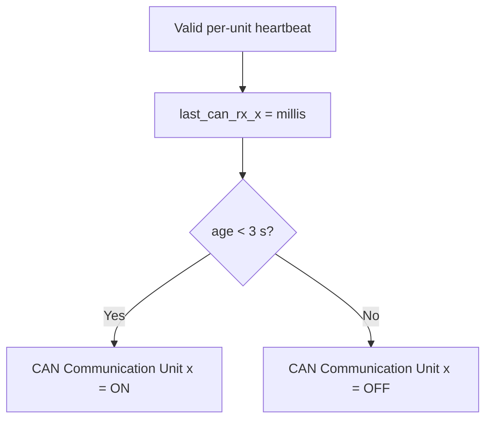
```mermaid
flowchart TD
    A[Valid per-unit heartbeat] --> B[last_can_rx_x = millis]
    B --> C{age < 3 s?}
    C -- Yes --> D[CAN Communication Unit x = ON]
    C -- No --> E[CAN Communication Unit x = OFF]
```

Normal heartbeat sources are valid cyclic telemetry. Valid property START/DATA and END frames also refresh the timestamp while static discovery temporarily suspends cyclic polling.

Raw CAN state and lifecycle state are intentionally not identical.

A separate 1-second reconciliation task demotes a lifecycle-`ONLINE` unit to `OFFLINE` only when:

- raw CAN is no longer valid,
- no static property discovery is active, and
- the 2-second post-property polling grace has expired.

The CAN-reported power state is then changed to `UNKNOWN` so stale `ON`/`OFF` information cannot be used for START decisions.

---

# 8. Slow probing of OFFLINE units

`OFFLINE` units are not continuously polled.

One probe slot runs every 5 seconds in round-robin order:

```text
Unit 1 → Unit 2 → Unit 3 → Unit 1 → ...
```

A CAN frame is transmitted only if the selected unit is currently `OFFLINE`.

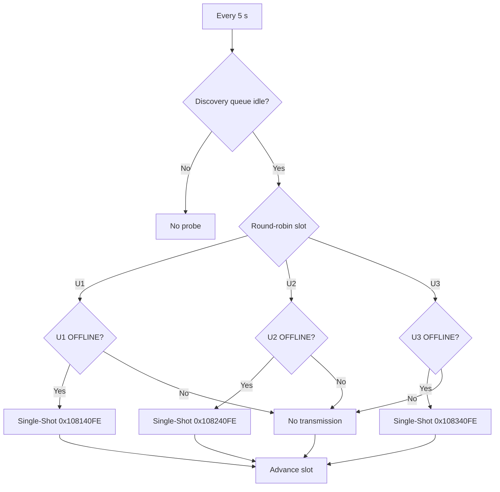
```mermaid
flowchart TD
    A[Every 5 s] --> B{Discovery queue idle?}
    B -- No --> X[No probe]
    B -- Yes --> C{Round-robin slot}

    C -- U1 --> D{U1 OFFLINE?}
    C -- U2 --> E{U2 OFFLINE?}
    C -- U3 --> F{U3 OFFLINE?}

    D -- Yes --> Q1[Single-Shot 0x108140FE]
    E -- Yes --> Q2[Single-Shot 0x108240FE]
    F -- Yes --> Q3[Single-Shot 0x108340FE]

    D -- No --> N[No transmission]
    E -- No --> N
    F -- No --> N

    Q1 --> A2[Advance slot]
    Q2 --> A2
    Q3 --> A2
    N --> A2
```

With three slots, a continuously offline rectifier is probed approximately every **15 seconds**. Fan telemetry is not requested from offline units.

---

# 9. OFFLINE → DISCOVERING reconnect trigger

When a valid heartbeat makes `can_com_ok_x` transition from OFF to ON, automatic reconnect handling runs only if that unit's lifecycle is still `OFFLINE`.

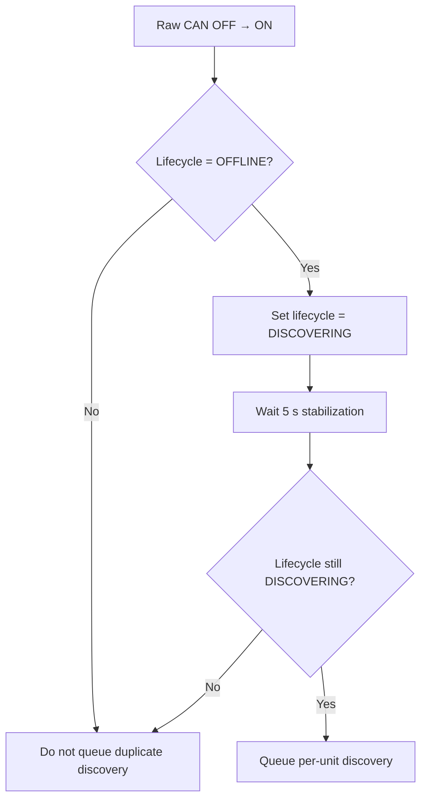
```mermaid
flowchart TD
    A[Raw CAN OFF → ON] --> B{Lifecycle = OFFLINE?}
    B -- No --> X[Do not queue duplicate discovery]
    B -- Yes --> C[Set lifecycle = DISCOVERING]
    C --> D[Wait 5 s stabilization]
    D --> E{Lifecycle still DISCOVERING?}
    E -- No --> X
    E -- Yes --> F[Queue per-unit discovery]
```

The five-second delay is a stabilization delay, not a declaration that the unit is already operationally ready.

If communication disappears again during this interval, discovery may still be attempted; final discovery verification checks raw CAN and all required discovery flags. A failed verification returns the unit to `OFFLINE`.

---

# 10. Static property discovery

Static property discovery has temporary exclusive use of the CAN bus because the response is a large multi-frame burst.

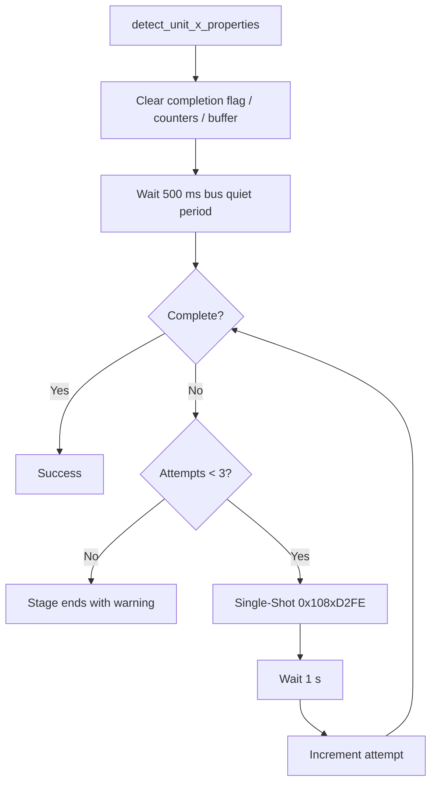
```mermaid
flowchart TD
    A[detect_unit_x_properties] --> B[Clear completion flag / counters / buffer]
    B --> C[Wait 500 ms bus quiet period]
    C --> D{Complete?}
    D -- Yes --> OK[Success]
    D -- No --> E{Attempts < 3?}
    E -- No --> FAIL[Stage ends with warning]
    E -- Yes --> F[Single-Shot 0x108xD2FE]
    F --> G[Wait 1 s]
    G --> H[Increment attempt]
    H --> D
```

Property receive flow:

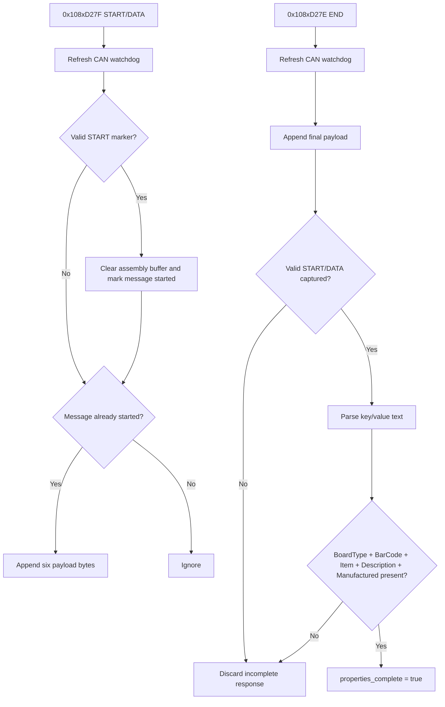
```mermaid
flowchart TD
    A[0x108xD27F START/DATA] --> B[Refresh CAN watchdog]
    B --> C{Valid START marker?}
    C -- Yes --> D[Clear assembly buffer and mark message started]
    C -- No --> E{Message already started?}
    D --> E
    E -- Yes --> F[Append six payload bytes]
    E -- No --> G[Ignore]

    H[0x108xD27E END] --> I[Refresh CAN watchdog]
    I --> J[Append final payload]
    J --> K{Valid START/DATA captured?}
    K -- No --> L[Discard incomplete response]
    K -- Yes --> M[Parse key/value text]
    M --> N{BoardType + BarCode + Item + Description + Manufactured present?}
    N -- Yes --> O[properties_complete = true]
    N -- No --> L
```

The tested R4875G1 returned **56 property frames**. The firmware's TWAI RX queue is 64 frames, providing enough headroom for this observed response while ESPHome processes the burst.

---

# 11. Capability and address discovery

After static properties, capability/address discovery runs sequentially for the same unit.

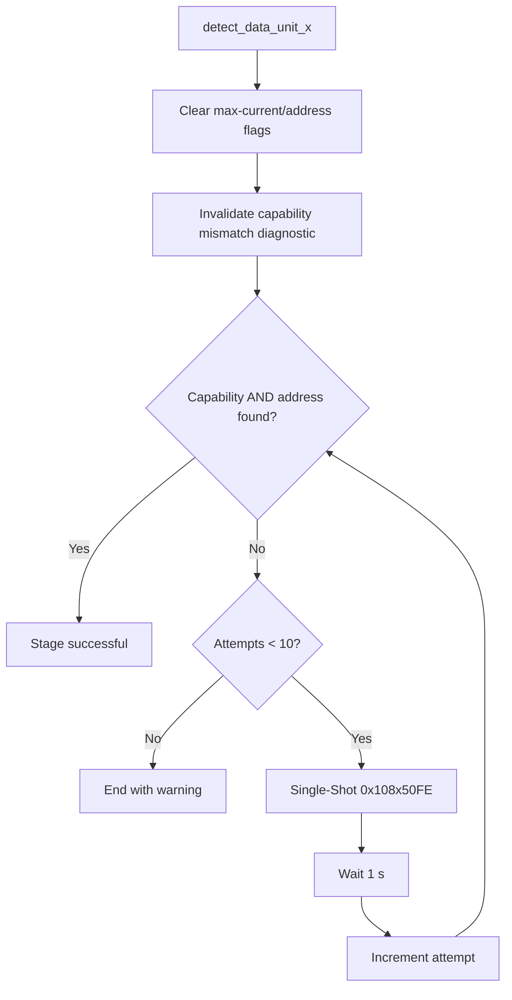
```mermaid
flowchart TD
    A[detect_data_unit_x] --> B[Clear max-current/address flags]
    B --> C[Invalidate capability mismatch diagnostic]
    C --> D{Capability AND address found?}
    D -- Yes --> OK[Stage successful]
    D -- No --> E{Attempts < 10?}
    E -- No --> FAIL[End with warning]
    E -- Yes --> F[Single-Shot 0x108x50FE]
    F --> G[Wait 1 s]
    G --> H[Increment attempt]
    H --> D
```

Maximum-current capability comes from capability packet 1:

```text
maximum_current_A = capability_byte_5 / 2
```

The tested unbridged R4875G1 reports **52.0 A**.

Shelf/slot diagnostics are decoded from the address response and are required together with maximum-current capability for full discovery verification.

---

# 12. Current capability, effective limit and scaling

There are two related but distinct concepts.

## 12.1 Effective current ceiling

```text
effective_dc_current_limit
    = min(75 A project ceiling, every valid detected capability)
```

Example:

```text
Unit 1 = 75 A
Unit 2 = 52 A
Unit 3 = 75 A
→ Effective DC Current Limit = 52 A
```

This ceiling constrains:

- active DC current,
- fallback DC current,
- nominal three-unit power → current conversion.

If a newly detected capability lowers the ceiling below an existing active or fallback current setpoint, the number entity is reduced immediately.

## 12.2 Current command scaling

Current commands use Unit 1 as the canonical scaling source:

```text
current_scaling_factor = 1024 / Unit_1_max_current
raw_current            = int(I_command × current_scaling_factor)
```

For a 52 A Unit 1:

```text
current_scaling_factor = 1024 / 52 ≈ 19.6923077
```

Verified CAN examples:

| Setpoint | Raw decimal | Raw hex |
|---:|---:|---:|
| 10 A | 196 | `0x00C4` |
| 20 A | 393 | `0x0189` |
| 30 A | 590 | `0x024E` |
| 40 A | 787 | `0x0313` |
| 50 A | 984 | `0x03D8` |

For the nominal 3 kW / 55.4 V / three-unit target:

```text
I_each = 3000 / (55.4 × 3) ≈ 18.0505 A
raw    = int(18.0505 × 1024 / 52)
       = 355
       = 0x0163
```

Unit 2 and Unit 3 capabilities are retained for diagnostics and the common effective ceiling, but do not replace the shared scaling factor.

---

# 13. Capability mismatch diagnostic

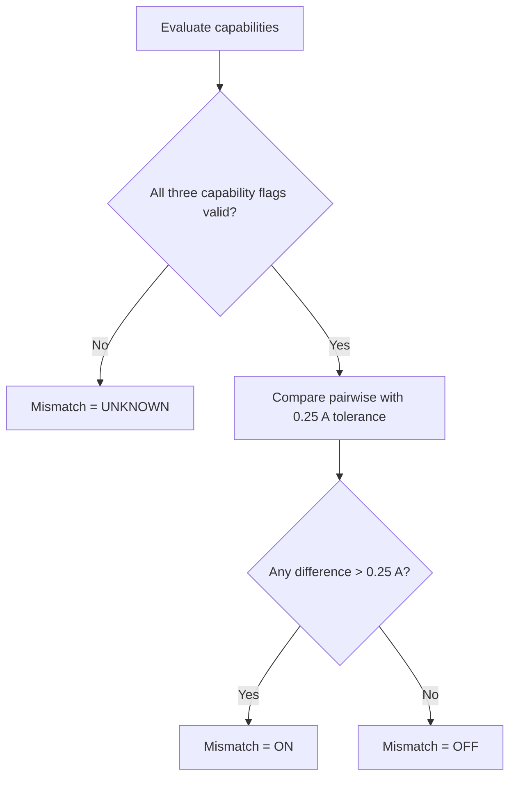
```mermaid
flowchart TD
    A[Evaluate capabilities] --> B{All three capability flags valid?}
    B -- No --> C[Mismatch = UNKNOWN]
    B -- Yes --> D[Compare pairwise with 0.25 A tolerance]
    D --> E{Any difference > 0.25 A?}
    E -- Yes --> F[Mismatch = ON]
    E -- No --> G[Mismatch = OFF]
```

The diagnostic does not itself inhibit operation. Mixed capability/scaling behavior is therefore not considered fully supported; Unit 1 remains the canonical current-scaling source.

---

# 14. Serialized discovery queue

All automatic reconnect discoveries and manual discovery requests use one queued worker.

For a per-unit discovery:

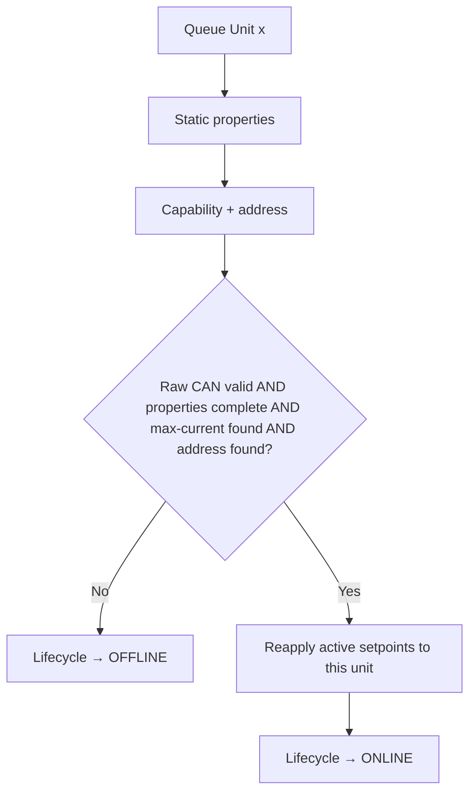
```mermaid
flowchart TD
    A[Queue Unit x] --> B[Static properties]
    B --> C[Capability + address]
    C --> D{Raw CAN valid AND properties complete AND max-current found AND address found?}
    D -- No --> E[Lifecycle → OFFLINE]
    D -- Yes --> F[Reapply active setpoints to this unit]
    F --> G[Lifecycle → ONLINE]
```

The unit remains `DISCOVERING` throughout discovery and restore.

A manual full discovery first puts all three lifecycle states into `DISCOVERING`, then processes Unit 1, Unit 2 and Unit 3 sequentially. Each unit is independently returned to `ONLINE` only after its own verification and restore succeed; otherwise it is returned to `OFFLINE`.

Serialization prevents overlapping large property responses.

---

# 15. Post-discovery active-setpoint restore

A verified rediscovered unit receives the stored active voltage and current **before** it becomes `ONLINE`.

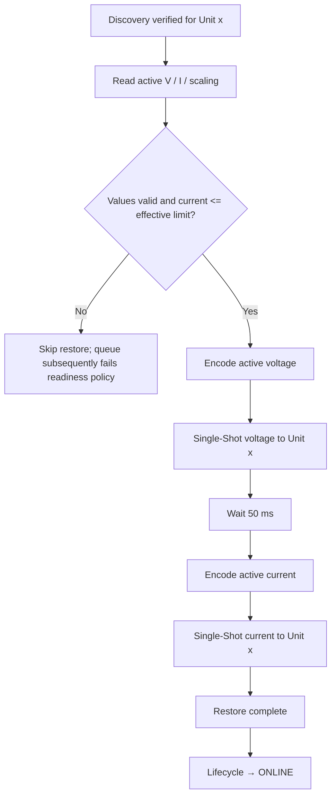
```mermaid
flowchart TD
    A[Discovery verified for Unit x] --> B[Read active V / I / scaling]
    B --> C{Values valid and current <= effective limit?}
    C -- No --> X[Skip restore; queue subsequently fails readiness policy]
    C -- Yes --> D[Encode active voltage]
    D --> E[Single-Shot voltage to Unit x]
    E --> F[Wait 50 ms]
    F --> G[Encode active current]
    G --> H[Single-Shot current to Unit x]
    H --> I[Restore complete]
    I --> J[Lifecycle → ONLINE]
```

The restore uses unit-specific IDs:

```text
Unit 1: 0x108180FE
Unit 2: 0x108280FE
Unit 3: 0x108380FE
```

It does **not** send an ON command.

---

# 16. Normal active-setpoint routing

Normal active voltage/current changes are no longer broadcast indiscriminately.

The number entities route active setpoints only to rectifiers that are both:

- lifecycle `ONLINE`, and
- raw CAN reachable (`can_com_ok_x = true`).

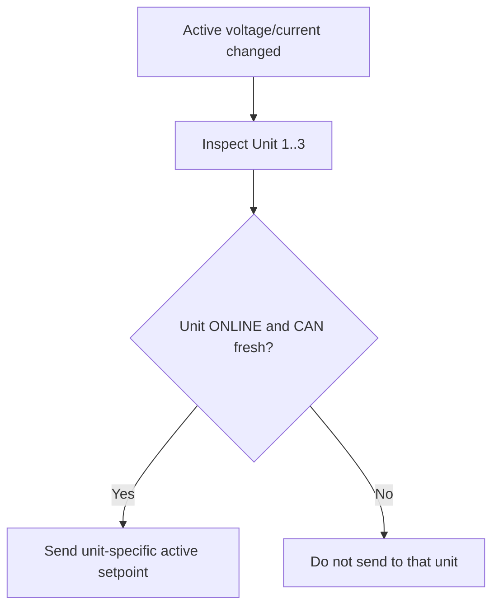
```mermaid
flowchart TD
    A[Active voltage/current changed] --> B[Inspect Unit 1..3]
    B --> C{Unit ONLINE and CAN fresh?}
    C -- Yes --> D[Send unit-specific active setpoint]
    C -- No --> E[Do not send to that unit]
```

This prevents `OFFLINE` or `DISCOVERING` rectifiers from receiving normal operational setpoint traffic.

Fallback voltage/current settings remain broadcast configuration commands using `0x108080FE` selectors `0x01` and `0x04`.

---

# 17. Periodic active-setpoint refresh

Every 30 seconds the current active voltage and current are reasserted only to fully online, CAN-fresh units.

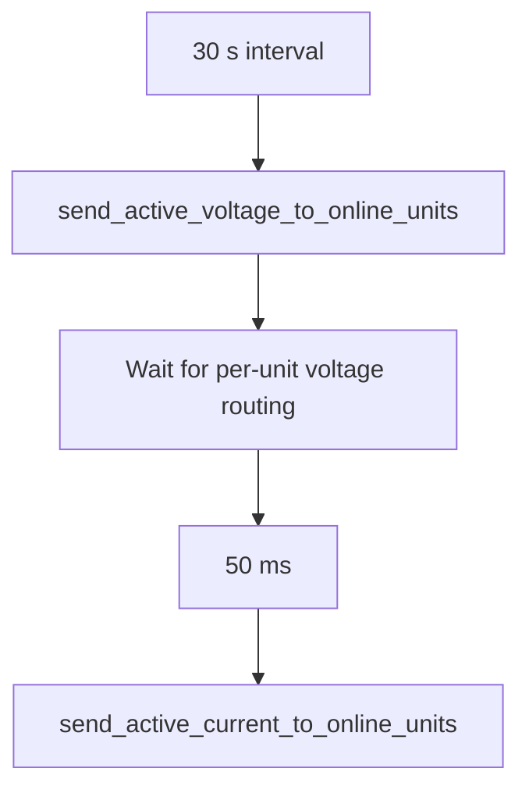
```mermaid
flowchart TD
    A[30 s interval] --> B[send_active_voltage_to_online_units]
    B --> C[Wait for per-unit voltage routing]
    C --> D[50 ms]
    D --> E[send_active_current_to_online_units]
```

`OFFLINE` and `DISCOVERING` units receive no normal periodic active refresh. A returning unit instead receives the dedicated Single-Shot restore before its lifecycle changes to `ONLINE`.

---

# 18. Nominal three-unit power → current

The local power target is deliberately based on a fixed three-unit divisor:

```text
I_each = P_target / (3 × V_DC)
```

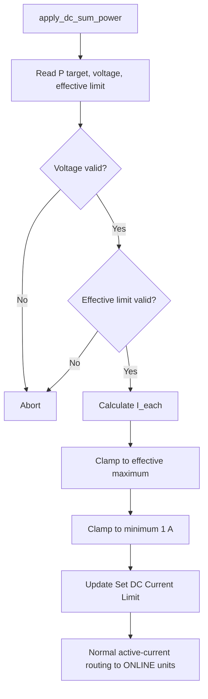
```mermaid
flowchart TD
    A[apply_dc_sum_power] --> B[Read P target, voltage, effective limit]
    B --> C{Voltage valid?}
    C -- No --> X[Abort]
    C -- Yes --> D{Effective limit valid?}
    D -- No --> X
    D -- Yes --> E[Calculate I_each]
    E --> F[Clamp to effective maximum]
    F --> G[Clamp to minimum 1 A]
    G --> H[Update Set DC Current Limit]
    H --> I[Normal active-current routing to ONLINE units]
```

Partial operation is intentionally not compensated:

```text
3 active units ≈ 100% of nominal target
2 active units ≈  67% of nominal target
1 active unit  ≈  33% of nominal target
```

---

# 19. Blackstart START

A local START does not broadcast active setpoints to unknown units.

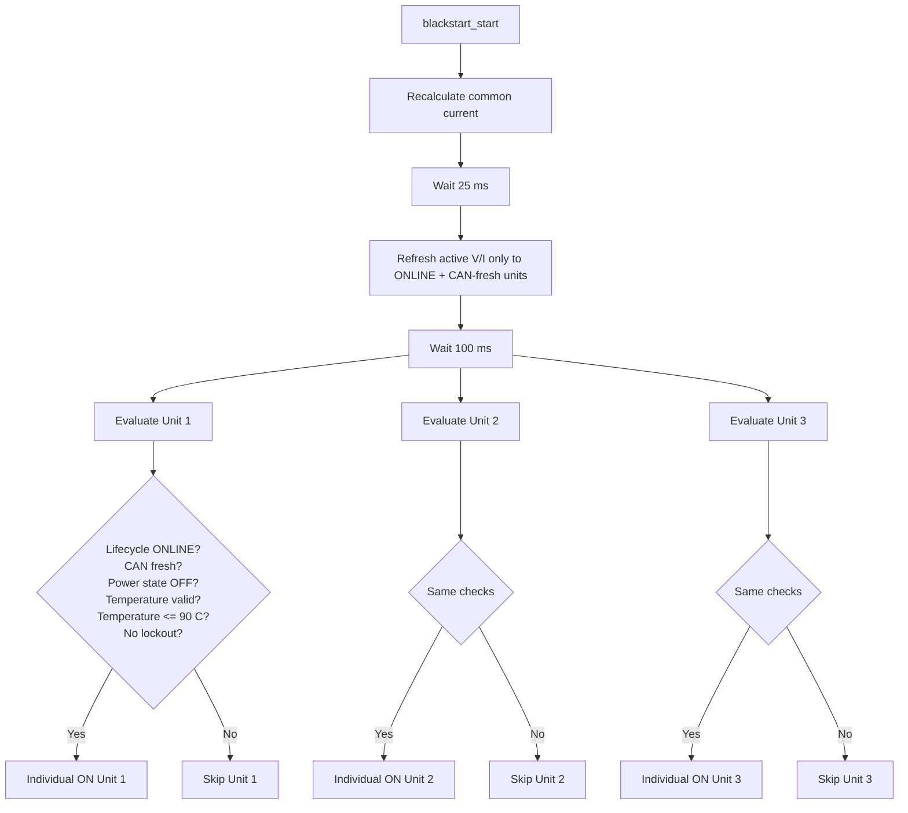
```mermaid
flowchart TD
    A[blackstart_start] --> B[Recalculate common current]
    B --> C[Wait 25 ms]
    C --> D[Refresh active V/I only to ONLINE + CAN-fresh units]
    D --> E[Wait 100 ms]
    E --> U1[Evaluate Unit 1]
    E --> U2[Evaluate Unit 2]
    E --> U3[Evaluate Unit 3]

    U1 --> C1{Lifecycle ONLINE?<br/>CAN fresh?<br/>Power state OFF?<br/>Temperature valid?<br/>Temperature <= 90 C?<br/>No lockout?}
    U2 --> C2{Same checks}
    U3 --> C3{Same checks}

    C1 -- Yes --> ON1[Individual ON Unit 1]
    C1 -- No --> S1[Skip Unit 1]
    C2 -- Yes --> ON2[Individual ON Unit 2]
    C2 -- No --> S2[Skip Unit 2]
    C3 -- Yes --> ON3[Individual ON Unit 3]
    C3 -- No --> S3[Skip Unit 3]
```

`OFFLINE`, `DISCOVERING`, `UNKNOWN` and `ERROR` never satisfy START readiness.

---

# 20. Encoder long-press decision

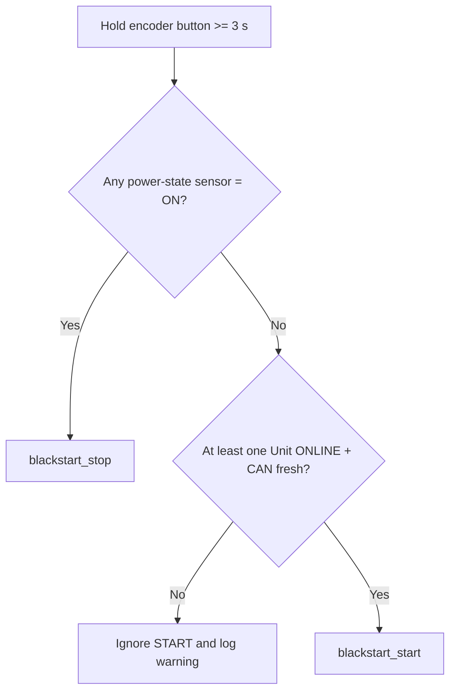
```mermaid
flowchart TD
    A[Hold encoder button >= 3 s] --> B{Any power-state sensor = ON?}
    B -- Yes --> C[blackstart_stop]
    B -- No --> D{At least one Unit ONLINE + CAN fresh?}
    D -- No --> E[Ignore START and log warning]
    D -- Yes --> F[blackstart_start]
```

STOP has priority and remains unrestricted.

---

# 21. Manual ON/OFF controls

## Individual ON

An individual ON button requires:

- lifecycle `ONLINE`,
- fresh CAN,
- explicit `OFF` power state,
- valid output temperature,
- temperature at or below trip threshold,
- no overtemperature lockout.

The firmware reasserts active voltage/current specifically to that unit before ON.

## Broadcast ON

Because a broadcast ON cannot exclude one unsafe unit, **all three** units must satisfy the full readiness checks. Active setpoints are refreshed to all verified online units immediately before the broadcast ON.

## OFF

Broadcast OFF and individual OFF controls are intentionally not subject to START-style preconditions.

---

# 22. Rectifier power-state decode

The `0x100x117E` status frame determines `ON`, `OFF` or `ERROR`.

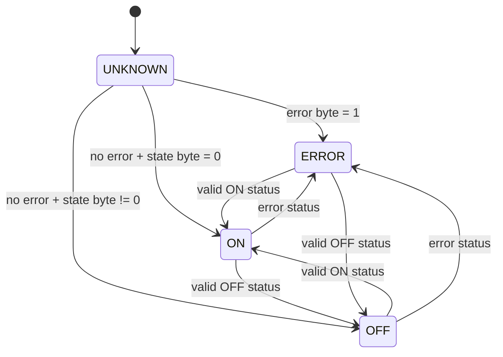
```mermaid
stateDiagram-v2
    [*] --> UNKNOWN
    UNKNOWN --> ERROR: error byte = 1
    UNKNOWN --> ON: no error + state byte = 0
    UNKNOWN --> OFF: no error + state byte != 0
    ON --> OFF: valid OFF status
    ON --> ERROR: error status
    OFF --> ON: valid ON status
    OFF --> ERROR: error status
    ERROR --> ON: valid ON status
    ERROR --> OFF: valid OFF status
```

On communication loss the power state is explicitly changed to `UNKNOWN`.

---

# 23. Cyclic telemetry decode

Valid `0x108x407F` telemetry uses selector byte 1.

| Selector | Meaning |
|---:|---|
| `0x0E` | Operating hours |
| `0x70` | AC input power |
| `0x71` | Grid frequency |
| `0x72` | AC input current |
| `0x73` | DC output power |
| `0x75` | DC output voltage |
| `0x76` | Configured maximum DC current setpoint |
| `0x78` | AC input voltage |
| `0x7F` | Output temperature |
| `0x80` | Input temperature |
| `0x81` | DC output current |

Most engineering values use:

```text
engineering_value = raw / 1024
```

The `0x80` cyclic value is **input temperature**. It is not the maximum-current capability. Maximum-current capability comes from the separate `0x108x50xx` discovery exchange.

Live telemetry values use a 5-second freshness timeout.

---

# 24. Fan telemetry

Fan telemetry request/response uses selector `0x01 / 0x87`.

```text
bytes 2..3 = minimum fan duty raw
bytes 4..5 = fan duty target raw
bytes 6..7 = fan RPM
```

```text
minimum duty % = raw / 256
target duty %  = raw / 256
RPM            = raw 16-bit value
```

Fan telemetry is requested only for lifecycle-`ONLINE` units and also uses Single-Shot query transmission.

---

# 25. Overtemperature protection

Each rectifier has an independent lockout.

```mermaid
stateDiagram-v2
    [*] --> NORMAL
    NORMAL --> LOCKOUT: valid output temperature > 90 C
    LOCKOUT --> LOCKOUT: 80..90 C
    LOCKOUT --> LOCKOUT: temperature unavailable
    LOCKOUT --> NORMAL: valid output temperature < 80 C
```

Entering lockout sends an individual OFF command. Missing/stale temperature never clears a lockout and never qualifies a unit for START.

---

# 26. CAN-aware aggregate telemetry

Aggregate sensors include only currently reachable units with the required numeric telemetry.

```mermaid
flowchart TD
    A[Aggregate update] --> B[Inspect each unit]
    B --> C{CAN fresh + required value numeric?}
    C -- Yes --> D[Include]
    C -- No --> E[Exclude]
    D --> F{More units?}
    E --> F
    F -- Yes --> B
    F -- No --> G{Any valid units?}
    G -- No --> H[Unavailable / NAN]
    G -- Yes --> I[Calculate sum / average / max]
```

`Available Units` intentionally returns `0` when none are reachable.

---

# 27. TFT rendering

The TFT updates every 500 ms.

For a per-unit line:

```mermaid
flowchart TD
    A[Render Unit x] --> B{Raw CAN reachable?}
    B -- No --> C[CAN bus communication fault]
    B -- Yes --> D{All required live values numeric?}
    D -- No --> E[Telemetry incomplete]
    D -- Yes --> F[Render numeric telemetry]
```

CAN reachability and telemetry freshness are displayed as different fault conditions.

The charger-state summary counts currently reachable units whose power-state sensor reports `ON` and displays `OFF`, `1/3 ON`, `2/3 ON` or `3/3 ON`.

---

# 28. TWAI BUS_OFF recovery

BUS_OFF remains a final controller-level safety/recovery mechanism; it is no longer the expected normal path for every CAN disconnect.

```mermaid
flowchart TD
    A[Every 2 s] --> B[Read TWAI status]
    B --> C{TWAI state}
    C -- RUNNING --> D[No action]
    C -- RECOVERING --> D
    C -- BUS_OFF --> E[twai_initiate_recovery]
    C -- STOPPED --> F[twai_start]
    E --> G[Recovery proceeds]
    F --> H[TWAI RUNNING]
```

Because read/query traffic is Single-Shot and offline units are removed from fast polling, a missing peer creates far less transmit pressure than the earlier retransmitting design.

Operational commands still use normal CAN transmission, so BUS_OFF handling remains necessary as a final recovery path.

---

# 29. Verified physical CAN disconnect/reconnect flow

The following sequence was verified on 2026-08-27 by unplugging and reconnecting the CAN connector while the R4875G1 itself remained powered.

```mermaid
sequenceDiagram
    participant ESP as ESP32
    participant BUS as CAN bus
    participant R as R4875G1
    participant LIFE as Lifecycle
    participant DISC as Discovery queue

    LIFE-->>ESP: ONLINE
    ESP->>R: Fast Single-Shot telemetry polling
    R-->>ESP: Valid cyclic telemetry

    Note over BUS: CAN connector unplugged

    ESP->>BUS: Remaining fast requests while watchdog expires
    BUS--xESP: No valid response
    ESP-->>LIFE: ≈3 s raw watchdog timeout
    LIFE-->>LIFE: ONLINE → OFFLINE
    ESP-->>ESP: Power state → UNKNOWN

    loop Round-robin offline probing
        ESP->>BUS: One Single-Shot probe every 5 s slot
    end

    Note over BUS: CAN connector reconnected

    ESP->>R: Next Unit 1 offline probe
    R-->>ESP: Valid 0x1081407F telemetry
    LIFE-->>LIFE: OFFLINE → DISCOVERING

    ESP-->>ESP: 5 s stabilization
    DISC->>R: Property request
    R-->>DISC: Complete property burst (56 frames observed)
    DISC->>R: Capability/address request
    R-->>DISC: Capability/address response
    DISC-->>ESP: Effective current limit updated (52 A in test)
    ESP->>R: Single-Shot active voltage restore
    ESP->>R: Single-Shot active current restore
    LIFE-->>LIFE: DISCOVERING → ONLINE
    ESP->>R: Normal fast polling resumes
```

Important observations from the verified trace:

- CAN loss was detected correctly without rebooting the ESP32.
- High-rate polling stopped after lifecycle demotion.
- Offline probing was sparse and round-robin.
- Reconnect was accepted on the next valid per-unit telemetry response.
- The full 56-frame property response was captured with the 64-frame RX queue.
- Capability discovery correctly detected the 52 A reduced-current configuration.
- Active setpoints were restored before `DISCOVERING → ONLINE`.
- The reconnect test did **not** require BUS_OFF as a prerequisite for recovery.

---

# 30. Safety and behavioral invariants

1. **Every unit starts lifecycle-OFFLINE after ESP boot.**
2. **Raw CAN reachability alone is not operational readiness.**
3. **Only lifecycle-ONLINE units receive normal fast polling.**
4. **Only lifecycle-ONLINE + CAN-fresh units receive normal active setpoint updates/refresh.**
5. **OFFLINE units are probed sparsely with Single-Shot telemetry requests.**
6. **DISCOVERING units receive discovery traffic, not normal fast operational polling.**
7. **A rediscovered unit receives active voltage/current before it becomes ONLINE.**
8. **Reconnect restore uses Single-Shot unit-specific CAN.**
9. **START requires lifecycle ONLINE, fresh CAN, explicit OFF, valid safe temperature and no lockout.**
10. **STOP remains unrestricted.**
11. **The nominal power divisor remains fixed at three; remaining units are never automatically overdriven to compensate for a missing unit.**
12. **The effective current ceiling is the lowest valid detected capability, bounded by the 75 A project ceiling.**
13. **Current command scaling remains based on Unit 1 capability.**
14. **Property discovery is serialized and temporarily owns the bus.**
15. **BUS_OFF recovery is a final safety path, not the normal reconnect mechanism.**

---

# 31. End-to-end runtime summary

```mermaid
flowchart TD
    A[ESP32 boot] --> B[All lifecycle states OFFLINE]
    B --> C[Slow probes]
    C --> D[Valid per-unit heartbeat]
    D --> E[DISCOVERING]
    E --> F[5 s stabilization]
    F --> G[Serialized properties + capability/address]
    G --> H{Verified?}
    H -- No --> C
    H -- Yes --> I[Single-Shot active setpoint restore]
    I --> J[ONLINE]
    J --> K[Fast telemetry + fan polling]
    J --> L[Normal active setpoint routing]
    J --> M[START eligible after safety checks]

    K --> N{Raw CAN lost?}
    N -- No --> J
    N -- Yes --> O[Power state UNKNOWN]
    O --> P[Lifecycle OFFLINE]
    P --> C

    Q[TWAI BUS_OFF if it occurs] --> R[Automatic TWAI recovery]
    R --> C
```

The architecture follows five central principles:

1. **Network-independent local operation.**
2. **Explicit per-unit lifecycle gating.**
3. **Low-pressure Single-Shot query traffic during faults.**
4. **Discovery/capability validation before operational release.**
5. **Fail-safe START with unrestricted STOP.**

---

## Source

Behavior documented from the current `main` implementation in:

```text
r4875g1-3phase-charger.yaml
```

Last synchronized: **2026-08-27**.
