# R4875G1 Three-Phase Charger — Control and Runtime Flows

This document describes the control flows, state transitions, recovery paths, safety checks, discovery sequences, telemetry processing, and local user-interface behavior implemented in `r4875g1-3phase-charger.yaml`.

All diagrams use Mermaid and are intended to render directly on GitHub.

> **Scope:** This is behavioral firmware documentation, not an electrical safety specification. Hardware protection such as fuses, breakers, contactors, BMS protection, earthing, isolation, and correctly rated conductors remains independent of the firmware.

---

## Runtime Constants

| Function | Current value |
|---|---:|
| Project DC current ceiling | 75 A per rectifier |
| Minimum DC current command | 1 A |
| DC voltage range | 49–58 V |
| Default DC voltage | 53 V |
| Overtemperature trip / reset | 90 °C / 80 °C |
| CAN watchdog | 3 s |
| Live telemetry timeout | 5 s |
| Telemetry polling | 577 ms |
| TWAI recovery check | 2 s |
| Periodic setpoint refresh | 30 s |
| Automatic discovery startup delay | 5 s |
| Property bus quiet period | 500 ms |
| Property / capability attempts | 3 / 10 |
| Discovery retry delay | 1 s |
| CAN RX queue | 64 frames |
| Protocol scale | 1024 |
| Fan duty scale | 256 counts/% |
| Display refresh / inactivity | 500 ms / 5 min |

---

# 1. System-Level Architecture

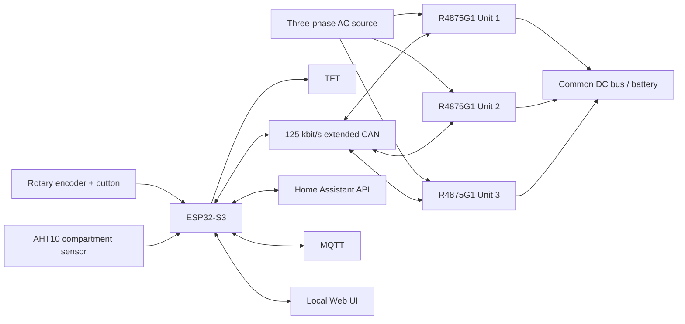

Core charger control remains local; Home Assistant, MQTT, and Wi-Fi are optional.

---

# 2. Boot and Initialization

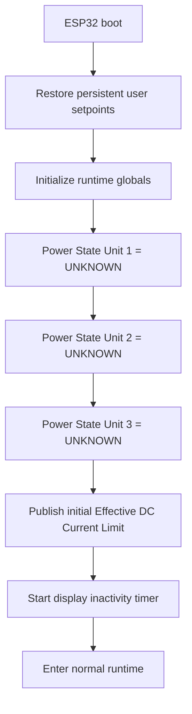

The initial shared current scaling uses the known R4875G1 fallback:

```text
current_scaling_factor = 1024 / 75 ≈ 13.653333
```

---

# 3. Network Independence

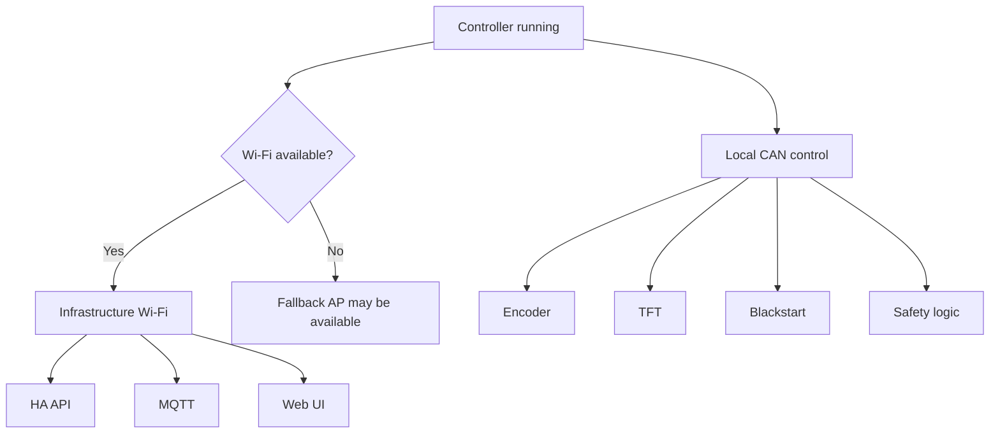

Wi-Fi, API, and MQTT use disabled reboot timeouts, so network failure cannot reboot the charger controller.

---

# 4. Display Backlight / Inactivity

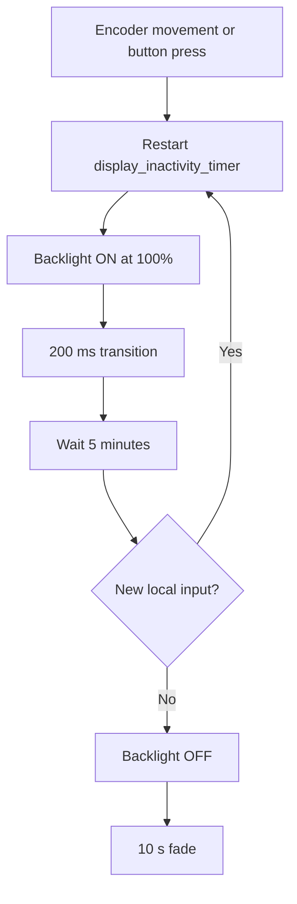

The timer script uses `mode: restart`.

---

# 5. Rotary Encoder

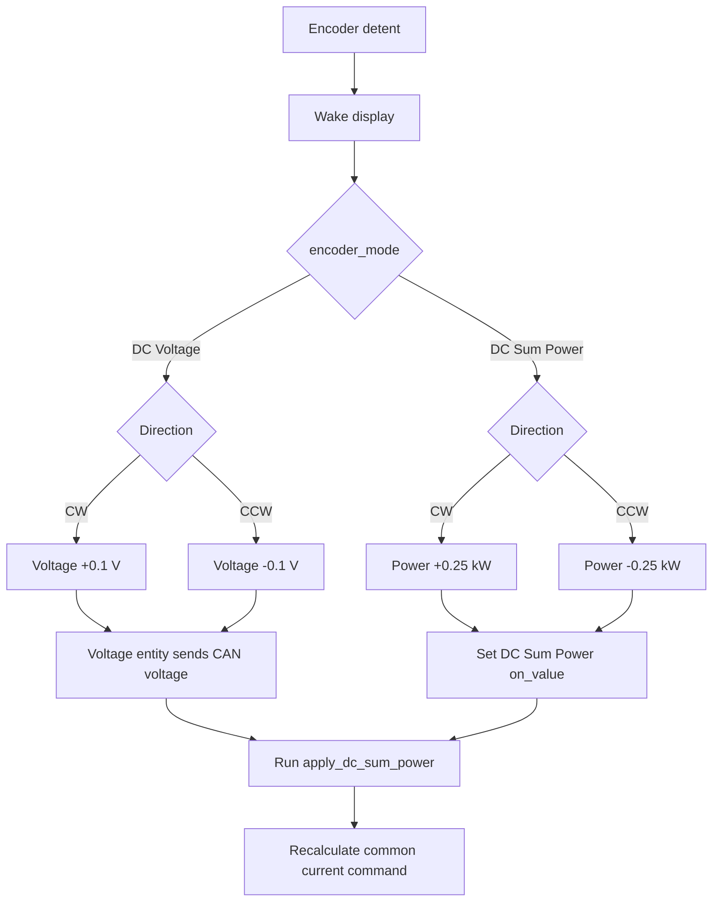

---

# 6. Encoder Push Button

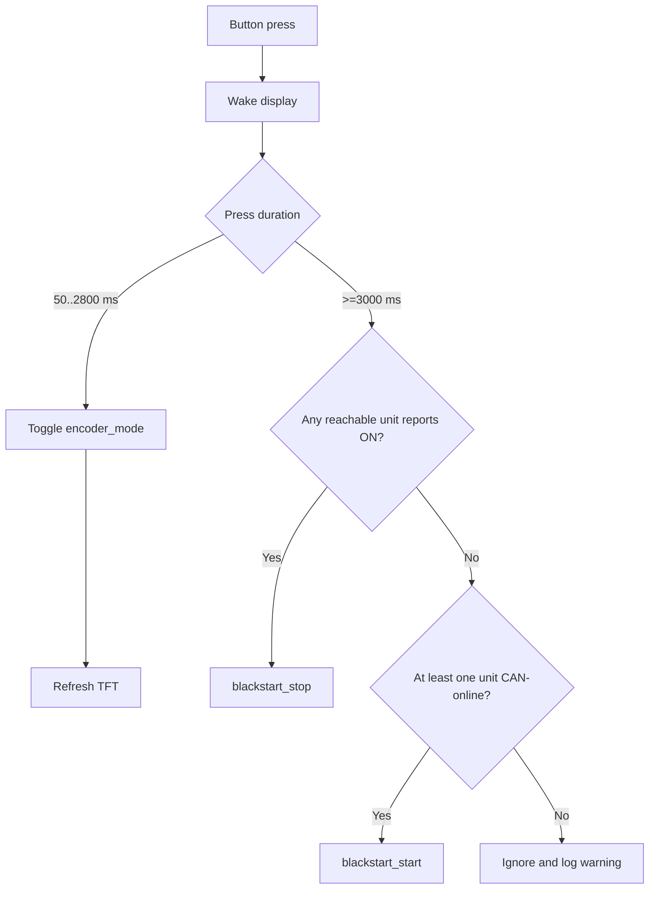

---

# 7. Nominal Three-Unit Power → Current

The fixed formula is:

```text
I_each = P_target / (3 × V_DC)
```

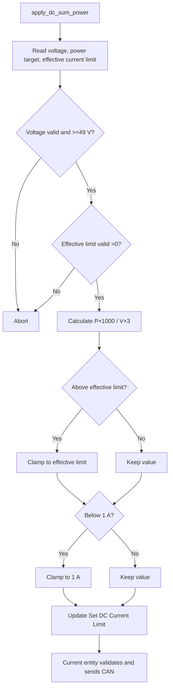

The divisor remains fixed at three even if fewer rectifiers are active:

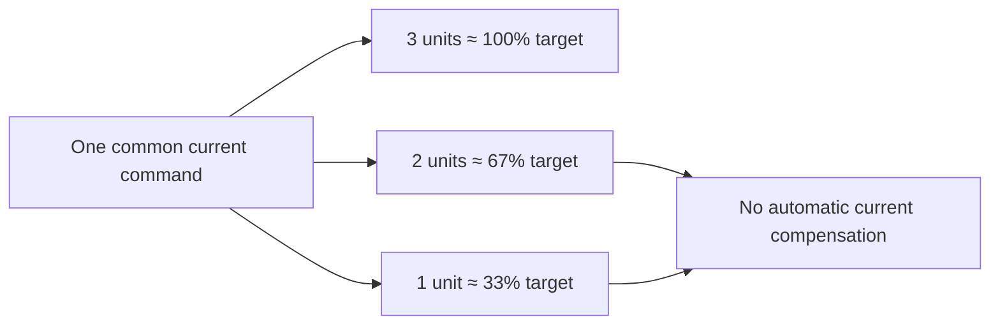

---

# 8. Active and Fallback Setpoints

## Active voltage

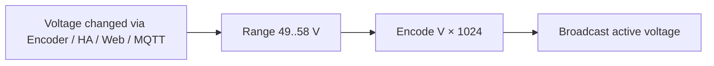

## Active current

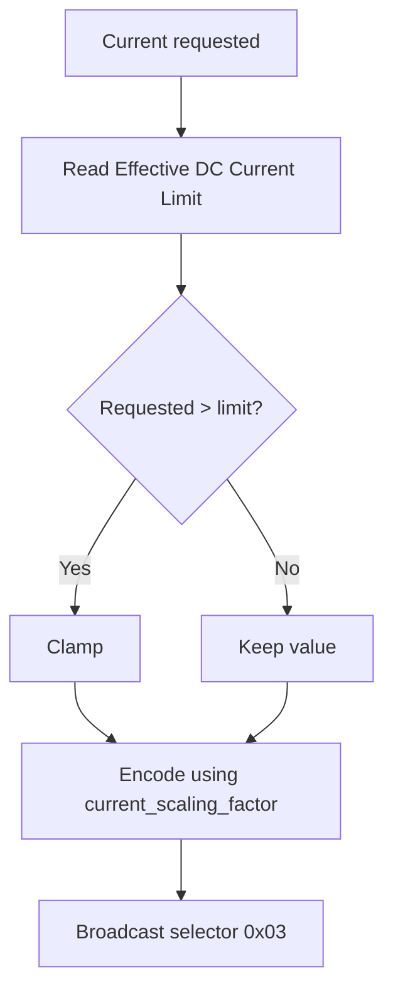

## Fallback voltage


## Fallback current

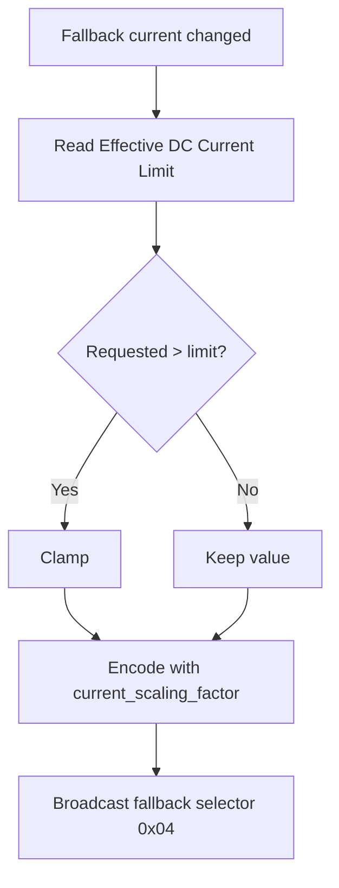

---

# 9. AC Current Limit

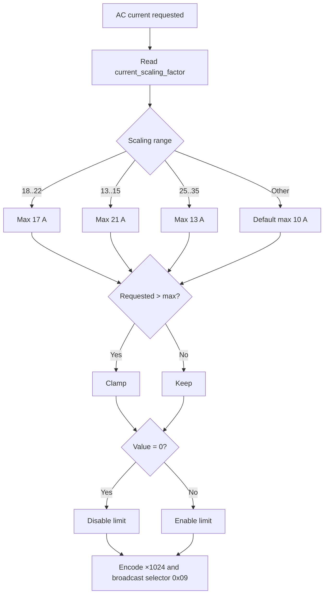

---

# 10. Blackstart START

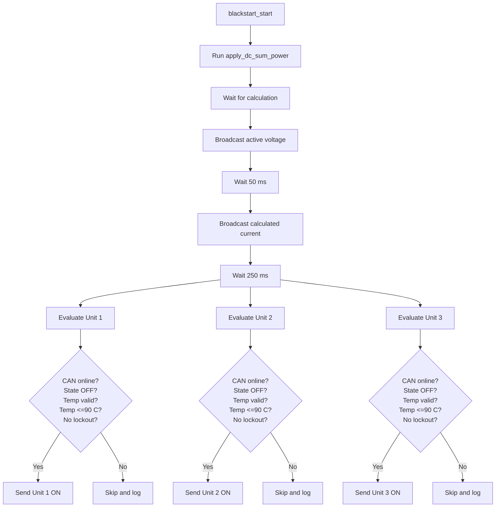

`ERROR` and `UNKNOWN` never satisfy the explicit `OFF` requirement.

---

# 11. Blackstart STOP


STOP has no START-style safety preconditions.

---

# 12. Manual ON/OFF Controls

## Individual ON

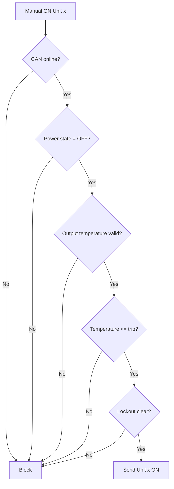

## Broadcast ON

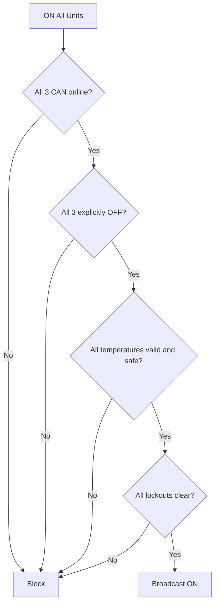

## OFF

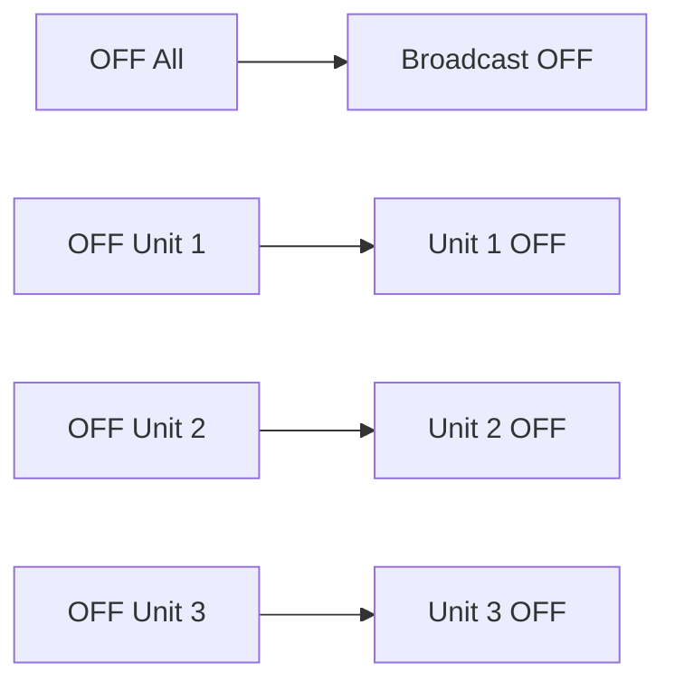

---

# 13. Fan Control

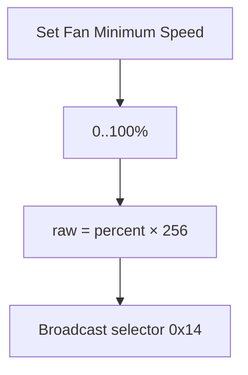

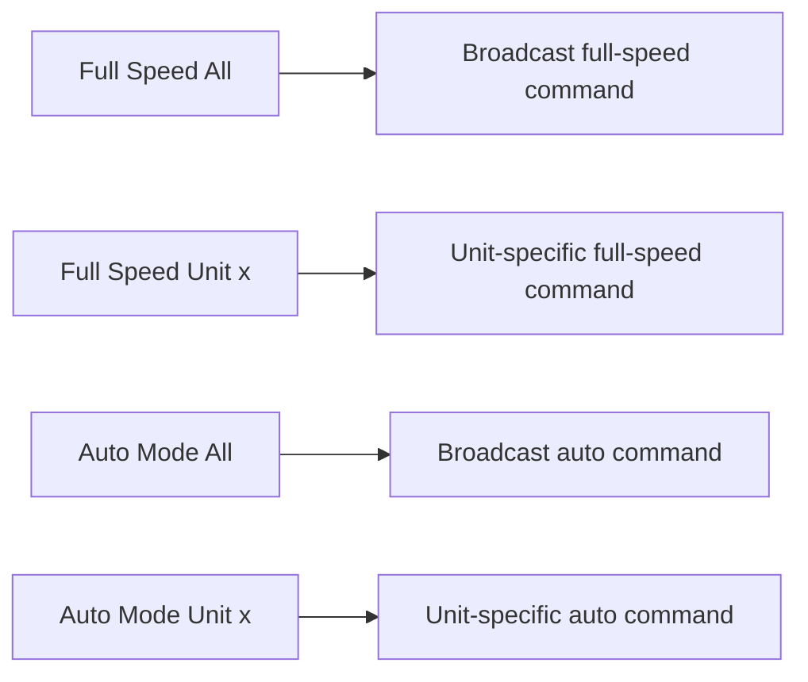

---

# 14. Periodic CAN Polling

```mermaid
flowchart TD
    A[Every 577 ms] --> B{Any property discovery running?}
    B -- Yes --> C[Skip polling cycle]
    B -- No --> D[Unit 1 cyclic telemetry request]
    D --> E[Wait 27 ms]
    E --> F[Unit 1 fan request]
    F --> G[Wait 156 ms]
    G --> H[Unit 2 cyclic telemetry request]
    H --> I[Wait 27 ms]
    I --> J[Unit 2 fan request]
    J --> K[Wait 166 ms]
    K --> L[Unit 3 cyclic telemetry request]
    L --> M[Wait 27 ms]
    M --> N[Unit 3 fan request]
```

Property discovery gets temporary exclusive use of the CAN bus.


---

# 15. Cyclic Telemetry Receive and Decode

Each valid cyclic telemetry frame also acts as the normal CAN heartbeat for that rectifier.

```mermaid
flowchart TD
    A[Receive 0x108x407F] --> B{Frame length >= 8?}
    B -- No --> X[Ignore]
    B -- Yes --> C[last_can_rx_x = millis]
    C --> D{Message class = 0x01?}
    D -- No --> Y[No measurement decode]
    D -- Yes --> E[Read selector]

    E --> P70[0x70 AC power]
    E --> P71[0x71 Grid frequency]
    E --> P72[0x72 AC current]
    E --> P73[0x73 DC power]
    E --> P75[0x75 DC voltage]
    E --> P76[0x76 Max DC current setpoint]
    E --> P78[0x78 AC voltage]
    E --> P7F[0x7F Output temperature]
    E --> P80[0x80 Input temperature]
    E --> P81[0x81 DC current]
    E --> P0E[0x0E Operating hours]

    P70 --> PUB[Publish template sensor]
    P71 --> PUB
    P72 --> PUB
    P73 --> PUB
    P75 --> PUB
    P76 --> PUB
    P78 --> PUB
    P7F --> PUB
    P80 --> PUB
    P81 --> PUB
    P0E --> PUB

    PUB --> S[Apply engineering scaling]
    S --> T[Live values use 5 s freshness timeout]
```

Most engineering values use:

```text
engineering value = raw / 1024
```

---

# 16. Fan Telemetry Receive and Decode

Fan telemetry uses selector `0x01 / 0x87`.

```mermaid
flowchart TD
    A[Receive 0x108x827E] --> B{DLC >= 8?}
    B -- No --> X[Ignore]
    B -- Yes --> C{Selector = 0x01 / 0x87?}
    C -- No --> X

    C -- Yes --> D[Bytes 2..3: minimum duty raw]
    C --> E[Bytes 4..5: duty target raw]
    C --> F[Bytes 6..7: RPM]

    D --> G[Minimum duty % = raw / 256]
    E --> H[Duty target % = raw / 256]
    F --> I[RPM used directly]

    G --> J[Fan Minimum Duty Unit x]
    H --> K[Fan Duty Target Unit x]
    I --> L[Fan RPM Unit x]

    J --> M[5 s freshness timeout]
    K --> M
    L --> M
```

---

# 17. Rectifier Power-State Decode

The alternate status frame `0x100x117E` determines `ON`, `OFF`, or `ERROR`. Communication loss forces the state to `UNKNOWN`.

```mermaid
stateDiagram-v2
    [*] --> UNKNOWN: Controller boot

    UNKNOWN --> ERROR: error byte = 1
    UNKNOWN --> ON: error = 0 and state byte = 0
    UNKNOWN --> OFF: error = 0 and state byte != 0

    ON --> OFF: Valid OFF frame
    ON --> ERROR: Error frame

    OFF --> ON: Valid ON frame
    OFF --> ERROR: Error frame

    ERROR --> ON: Valid ON frame
    ERROR --> OFF: Valid OFF frame

    ON --> UNKNOWN: CAN watchdog timeout
    OFF --> UNKNOWN: CAN watchdog timeout
    ERROR --> UNKNOWN: CAN watchdog timeout
```

This prevents stale state from being used in START decisions.

---

# 18. Per-Unit CAN Watchdog

```mermaid
flowchart TD
    A[Valid per-unit CAN activity] --> B[last_can_rx_x = millis]
    B --> C[Evaluate watchdog]
    C --> D{Timestamp exists and age < 3 s?}

    D -- Yes --> E[CAN Communication Unit x = ON]
    D -- No --> F[CAN Communication Unit x = OFF]

    F --> G[on_release]
    G --> H[Power State Unit x = UNKNOWN]

    E --> I{OFF -> ON transition?}
    I -- No --> J[Remain online]
    I -- Yes --> K[on_press]
    K --> L[Wait 5 s stabilization]
    L --> M{Still online?}
    M -- No --> N[Cancel automatic discovery]
    M -- Yes --> O[Queue discovery for Unit x]
```

Valid watchdog activity includes:

- cyclic telemetry frames,
- property START/DATA frames,
- property END frames.

---

# 19. TWAI Bus-Off Recovery

If the physical CAN bus disappears while the ESP32 continues transmitting, missing acknowledgements can eventually force the TWAI controller into `BUS_OFF`.

```mermaid
flowchart TD
    A[Every 2 s] --> B[Read TWAI controller status]
    B --> C{Status read OK?}

    C -- No --> D[Log warning]
    C -- Yes --> E{TWAI state}

    E -- RUNNING --> F[No action]
    E -- RECOVERING --> F

    E -- BUS_OFF --> G[Log error counters]
    G --> H[twai_initiate_recovery]
    H --> I{Initiation successful?}
    I -- Yes --> J[State becomes RECOVERING]
    I -- No --> K[Log failure]

    E -- STOPPED --> L[twai_start]
    L --> M{Restart successful?}
    M -- Yes --> N[TWAI RUNNING]
    M -- No --> O[Log failure]
```

---

# 20. Complete CAN Disconnect / Reconnect Recovery

This is the end-to-end recovery path verified during physical CAN disconnect testing.

```mermaid
sequenceDiagram
    participant R as Rectifier
    participant B as CAN Bus
    participant T as ESP32 TWAI
    participant W as CAN Watchdog
    participant D as Discovery Queue
    participant S as Setpoint Restore

    R->>B: Normal telemetry
    B->>T: Valid frames
    T->>W: Refresh last_can_rx
    W-->>W: Unit online

    Note over B: CAN cable disconnected

    T->>B: Polling continues
    B--xT: No ACK / no response
    W-->>W: 3 s timeout
    W-->>W: Unit offline
    W-->>W: Power state = UNKNOWN

    T-->>T: TX errors accumulate
    T-->>T: BUS_OFF

    Note over R: Rectifier may use its stored fallback settings

    T-->>T: Periodic status check
    T-->>T: Initiate recovery
    T-->>T: RECOVERING
    T-->>T: STOPPED
    T-->>T: Restart TWAI
    T-->>T: RUNNING

    Note over B: CAN cable reconnected

    T->>B: Next telemetry request
    R->>B: Valid response
    B->>T: RX frame
    T->>W: Refresh last_can_rx
    W-->>W: OFF -> ON
    W->>D: Queue discovery after 5 s
    D->>R: Property discovery
    D->>R: Capability/address discovery
    D->>S: Discovery verified
    S->>R: Reapply active voltage
    S->>R: Reapply active current
```

---

# 21. Static Property Discovery

Each unit has its own property-discovery script.

```mermaid
flowchart TD
    A[detect_unit_x_properties] --> B[properties_complete = false]
    B --> C[Reset retry and frame counters]
    C --> D[Clear property buffer]
    D --> E[Wait 500 ms bus quiet period]

    E --> F{Properties complete?}
    F -- Yes --> G[Success]
    F -- No --> H{Attempts < 3?}
    H -- No --> I[Stop with fail-safe warning]
    H -- Yes --> J[Send 0x108xD2FE property request]
    J --> K[Wait 1 s]
    K --> L[Increment attempt counter]
    L --> F
```

## Property START/DATA and END processing

```mermaid
flowchart TD
    A[START/DATA frame 0x108xD27F] --> B[Refresh CAN watchdog]
    B --> C{Valid protocol START marker?}
    C -- Yes --> D[Clear buffer and counters]
    D --> E[message_started = true]
    C -- No --> F{message_started?}
    E --> F

    F -- Yes --> G[Append 6 payload bytes]
    G --> H[Increment frame counter]
    F -- No --> I[Ignore until valid START]

    J[END frame 0x108xD27E] --> K[Refresh CAN watchdog]
    K --> L[Append remaining payload]
    L --> M{Any START/DATA frames captured?}

    M -- No --> N[Discard incomplete response]
    M -- Yes --> O[Parse key/value fields]

    O --> P[BoardType]
    O --> Q[BarCode]
    O --> R[Item]
    O --> S[Description]
    O --> T[Manufactured]

    P --> U{All required fields present?}
    Q --> U
    R --> U
    S --> U
    T --> U

    U -- Yes --> V[properties_complete = true]
    U -- No --> N
```

---

# 22. Capability and Address Discovery

```mermaid
flowchart TD
    A[detect_data_unit_x] --> B[max_current_found = false]
    B --> C[data_found = false]
    C --> D[search_counter = 0]
    D --> E[Invalidate capability mismatch state]

    E --> F{Both capability and address found?}
    F -- Yes --> G[Stage successful]
    F -- No --> H{Attempts < 10?}
    H -- No --> I[End with warning]
    H -- Yes --> J[Send 0x108x50FE request]
    J --> K[Wait 1 s]
    K --> L[Increment counter]
    L --> F
```

## Maximum-current capability

```mermaid
flowchart TD
    A[Capability response] --> B{DLC = 8?}
    B -- No --> X[Reject]
    B -- Yes --> C{Packet number = 1?}
    C -- No --> Y[Ignore for max-current]
    C -- Yes --> D[max current = byte 5 / 2]
    D --> E{Value > 0?}
    E -- No --> X
    E -- Yes --> F[Publish Max Current Capability Unit x]
    F --> G[max_current_found_x = true]

    G --> H{Unit 1?}
    H -- Yes --> I[current_scaling_factor = 1024 / max current]
    I --> J[Publish Unit 1 scaling diagnostic]
    H -- No --> K[Publish unit-specific diagnostic scaling]
```

## Shelf / slot address

```mermaid
flowchart TD
    A[Address response 0x108x507E] --> B{DLC = 8?}
    B -- No --> X[Reject]
    B -- Yes --> C[Pin 11 = byte 2]
    C --> D[Pin 12 = byte 3]
    D --> E[Publish address diagnostics]
    E --> F{Address values valid?}
    F -- Yes --> G[data_found_x = true]
    F -- No --> H[Keep searching]
```

---

# 23. Per-Unit Discovery Wrapper

```mermaid
flowchart LR
    A[discover_unit_x] --> B[Static properties]
    B --> C[Wait for property script]
    C --> D[Capability / address]
    D --> E[Wait for capability script]
    E --> F[Per-unit discovery finished]
```

---

# 24. Full Manual Discovery Sequence

```mermaid
flowchart LR
    A[setup_sequence] --> B[Discover Unit 1]
    B --> C[Wait]
    C --> D[Discover Unit 2]
    D --> E[Wait]
    E --> F[Discover Unit 3]
    F --> G[Wait]
    G --> H[Full sequence complete]
```

---

# 25. Global Serialized Discovery Queue

All automatic and manual discovery requests use one `mode: queued` worker.

```mermaid
flowchart TD
    A[Discovery request] --> B{unit parameter}

    B -- 0 --> C[Full discovery]
    B -- 1 --> D[Unit 1]
    B -- 2 --> E[Unit 2]
    B -- 3 --> F[Unit 3]
    B -- Other --> G[Log invalid unit]

    C --> H[Run setup_sequence]
    D --> I[Run discover_unit_1]
    E --> J[Run discover_unit_2]
    F --> K[Run discover_unit_3]

    H --> V0{At least one reachable unit fully verified?}
    I --> V1{Unit 1 fully verified?}
    J --> V2{Unit 2 fully verified?}
    K --> V3{Unit 3 fully verified?}

    V0 -- Yes --> R[Reapply active setpoints]
    V1 -- Yes --> R
    V2 -- Yes --> R
    V3 -- Yes --> R

    V0 -- No --> S[Skip immediate restore]
    V1 -- No --> S
    V2 -- No --> S
    V3 -- No --> S

    R --> Z[Queue item complete]
    S --> Z
```

Serialization prevents overlapping large property responses.

---

# 26. Post-Discovery Active Setpoint Restore

```mermaid
flowchart TD
    A[Fully verified discovery] --> B[reapply_active_setpoints]
    B --> C[Read active voltage]
    C --> D[Read active current]
    D --> E[Read current_scaling_factor]

    E --> F{Voltage in range?<br/>Current >=1 A?<br/>Scaling valid >0?}
    F -- No --> G[Skip and log warning]
    F -- Yes --> H[Broadcast active voltage]
    H --> I[Wait 50 ms]
    I --> J[Broadcast active current]
    J --> K[Log success]
```

This path restores normal active setpoints immediately after reconnect instead of waiting for the next 30-second refresh.

It does **not** send an ON command.

---

# 27. Effective DC Current Limit

```mermaid
flowchart TD
    A[Capability data changes] --> B[Start from 75 A project ceiling]
    B --> C[Inspect valid Unit 1 capability]
    C --> D[Inspect valid Unit 2 capability]
    D --> E[Inspect valid Unit 3 capability]
    E --> F[effective limit = minimum valid capability]
    F --> G[Publish Effective DC Current Limit]

    G --> H{Active current > new limit?}
    H -- Yes --> I[Reduce active current]
    I --> J[Current CAN command sent]

    G --> K{Fallback current > new limit?}
    K -- Yes --> L[Reduce fallback current]
    L --> M[Fallback CAN command sent]
```

The effective limit is shared by direct current control, fallback current, and power-to-current conversion.


---

# 28. Rectifier Capability Consistency

```mermaid
flowchart TD
    A[Evaluate capabilities] --> B{All 3 capability flags found?}
    B -- No --> C[Capability Mismatch = UNKNOWN]
    B -- Yes --> D{All values numeric?}
    D -- No --> C
    D -- Yes --> E[Compare each pair with 0.25 A tolerance]
    E --> F{Any difference >0.25 A?}
    F -- Yes --> G[Capability Mismatch = ON]
    G --> H[Log error with all values]
    F -- No --> I[Capability Mismatch = OFF]
    I --> J[Log matching values]
```

The diagnostic does not itself inhibit charger operation. Unit 1 remains the canonical source of shared current scaling.

---

# 29. Overtemperature Protection

Each rectifier has its own output-temperature lockout.

```mermaid
stateDiagram-v2
    [*] --> NORMAL
    NORMAL --> LOCKOUT: Valid temperature > 90 °C
    LOCKOUT --> LOCKOUT: 80..90 °C
    LOCKOUT --> LOCKOUT: Temperature unavailable
    LOCKOUT --> NORMAL: Valid temperature < 80 °C
```

Detailed action flow:

```mermaid
flowchart TD
    A[New Output Temperature Unit x] --> B{Numeric?}
    B -- No --> C[Do not clear lockout]
    B -- Yes --> D{Lockout false AND temp >90 °C?}
    D -- Yes --> E[Set lockout = true]
    E --> F[Send individual OFF]
    F --> G[Future ON blocked]

    D -- No --> H{Lockout true AND temp <80 °C?}
    H -- Yes --> I[Clear lockout]
    H -- No --> J[Keep current state]
```

Missing or stale temperature data never clears an active lockout.

---

# 30. CAN-Aware Aggregate Sensors

Offline or invalid units are excluded instead of contributing stale values.

```mermaid
flowchart TD
    A[Evaluate aggregate] --> B[Inspect each unit]
    B --> C{CAN online AND required value numeric?}
    C -- Yes --> D[Include unit]
    C -- No --> E[Exclude unit]
    D --> F{More units?}
    E --> F
    F -- Yes --> B
    F -- No --> G{Any valid units?}
    G -- No --> H[Return unavailable / NAN]
    G -- Yes --> I[Calculate aggregate]
```

`Available Units` is the exception: it returns `0` when no units are reachable.

Aggregate operations:

```mermaid
flowchart LR
    A[Valid reachable units] --> B[Combined AC Power = sum]
    A --> C[Combined DC Power = sum]
    A --> D[Combined DC Current = sum]
    A --> E[Average DC Voltage = average]
    A --> F[Highest Output Temperature = max]
    A --> G[Available Units = count]

    B --> H[Conversion Efficiency]
    C --> H
    H --> I{Paired AC/DC data valid<br/>and AC power >=100 W?}
    I -- Yes --> J[DC / AC × 100%]
    I -- No --> K[Unavailable]
```

---

# 31. TFT Rendering

The TFT refreshes every 500 ms.

## AC overview

```mermaid
flowchart TD
    A[TFT refresh] --> B[Inspect Units 1..3]
    B --> C{CAN online and all required AC values valid?}
    C -- Yes --> D[Include in sums / averages]
    C -- No --> E[Exclude]
    D --> F{At least one valid unit?}
    E --> F
    F -- Yes --> G[Show AC power sum]
    G --> H[Show average voltage/current/frequency]
    H --> I[Show contributing unit count x/3]
    F -- No --> J[Show AC CAN fault]
```

## DC overview

```mermaid
flowchart TD
    A[Evaluate DC header] --> B[Count CAN-online units with valid DC power]
    B --> C{Count >0 and combined DC power valid?}
    C -- Yes --> D[Show DC kW and x/3]
    C -- No --> E[Show DC CAN fault]
```

## Per-unit line

A numeric line is rendered only when all five values are available:

- DC voltage,
- DC current,
- DC power,
- input temperature,
- output temperature.

```mermaid
flowchart TD
    A[Render Unit x] --> B{CAN online?}
    B -- No --> C[CAN bus communication fault]
    B -- Yes --> D{All 5 values numeric?}
    D -- No --> E[Telemetry incomplete]
    D -- Yes --> F[Render numeric line]
```

## Charger state

```mermaid
flowchart TD
    A[Count reachable units whose power state = ON] --> B{Count}
    B -- 0 --> C[OFF]
    B -- 1 --> D[1/3 ON]
    B -- 2 --> E[2/3 ON]
    B -- 3 --> F[3/3 ON]
```

---

# 32. Daily Energy Counters

```mermaid
flowchart TD
    A[Combined AC Power] --> B[AC total_daily_energy]
    C[Combined DC Power] --> D[DC total_daily_energy]
    E[SNTP Europe/Berlin time] --> B
    E --> D
    B --> F[AC Energy Today]
    D --> G[DC Energy Today]
    E --> H[Midnight]
    H --> I[Start new daily accumulation period]
```

Because combined power excludes disconnected units, stale power does not continue accumulating into daily totals.

---

# 33. Rectifier Compartment Sensor

The AHT10 is installed in the common rear connection compartment behind the three rectifiers.

```mermaid
flowchart LR
    U1[Warm airflow Unit 1] --> C[Shared rear compartment]
    U2[Warm airflow Unit 2] --> C
    U3[Warm airflow Unit 3] --> C
    C --> AHT[AHT10]
    AHT --> T[Rectifier Compartment Temperature]
    AHT --> H[Rectifier Compartment Humidity]
    T --> UI[HA / API / Web]
    H --> UI
```

The temperature is therefore a shared compartment-air measurement, not room temperature and not an internal temperature of one specific rectifier.

Update interval: 60 seconds.

---

# 34. Periodic Active Setpoint Refresh

Voltage and current are also reasserted every 30 seconds.

```mermaid
flowchart TD
    A[30 s voltage interval] --> B[Read active voltage]
    B --> C[Encode ×1024]
    C --> D[Broadcast active voltage]

    E[30 s current interval] --> F[Read active current]
    F --> G[Encode with current_scaling_factor]
    G --> H[Broadcast active current]
```

This remains a fallback mechanism for restarted units, late-joining units, missed commands, or incomplete reconnect/discovery cases.

---

# 35. Safety and Behavioral Invariants

## START is fail-safe

```mermaid
flowchart LR
    A[START requested] --> B[CAN valid]
    B --> C[Explicit OFF state]
    C --> D[Fresh temperature]
    D --> E[Temperature safe]
    E --> F[No lockout]
    F --> G[ON allowed]
```

`UNKNOWN` and `ERROR` never count as `OFF`.

## STOP remains available

```mermaid
flowchart LR
    A[STOP requested] --> B[Send OFF]
```

## CAN connectivity and telemetry freshness are separate

```mermaid
flowchart TD
    A[CAN watchdog] --> B{Valid CAN activity <3 s?}
    B -- No --> C[Unit offline]
    B -- Yes --> D[Unit reachable]

    D --> E{Live sensor refreshed <5 s?}
    E -- Yes --> F[Telemetry valid]
    E -- No --> G[Telemetry unavailable]

    C --> H[CAN communication fault]
    G --> I[Telemetry incomplete]
```

## Discovery is serialized

```mermaid
flowchart LR
    A[Unit 1 request] --> Q[Global discovery queue]
    B[Unit 2 request] --> Q
    C[Unit 3 request] --> Q
    D[Manual full request] --> Q
    Q --> E[One discovery operation at a time]
    E --> F[Next queued request]
```

## Reconnect does not require an ESP reboot

```mermaid
flowchart LR
    A[CAN unavailable] --> B[TWAI may enter BUS_OFF]
    B --> C[Automatic TWAI recovery]
    C --> D[Polling resumes]
    D --> E[Watchdog detects online transition]
    E --> F[Automatic discovery]
    F --> G[Capability verified]
    G --> H[Active setpoints restored]
```

---

# 36. End-to-End Runtime Summary

```mermaid
flowchart TD
    A[ESP32 running] --> B[Periodic CAN polling]
    B --> C[Telemetry received]
    C --> D[Watchdog online]
    D --> E[Decode and publish live values]
    E --> F[Aggregate sensors]
    E --> G[TFT]
    E --> H[Home Assistant / Web / MQTT]

    I[Local encoder / button] --> J[Setpoints or START/STOP]
    J --> K[Safety validation]
    K --> L[CAN commands]

    C --> M[Capability / property discovery when triggered]
    M --> N[Effective current limit]
    N --> O[Current clamping / scaling]

    P[CAN failure] --> Q[Watchdog offline]
    P --> R[TWAI Bus-Off recovery if required]
    R --> S[CAN returns]
    S --> T[Automatic discovery]
    T --> U[Immediate active setpoint restore]
```

The resulting architecture follows five core principles:

1. **Local operation remains available without network infrastructure.**
2. **START decisions fail safe when communication, state, or temperature is uncertain.**
3. **Stale telemetry is excluded from display, aggregation, and control decisions.**
4. **Discovery and capability information constrain the common current command.**
5. **Complete CAN failure can recover automatically without rebooting the ESP32.**

---

## Source

Behavior documented from the current `main` branch implementation in:

```text
r4875g1-3phase-charger.yaml
```

Document generated on 2026-08-23.
