# R4875G1 Three-Phase Charger — Control and Runtime Flows

This document describes the control flows, lifecycle state transitions, CAN recovery paths, discovery sequence, current-capability handling, setpoint routing, safety checks, telemetry processing, and local user-interface behavior implemented by the modular `r4875g1-3phase-charger.yaml` + `packages/` firmware source.

It is synchronized with firmware version **3.0.6** on `main` as of **2026-08-29**. Runtime behaviour remains equivalent to the validated v3.0.4 baseline; this patch only removes an unused include variable and updates documentation.

> **Scope:** This is behavioral firmware documentation, not an electrical safety specification. Fuses, breakers, contactors, BMS protection, earthing, isolation, conductor sizing and other hardware protection remain independent of the firmware.

---

## Runtime constants

| Function | Current value |
|---|---:|
| Project DC current ceiling | 75 A per rectifier |
| Minimum DC current command | 1 A |
| DC voltage range | 49–58 V |
| Default DC voltage | 53 V |
| Overtemperature trip / reset | 90 °C / 80 °C |
| Raw CAN watchdog | 3 s |
| Lifecycle reconciliation | 1 s |
| Live telemetry freshness | 5 s |
| Fast polling cycle | 577 ms |
| Fan query delay | 27 ms |
| Offline probe slot | 5 s |
| Maximum probe interval per unit | ≈15 s |
| TWAI recovery check | 2 s |
| Periodic active-setpoint refresh | 30 s |
| Reconnect discovery stabilization | 5 s |
| Post-property polling grace | 2 s |
| Property bus quiet period | 500 ms |
| Property / capability attempts | 3 / 10 |
| Discovery retry delay | 1 s |
| TWAI RX queue | 64 frames |
| General protocol scale | 1024 |
| Fan duty scale | 256 counts/% |
| Display refresh / inactivity | 500 ms / 5 min |

---

# 1. System architecture

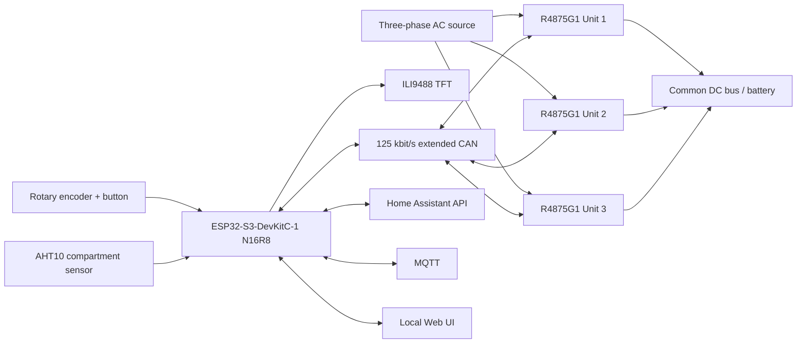
```mermaid
flowchart LR
    AC[Three-phase AC source] --> U1[R4875G1 Unit 1]
    AC --> U2[R4875G1 Unit 2]
    AC --> U3[R4875G1 Unit 3]

    U1 --> DCBUS[Common DC bus / battery]
    U2 --> DCBUS
    U3 --> DCBUS

    ENC[Rotary encoder + button] --> ESP[ESP32-S3-DevKitC-1 N16R8]
    AHT[AHT10 compartment sensor] --> ESP
    ESP --> TFT[ILI9488 TFT]

    ESP <--> CAN[125 kbit/s extended CAN]
    CAN <--> U1
    CAN <--> U2
    CAN <--> U3

    ESP <--> HA[Home Assistant API]
    ESP <--> MQTT[MQTT]
    ESP <--> WEB[Local Web UI]
```

Core charger control remains local. Wi-Fi, Home Assistant and MQTT are optional for operation.

## Firmware module ownership

The runtime diagrams below describe the assembled ESPHome configuration. Source ownership in v3 is:

| Source | Primary responsibility |
|---|---|
| `r4875g1-3phase-charger.yaml` | substitutions, three unit instances, device identity, boot safety sequence |
| `packages/core.yaml` | ESP32/network/API/MQTT/web/controller diagnostics |
| `packages/hardware.yaml` | shared I²C/SPI hardware buses |
| `packages/display.yaml` | TFT, fonts, colors and display/backlight logic |
| `packages/cooling.yaml` | external chassis fan power/PWM/tach |
| `packages/controls.yaml` | charger-wide user controls |
| `packages/rectifier-unit.yaml` | parameterized per-unit state, entities, discovery, watchdog and controls |
| `packages/rectifier-shared.yaml` | cross-unit orchestration, current/thermal coordination, schedulers, CAN controller |
| `packages/rectifier-can/*.yaml` | parameterized identical per-unit CAN RX handler families |

The shared lifecycle, discovery queue, blackstart coordination, polling cadence, Single-Shot reconnect probing, TWAI recovery and aggregate current/thermal decisions remain explicit rather than being hidden behind a generic unit loop.

---

Controller hardware target: **Espressif ESP32-S3-DevKitC-1** with **ESP32-S3-WROOM-1-N16R8**, 16 MB Quad-SPI flash and 8 MB Octal-SPI PSRAM. GPIO assignments are centralized in YAML substitutions. Current map: encoder button 2; TFT backlight 4; TFT control 5/6/7; I2C 8/9; TFT SPI 11/12/13; CAN 15/16; encoder 17/18; cooling fan enable 21; cooling fan tach 39/40/41; cooling fan PWM 42. Strapping pins 0/3/45/46, native USB/JTAG 19/20 and Octal-memory GPIO33–37 remain unused.

---

# External cooling-fan baseline

The external/chassis fan control is independent of the R4875G1 internal fan commands.

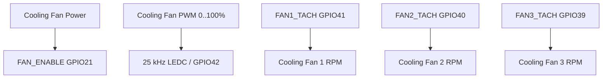
```mermaid
flowchart TD
    A[Cooling Fan Power] --> B[FAN_ENABLE GPIO21]
    C[Cooling Fan PWM 0..100%] --> D[25 kHz LEDC / GPIO42]
    E[FAN1_TACH GPIO41] --> R1[Cooling Fan 1 RPM]
    F[FAN2_TACH GPIO40] --> R2[Cooling Fan 2 RPM]
    G[FAN3_TACH GPIO39] --> R3[Cooling Fan 3 RPM]
```

On boot a 100% PWM command is applied first and the common fan supply is then enabled. The persistent PWM number may subsequently restore another configured value. Tach conversion assumes two pulses per revolution. No automatic temperature curve or fan-failure alarm is implemented yet.

---

# 2. Per-unit lifecycle state machine

The operational lifecycle is deliberately separate from raw CAN reachability.

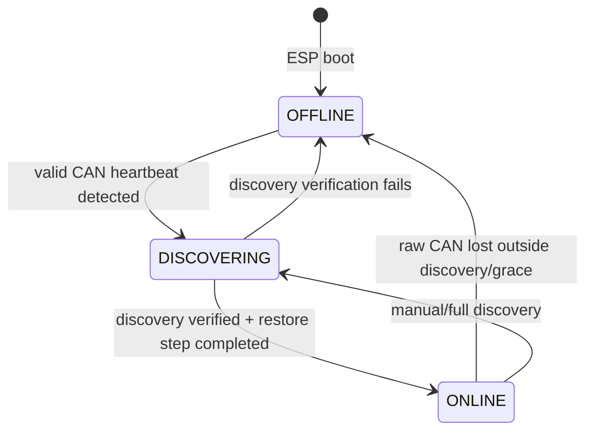
```mermaid
stateDiagram-v2
    [*] --> OFFLINE: ESP boot
    OFFLINE --> DISCOVERING: valid CAN heartbeat detected
    DISCOVERING --> ONLINE: discovery verified + restore step completed
    DISCOVERING --> OFFLINE: discovery verification fails
    ONLINE --> OFFLINE: raw CAN lost outside discovery/grace
    ONLINE --> DISCOVERING: manual/full discovery
```

Meaning:

- **OFFLINE** — no operationally released communication; excluded from fast polling and START.
- **DISCOVERING** — communication has been detected, but property/capability/address validation and the post-discovery restore step have not yet completed.
- **ONLINE** — discovery verification succeeded and the post-discovery restore script has completed, so the unit is released for normal polling, active setpoint traffic and START decisions.

The discovery queue waits for `reapply_active_setpoints` to complete before changing the lifecycle to `ONLINE`. It does not separately inspect a CAN acknowledgement/result for those restore commands.

---

# 3. Boot and initialization

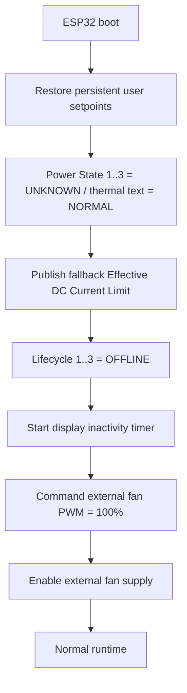
```mermaid
flowchart TD
    A[ESP32 boot] --> B[Restore persistent user setpoints]
    B --> C[Power State 1..3 = UNKNOWN / thermal text = NORMAL]
    C --> D[Publish fallback Effective DC Current Limit]
    D --> E[Lifecycle 1..3 = OFFLINE]
    E --> F[Start display inactivity timer]
    F --> G[Command external fan PWM = 100%]
    G --> H[Enable external fan supply]
    H --> I[Normal runtime]
```

Initial current scaling:

```text
current_scaling_factor = 1024 / 75
                       ≈ 13.653333
```

Unit 1 capability discovery can replace this fallback at runtime.

---

# 4. CAN transport strategy

The v3 hardware-test candidate retains the v2.2.2 rule: **Single-Shot is used only for slow OFFLINE reconnect probes**.

## OFFLINE probe transport

`send_single_shot_offline_probe` bypasses normal ESPHome CAN transmission and uses:

```text
TWAI_MSG_FLAG_EXTD | TWAI_MSG_FLAG_SS
```

This prevents automatic hardware retransmission of an unacknowledged reconnect probe when a rectifier or the complete CAN bus is absent.

## Normal ESPHome CAN transport

The following traffic uses normal ESPHome `canbus.send`:

- online cyclic telemetry polling,
- online fan telemetry polling,
- static property discovery,
- capability/address discovery,
- normal active voltage/current setpoints,
- reconnect active-setpoint restore,
- ON/OFF commands,
- fallback and other broadcast configuration commands.

`BUS_OFF` recovery therefore remains relevant as a final controller-level recovery mechanism.

---

# 5. Normal fast polling

Fast polling runs every 577 ms while no static property-discovery script is active.

Only lifecycle-`ONLINE` units participate.

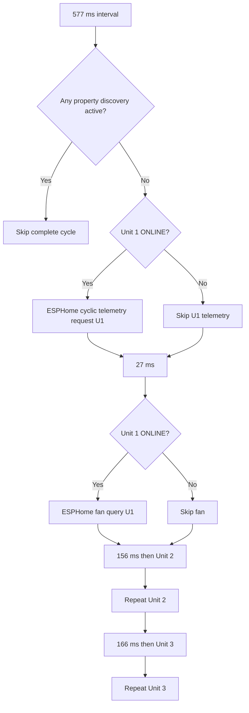
```mermaid
flowchart TD
    A[577 ms interval] --> B{Any property discovery active?}
    B -- Yes --> X[Skip complete cycle]
    B -- No --> U1{Unit 1 ONLINE?}
    U1 -- Yes --> Q1[ESPHome cyclic telemetry request U1]
    U1 -- No --> S1[Skip U1 telemetry]
    Q1 --> W1[27 ms]
    S1 --> W1
    W1 --> F1{Unit 1 ONLINE?}
    F1 -- Yes --> FAN1[ESPHome fan query U1]
    F1 -- No --> SF1[Skip fan]
    FAN1 --> G2[156 ms then Unit 2]
    SF1 --> G2
    G2 --> U2[Repeat Unit 2]
    U2 --> G3[166 ms then Unit 3]
    G3 --> U3[Repeat Unit 3]
```

There is no separate TWAI-state or TX-error-counter gate in the current 577-ms polling condition. Controller-level `BUS_OFF`/`STOPPED` handling is performed by the independent TWAI recovery task.

---

# 6. Raw CAN watchdog and lifecycle reconciliation

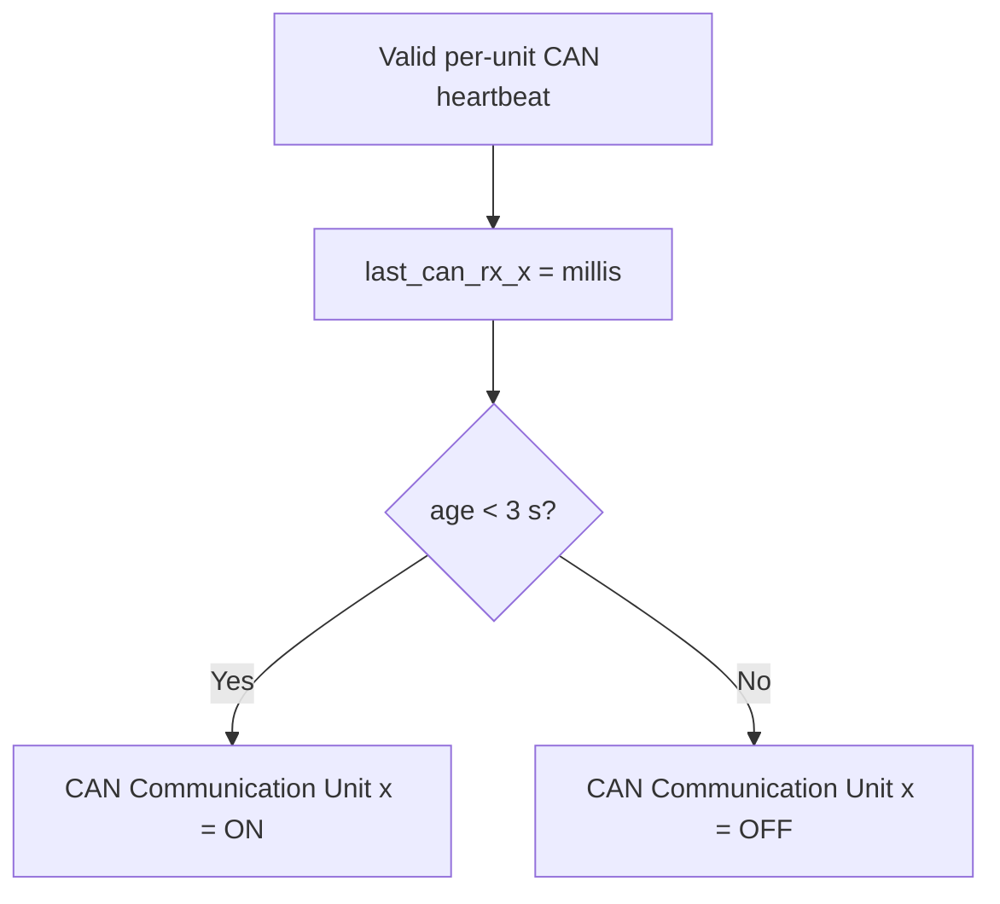
```mermaid
flowchart TD
    A[Valid per-unit CAN heartbeat] --> B[last_can_rx_x = millis]
    B --> C{age < 3 s?}
    C -- Yes --> D[CAN Communication Unit x = ON]
    C -- No --> E[CAN Communication Unit x = OFF]
```

Normal cyclic telemetry is the regular heartbeat. Valid property START/DATA and END frames also refresh it while property discovery temporarily suspends cyclic polling. Valid capability/address responses refresh the corresponding unit timestamp as well.

A separate 1-second reconciliation task demotes lifecycle `ONLINE -> OFFLINE` only when raw CAN is false, no static property discovery is active and the 2-second post-property grace has expired. The CAN-reported power state is then set to `UNKNOWN`.

---

# 7. Slow probing of OFFLINE units

One probe slot runs every five seconds in round-robin order:

```text
Unit 1 → Unit 2 → Unit 3 → Unit 1 → ...
```

A request is transmitted only if the selected unit is `OFFLINE`.

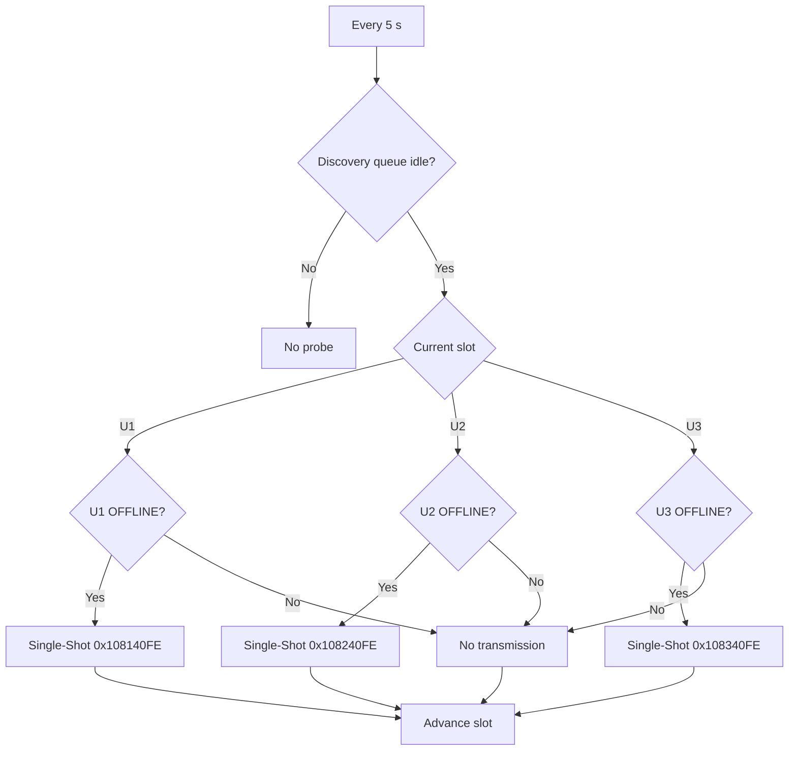
```mermaid
flowchart TD
    A[Every 5 s] --> B{Discovery queue idle?}
    B -- No --> X[No probe]
    B -- Yes --> C{Current slot}
    C -- U1 --> D{U1 OFFLINE?}
    C -- U2 --> E{U2 OFFLINE?}
    C -- U3 --> F{U3 OFFLINE?}
    D -- Yes --> Q1[Single-Shot 0x108140FE]
    E -- Yes --> Q2[Single-Shot 0x108240FE]
    F -- Yes --> Q3[Single-Shot 0x108340FE]
    D -- No --> N[No transmission]
    E -- No --> N
    F -- No --> N
    Q1 --> A2[Advance slot]
    Q2 --> A2
    Q3 --> A2
    N --> A2
```

A continuously offline unit is therefore probed about every 15 seconds in a three-slot installation. Fan telemetry is not requested from offline units.

---

# 8. Reconnect trigger and stabilization

A raw CAN OFF→ON edge starts automatic reconnect handling only when the lifecycle is `OFFLINE`.

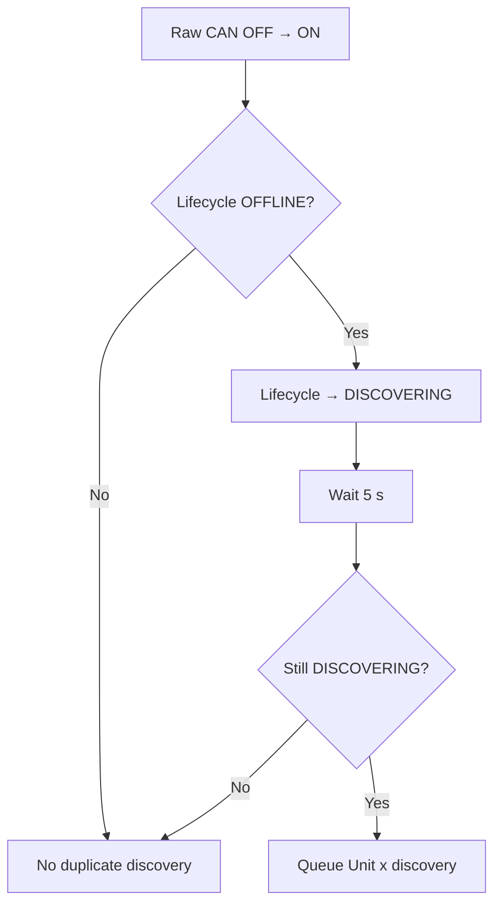
```mermaid
flowchart TD
    A[Raw CAN OFF → ON] --> B{Lifecycle OFFLINE?}
    B -- No --> X[No duplicate discovery]
    B -- Yes --> C[Lifecycle → DISCOVERING]
    C --> D[Wait 5 s]
    D --> E{Still DISCOVERING?}
    E -- No --> X
    E -- Yes --> F[Queue Unit x discovery]
```

The first returned CAN frame proves reachability, not operational readiness.

---

# 9. Static property discovery

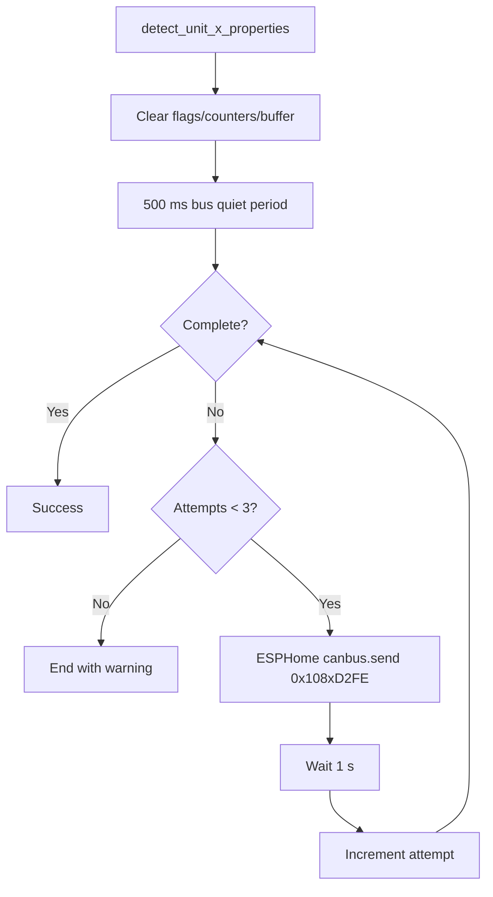
```mermaid
flowchart TD
    A[detect_unit_x_properties] --> B[Clear flags/counters/buffer]
    B --> C[500 ms bus quiet period]
    C --> D{Complete?}
    D -- Yes --> OK[Success]
    D -- No --> E{Attempts < 3?}
    E -- No --> FAIL[End with warning]
    E -- Yes --> F[ESPHome canbus.send 0x108xD2FE]
    F --> G[Wait 1 s]
    G --> H[Increment attempt]
    H --> D
```

The response is assembled from `0x108xD27F` START/DATA frames and a `0x108xD27E` END frame. Required parsed keys are:

- `BoardType`
- `BarCode`
- `Item`
- `Description`
- `Manufactured`

The tested R4875G1 produced **56 captured property frames**. The firmware uses a **64-frame TWAI RX queue**.

---

# 10. Capability and address discovery

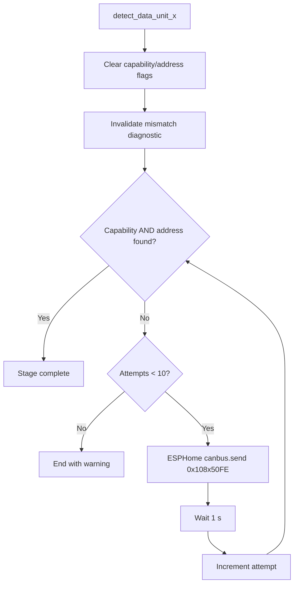
```mermaid
flowchart TD
    A[detect_data_unit_x] --> B[Clear capability/address flags]
    B --> C[Invalidate mismatch diagnostic]
    C --> D{Capability AND address found?}
    D -- Yes --> OK[Stage complete]
    D -- No --> E{Attempts < 10?}
    E -- No --> FAIL[End with warning]
    E -- Yes --> F[ESPHome canbus.send 0x108x50FE]
    F --> G[Wait 1 s]
    G --> H[Increment attempt]
    H --> D
```

Maximum-current capability is decoded from capability packet 1:

```text
maximum_current_A = capability_byte_5 / 2
```

The tested reduced-current R4875G1 configuration reports **52.0 A**.

---

# 11. Effective DC current limit

```text
effective_dc_current_limit
  = min(75 A project ceiling, every valid detected capability)
```

This is the hardware/capability ceiling. It constrains the **applied** active current and the rectifier fallback-current configuration. The active requested-current number is preserved even when it is temporarily above this ceiling.

Nominal three-unit power conversion calculates a requested per-unit current; hardware and thermal limits are applied only when the active CAN current command is encoded.

---

# 12. Current command scaling

Unit 1 is the canonical source:

```text
current_scaling_factor = 1024 / Unit_1_max_current
raw_current = int(I_command × current_scaling_factor)
```

For 52 A:

```text
1024 / 52 ≈ 19.6923077
```

Verified values:

| Setpoint | Raw decimal | Raw hex |
|---:|---:|---:|
| 10 A | 196 | `0x00C4` |
| 20 A | 393 | `0x0189` |
| 30 A | 590 | `0x024E` |
| 40 A | 787 | `0x0313` |
| 50 A | 984 | `0x03D8` |

For 3 kW at 55.4 V with the fixed three-unit divisor:

```text
I_each = 3000 / (55.4 × 3) ≈ 18.0505 A
raw = int(18.0505 × 1024 / 52) = 355 = 0x0163
```

Unit 2 and Unit 3 capabilities participate in the effective ceiling and mismatch diagnostic, but do not replace Unit 1 as the shared scaling source.

---

# 13. Capability mismatch

After all three capability values are valid, the firmware compares them pairwise with 0.25 A tolerance.

```text
unknown = not all three known
OFF     = capabilities match
ON      = at least one differs
```

The diagnostic does not inhibit operation automatically.

---

# 14. Serialized discovery queue

All automatic and manual discoveries share one queued worker.

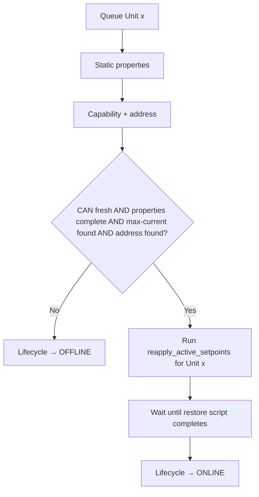
```mermaid
flowchart TD
    A[Queue Unit x] --> B[Static properties]
    B --> C[Capability + address]
    C --> D{CAN fresh AND properties complete AND max-current found AND address found?}
    D -- No --> E[Lifecycle → OFFLINE]
    D -- Yes --> F[Run reapply_active_setpoints for Unit x]
    F --> G[Wait until restore script completes]
    G --> H[Lifecycle → ONLINE]
```

For manual full discovery, all three lifecycle states are first set to `DISCOVERING`, then Unit 1, Unit 2 and Unit 3 are processed sequentially.

Important implementation detail: lifecycle promotion depends on discovery verification and completion of the restore script. The discovery queue does **not** perform an additional CAN acknowledgement check for the restore frames before setting `ONLINE`.

---

# 15. Post-discovery active-setpoint restore

`reapply_active_setpoints(unit)` validates stored active voltage/current/scaling, then invokes the normal unit-specific setpoint scripts.

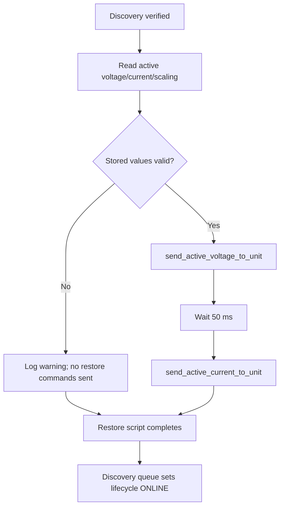
```mermaid
flowchart TD
    A[Discovery verified] --> B[Read active voltage/current/scaling]
    B --> C{Stored values valid?}
    C -- No --> D[Log warning; no restore commands sent]
    C -- Yes --> E[send_active_voltage_to_unit]
    E --> F[Wait 50 ms]
    F --> G[send_active_current_to_unit]
    D --> H[Restore script completes]
    G --> H
    H --> I[Discovery queue sets lifecycle ONLINE]
```

The restore uses normal ESPHome CAN transmission via the existing unit-specific active-setpoint helpers. It does not send an ON command.

---

# 16. Normal active-setpoint routing

Normal active voltage/current changes are routed only to rectifiers that are both:

- lifecycle `ONLINE`, and
- raw CAN fresh.

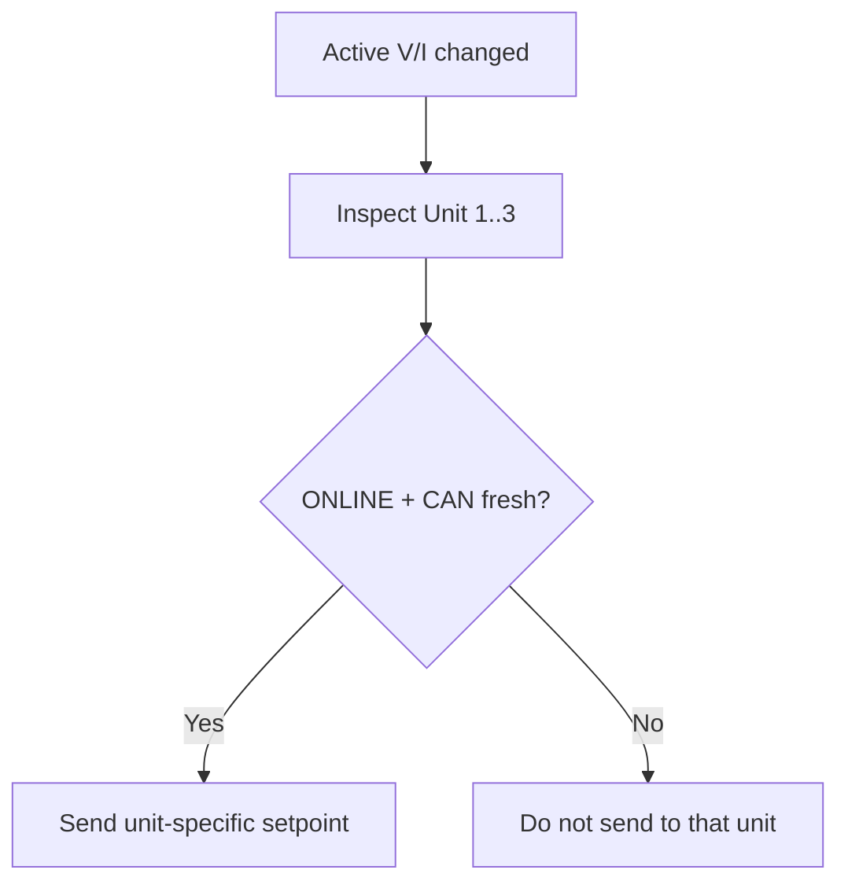
```mermaid
flowchart TD
    A[Active V/I changed] --> B[Inspect Unit 1..3]
    B --> C{ONLINE + CAN fresh?}
    C -- Yes --> D[Send unit-specific setpoint]
    C -- No --> E[Do not send to that unit]
```

Fallback voltage/current remain broadcast configuration commands using `0x108080FE` selectors `0x01` and `0x04`.

---

# 17. Periodic active-setpoint refresh

Every 30 seconds:

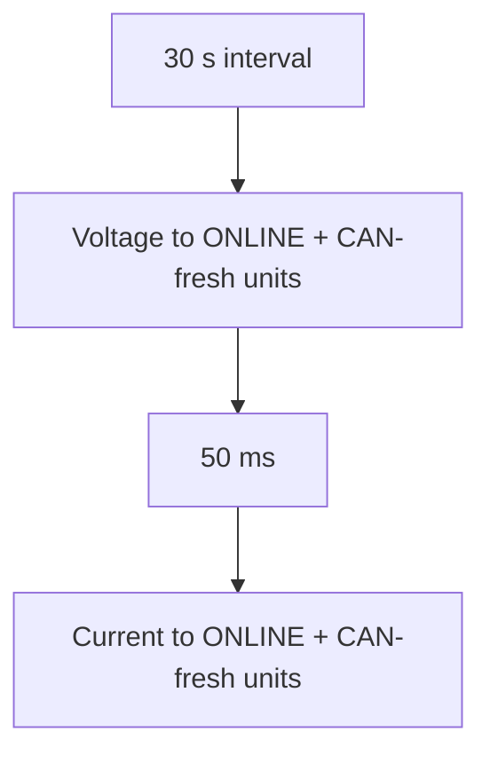
```mermaid
flowchart TD
    A[30 s interval] --> B[Voltage to ONLINE + CAN-fresh units]
    B --> C[50 ms]
    C --> D[Current to ONLINE + CAN-fresh units]
```

`OFFLINE` and `DISCOVERING` units receive no normal periodic active refresh.

---

# 18. Nominal three-unit power → current

```text
I_each = P_target / (3 × V_DC)
```

The divisor stays fixed at three:

```text
3 active units ≈ 100% target
2 active units ≈  67% target
1 active unit  ≈  33% target
```

The requested value is clamped only to the 1–75 A project/UI range. The transmitted applied current is then `min(requested, hardware limit, thermal limit)`.

---

# 19. Blackstart START

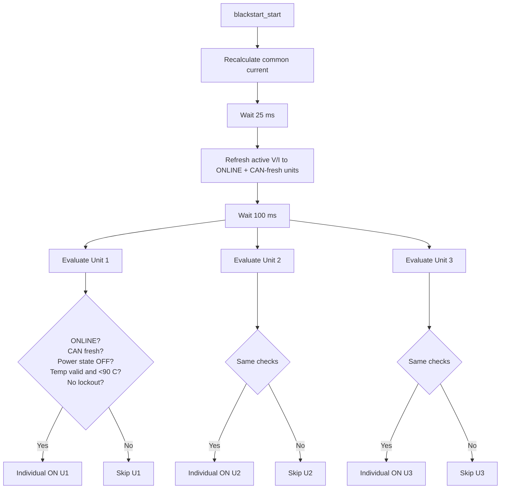
```mermaid
flowchart TD
    A[blackstart_start] --> B[Recalculate common current]
    B --> C[Wait 25 ms]
    C --> D[Refresh active V/I to ONLINE + CAN-fresh units]
    D --> E[Wait 100 ms]
    E --> U1[Evaluate Unit 1]
    E --> U2[Evaluate Unit 2]
    E --> U3[Evaluate Unit 3]
    U1 --> C1{ONLINE?<br/>CAN fresh?<br/>Power state OFF?<br/>Temp valid and <90 C?<br/>No lockout?}
    U2 --> C2{Same checks}
    U3 --> C3{Same checks}
    C1 -- Yes --> ON1[Individual ON U1]
    C1 -- No --> S1[Skip U1]
    C2 -- Yes --> ON2[Individual ON U2]
    C2 -- No --> S2[Skip U2]
    C3 -- Yes --> ON3[Individual ON U3]
    C3 -- No --> S3[Skip U3]
```

`OFFLINE`, `DISCOVERING`, `UNKNOWN` and `ERROR` do not satisfy START readiness.

---

# 20. Encoder long press

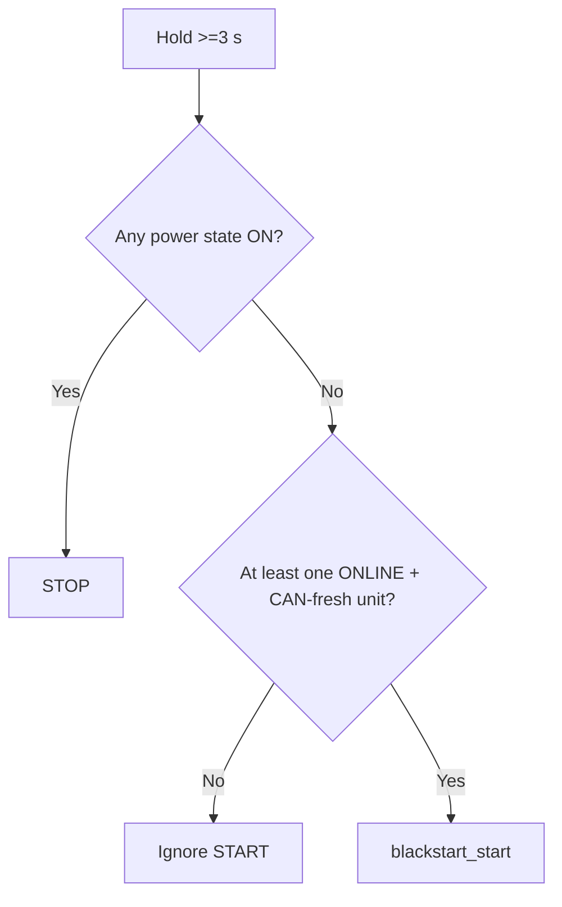
```mermaid
flowchart TD
    A[Hold >=3 s] --> B{Any power state ON?}
    B -- Yes --> C[STOP]
    B -- No --> D{At least one ONLINE + CAN-fresh unit?}
    D -- No --> E[Ignore START]
    D -- Yes --> F[blackstart_start]
```

STOP has priority and remains unrestricted.

---

# 21. Manual ON/OFF

Individual ON requires lifecycle `ONLINE`, fresh CAN, explicit `OFF`, valid safe output temperature and no lockout. The latest active setpoints are reasserted to that unit before ON.

Broadcast ON is stricter: all three rectifiers must satisfy those conditions because a broadcast cannot exclude one unsafe unit.

Individual and broadcast OFF are intentionally unrestricted by START-style preconditions.

---

# 22. Power-state decode

`0x100x117E` determines `ON`, `OFF` or `ERROR`.

Communication loss explicitly changes the published state to `UNKNOWN`, preventing stale state from being used for control decisions.

---

# 23. Cyclic telemetry

Important `0x108x407F` selectors:

| Selector | Meaning |
|---:|---|
| `0x0E` | Operating hours |
| `0x70` | AC input power |
| `0x71` | Grid frequency |
| `0x72` | AC input current |
| `0x73` | DC output power |
| `0x75` | DC output voltage |
| `0x76` | Configured maximum DC-current setpoint |
| `0x78` | AC input voltage |
| `0x7F` | Output temperature |
| `0x80` | Input temperature |
| `0x81` | DC output current |

Most engineering values use `raw / 1024`.

`0x80` is **input temperature**, not maximum-current capability. Maximum-current capability comes from the separate `0x108x50xx` discovery exchange.

Live telemetry has a 5-second freshness timeout.

---

# 24. Fan telemetry

Fan response payload:

```text
bytes 2..3 = minimum duty raw
bytes 4..5 = target duty raw
bytes 6..7 = RPM
```

```text
duty % = raw / 256
RPM    = 16-bit raw value
```

Fan queries run only for lifecycle-`ONLINE` units and use normal ESPHome `canbus.send` in the v3 hardware-test candidate.

---

# 25. Overtemperature protection

The hard trip is integrated into the staged thermal state machine documented in section 32. At `>= 90 °C` the affected rectifier enters `LOCKOUT` and receives an individual OFF command. The lockout clears only after a fresh output-temperature value below 80 °C; clearing never sends an automatic ON command.

Missing or stale temperature never clears a warning or lockout and never qualifies START.

---

# 26. CAN-aware aggregate sensors

A unit contributes only when its raw CAN state is valid and the required sensor value is numeric. Stale/unreachable units are excluded rather than contributing their last value.

`Available Units` returns 0 when none are reachable; other aggregate sensors can become unavailable.

---

# 27. TFT rendering

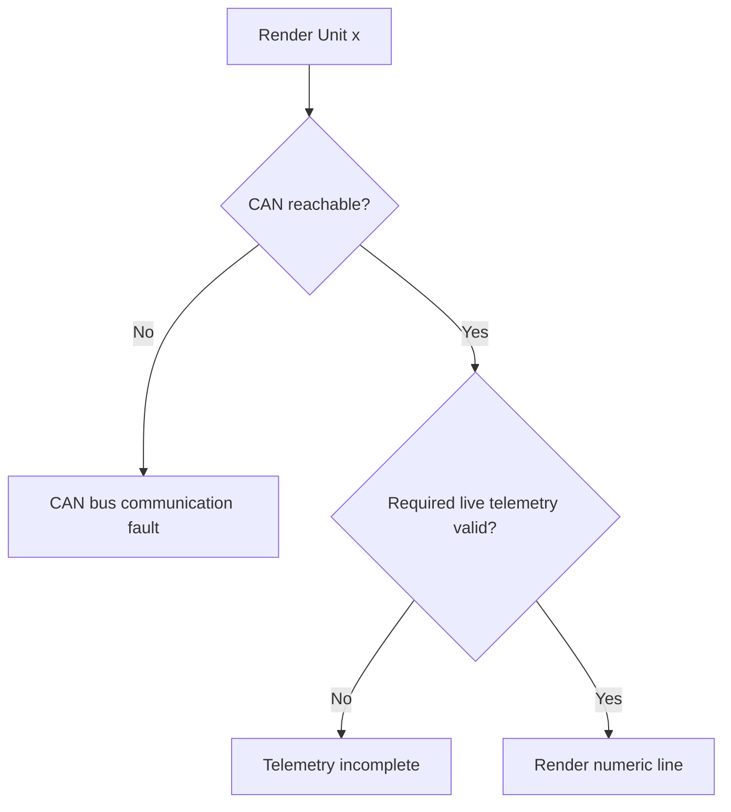
```mermaid
flowchart TD
    A[Render Unit x] --> B{CAN reachable?}
    B -- No --> C[CAN bus communication fault]
    B -- Yes --> D{Required live telemetry valid?}
    D -- No --> E[Telemetry incomplete]
    D -- Yes --> F[Render numeric line]
```

The TFT therefore distinguishes communication loss from stale/incomplete telemetry.

---

# 28. TWAI BUS_OFF recovery

BUS_OFF is a final controller-level recovery mechanism, not a required normal reconnect path.

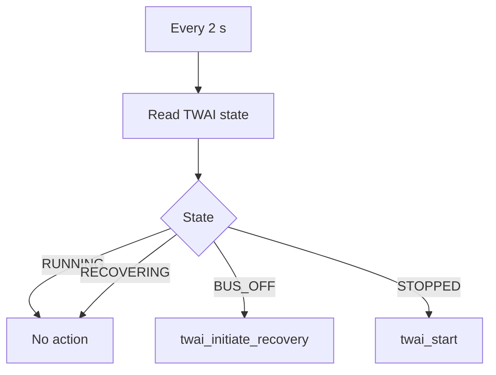
```mermaid
flowchart TD
    A[Every 2 s] --> B[Read TWAI state]
    B --> C{State}
    C -- RUNNING --> D[No action]
    C -- RECOVERING --> D
    C -- BUS_OFF --> E[twai_initiate_recovery]
    C -- STOPPED --> F[twai_start]
```

State-aware polling and Single-Shot OFFLINE probes reduce unnecessary transmit pressure when rectifiers disappear. Normal polling, discovery and control traffic still use regular ESPHome CAN transmission, so BUS_OFF recovery remains valuable as a final layer.

---

# 29. Verified physical CAN disconnect/reconnect flow

Verified on **2026-08-27** with the R4875G1 remaining powered while the CAN connector was physically unplugged and reconnected:

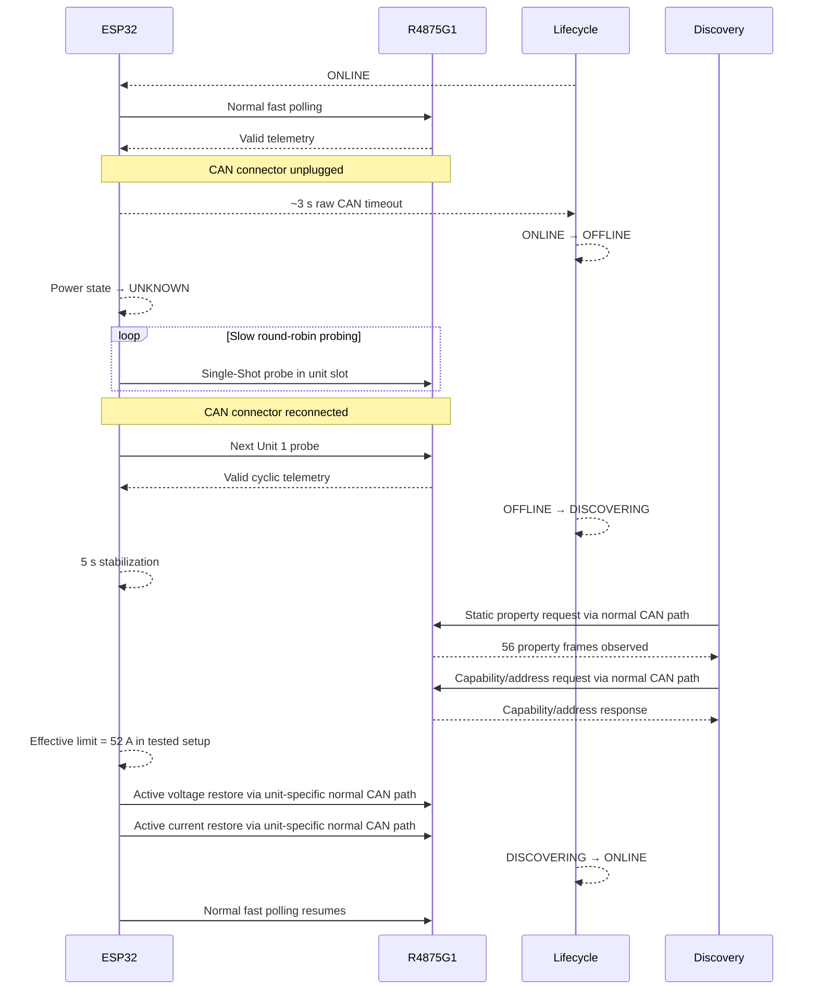
```mermaid
sequenceDiagram
    participant ESP as ESP32
    participant R as R4875G1
    participant LIFE as Lifecycle
    participant DISC as Discovery

    LIFE-->>ESP: ONLINE
    ESP->>R: Normal fast polling
    R-->>ESP: Valid telemetry

    Note over ESP,R: CAN connector unplugged
    ESP-->>LIFE: ~3 s raw CAN timeout
    LIFE-->>LIFE: ONLINE → OFFLINE
    ESP-->>ESP: Power state → UNKNOWN

    loop Slow round-robin probing
        ESP->>R: Single-Shot probe in unit slot
    end

    Note over ESP,R: CAN connector reconnected
    ESP->>R: Next Unit 1 probe
    R-->>ESP: Valid cyclic telemetry
    LIFE-->>LIFE: OFFLINE → DISCOVERING

    ESP-->>ESP: 5 s stabilization
    DISC->>R: Static property request via normal CAN path
    R-->>DISC: 56 property frames observed
    DISC->>R: Capability/address request via normal CAN path
    R-->>DISC: Capability/address response
    ESP-->>ESP: Effective limit = 52 A in tested setup
    ESP->>R: Active voltage restore via unit-specific normal CAN path
    ESP->>R: Active current restore via unit-specific normal CAN path
    LIFE-->>LIFE: DISCOVERING → ONLINE
    ESP->>R: Normal fast polling resumes
```

The test showed successful reconnect without an ESP reboot and without BUS_OFF being required for the recovery sequence.

---

# 30. Safety and behavioral invariants

1. Every rectifier starts lifecycle `OFFLINE` after ESP boot.
2. Raw CAN reachability is not the same as operational readiness.
3. Only `ONLINE` units receive normal fast polling.
4. Only `ONLINE` + CAN-fresh units receive normal active setpoint changes and periodic refresh.
5. `OFFLINE` units are probed sparsely with Single-Shot telemetry requests.
6. `DISCOVERING` units receive discovery traffic instead of normal fast polling.
7. Discovery verification must succeed before lifecycle promotion.
8. The post-discovery restore script completes before lifecycle promotion; the queue does not separately verify a CAN acknowledgement for those restore frames.
9. START requires `ONLINE`, fresh CAN, explicit `OFF`, valid safe temperature and no lockout.
10. STOP remains unrestricted.
11. The nominal power divisor remains fixed at three.
12. The effective current ceiling is the lowest valid detected capability, capped at 75 A.
13. Shared current scaling remains based on Unit 1 capability.
14. Property discovery is serialized and temporarily owns the bus.
15. Single-Shot is restricted to the slow OFFLINE reconnect probe in the v3 hardware-test candidate.
16. BUS_OFF recovery is a final protection/recovery path, not the normal reconnect mechanism.

---

# 31. End-to-end runtime summary

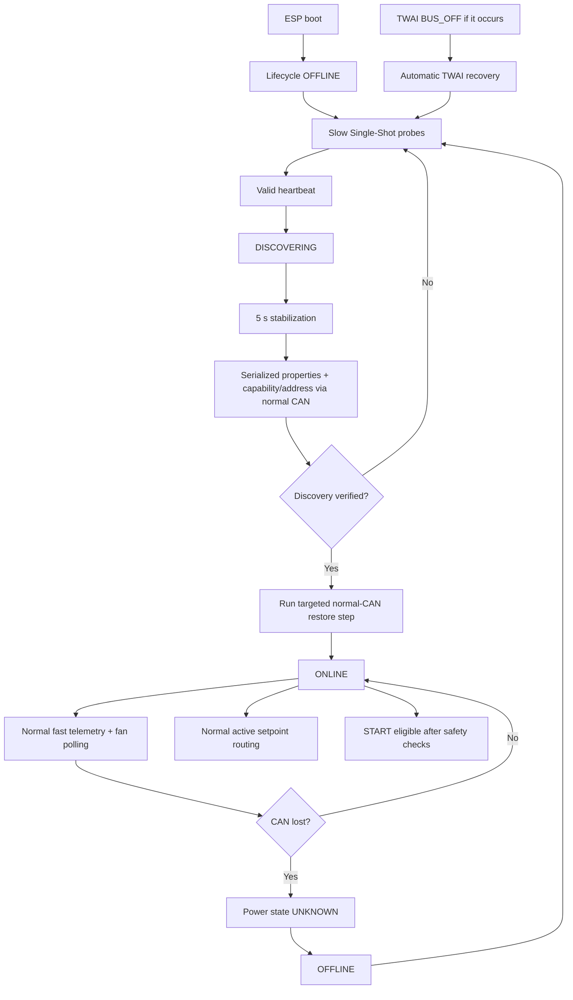
```mermaid
flowchart TD
    A[ESP boot] --> B[Lifecycle OFFLINE]
    B --> C[Slow Single-Shot probes]
    C --> D[Valid heartbeat]
    D --> E[DISCOVERING]
    E --> F[5 s stabilization]
    F --> G[Serialized properties + capability/address via normal CAN]
    G --> H{Discovery verified?}
    H -- No --> C
    H -- Yes --> I[Run targeted normal-CAN restore step]
    I --> J[ONLINE]
    J --> K[Normal fast telemetry + fan polling]
    J --> L[Normal active setpoint routing]
    J --> M[START eligible after safety checks]
    K --> N{CAN lost?}
    N -- No --> J
    N -- Yes --> O[Power state UNKNOWN]
    O --> P[OFFLINE]
    P --> C
    Q[TWAI BUS_OFF if it occurs] --> R[Automatic TWAI recovery]
    R --> C
```

---


# 32. Staged thermal derating

```mermaid
stateDiagram-v2
    [*] --> NORMAL
    NORMAL --> WARNING_1: temperature >= 70 C
    WARNING_1 --> NORMAL: temperature < 65 C
    WARNING_1 --> WARNING_2: temperature >= 80 C
    WARNING_2 --> WARNING_1: temperature < 75 C
    WARNING_2 --> LOCKOUT: temperature >= 90 C
    LOCKOUT --> WARNING_1: fresh temperature < 80 C
```

The states are per rectifier, but the current limit is shared. The most severe state wins:

```text
NORMAL     -> 75 A project thermal ceiling
WARNING_1  -> 50 A
WARNING_2  -> 30 A
LOCKOUT    -> 30 A + individual OFF
```

The active-current layers are:

```mermaid
flowchart TD
    A[Requested DC current] --> D[Minimum selector]
    B[Effective hardware capability limit] --> D
    C[Shared thermal current limit] --> D
    D --> E[Applied DC Current Limit]
    E --> F[Unit-specific current CAN command to ONLINE units]
```

Thermal or hardware derating never overwrites the requested active-current number. A lower applied current is therefore temporary and automatically rises again when limits recover.

Only fresh numeric output-temperature samples can reduce a thermal state. A stale/NAN temperature leaves the previous state latched. `LOCKOUT` clearing never sends an automatic ON command.

---

## Source

Behavior documented from the **v3.0.1 hardware-test candidate** on branch `v3-modularization`:

```text
r4875g1-3phase-charger.yaml
packages/
```

Last fully reviewed and resynchronized before hardware testing: **2026-08-29**.
