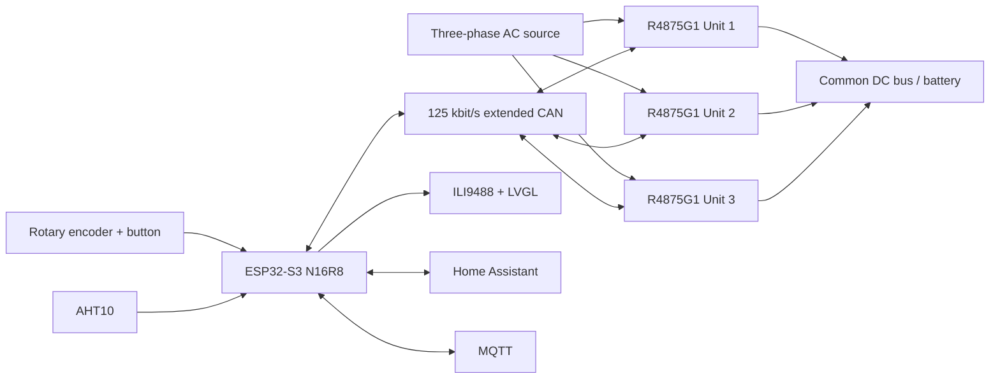
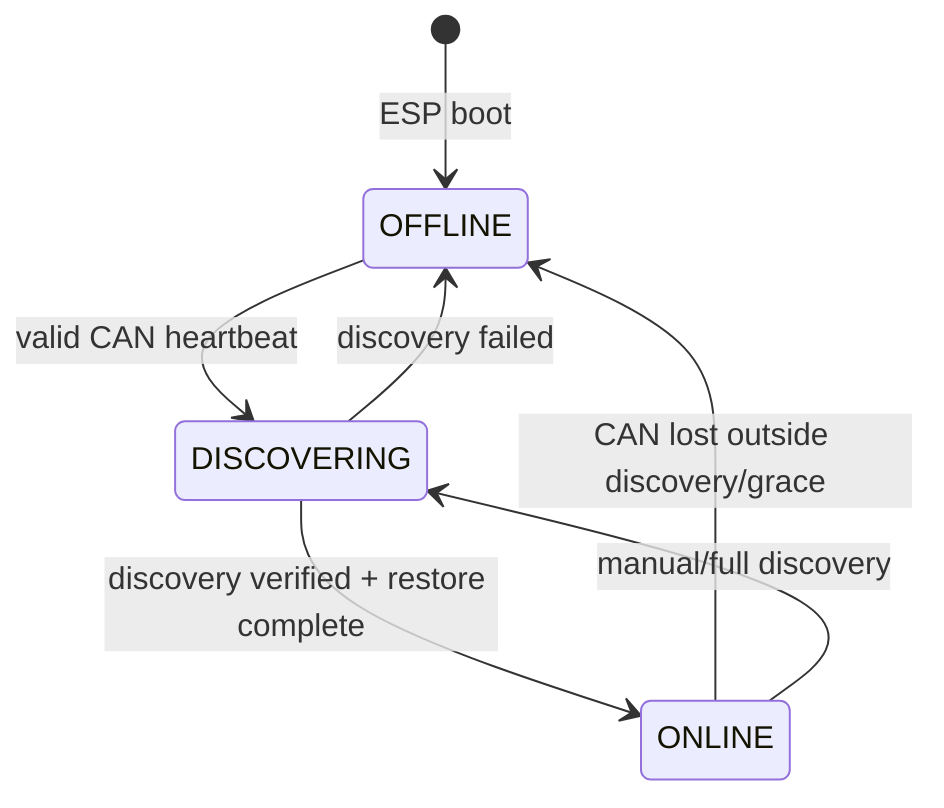
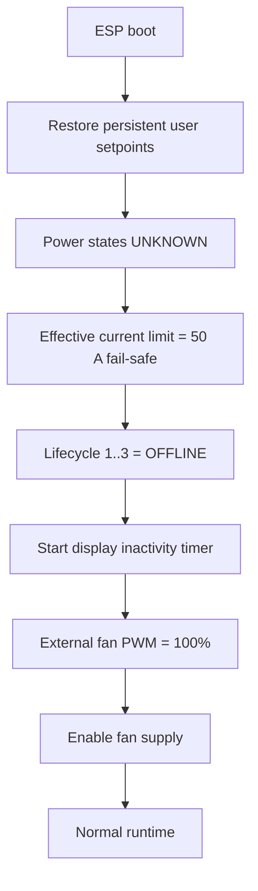
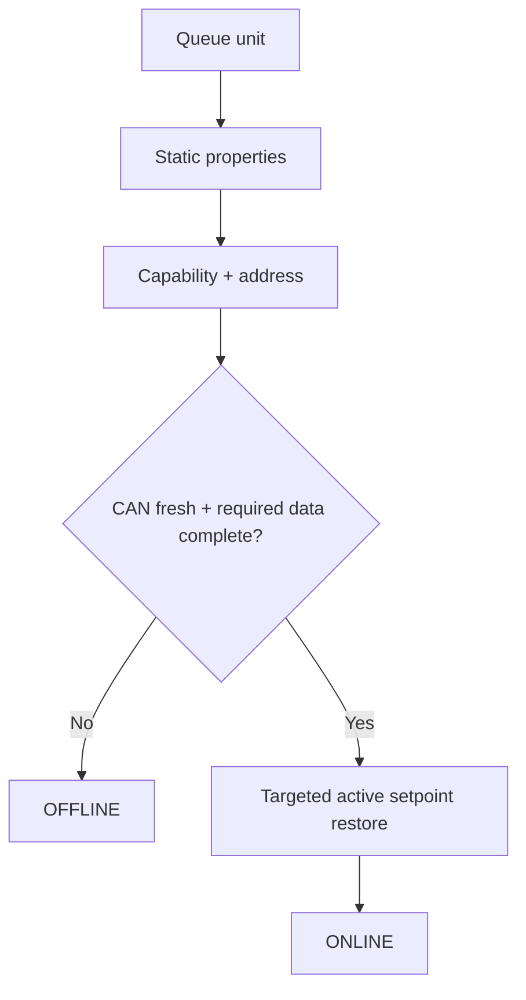

# R4875G1 Three-Phase Charger — Control and Runtime Flows

This document describes firmware **4.0.0** on `main` as of **2026-08-29**. Version 4 keeps the validated v3 charger/CAN/blackstart control model and replaces the local TFT renderer with an LVGL-based UI.

> **Scope:** behavioral firmware documentation, not an electrical safety specification.

## Runtime constants

| Function | Current value |
|---|---:|
| Project DC current ceiling | 75 A per rectifier |
| Capability fail-safe ceiling | 50 A per rectifier |
| Minimum DC current command | 1 A |
| DC voltage range / default | 49–58 V / 53 V |
| Overtemperature trip / reset | 90 °C / 80 °C |
| Raw CAN watchdog | 3 s |
| Live telemetry freshness | 5 s |
| Fast polling cycle | 577 ms |
| Offline probe slot / per-unit maximum | 5 s / ≈15 s |
| TWAI recovery check | 2 s |
| Active-setpoint refresh | 30 s |
| Reconnect stabilization | 5 s |
| Property bus quiet period | 500 ms |
| Property / capability attempts | 3 / 10 |
| TWAI RX queue | 64 frames |
| Display UI update / inactivity | 500 ms / 5 min |
| LVGL framebuffer | 100%, 16-bit RGB565 |
| Default UI orientation | 320×480 portrait |

# 1. System architecture



Core charging remains local. Wi-Fi, Home Assistant and MQTT are optional for charger control and blackstart.

# 2. Firmware module ownership

Version 4 retains the modular v3 charger architecture and adds a split LVGL display package:

| Source | Primary responsibility |
|---|---|
| `r4875g1-3phase-charger.yaml` | substitutions, unit instances, identity, boot sequence, aggregate entities |
| `packages/core.yaml` | ESP32/network/API/MQTT/web/OTA/time |
| `packages/hardware.yaml` | I²C/SPI buses |
| `packages/display.yaml` | display aggregator, rotation/version substitutions |
| `packages/display/hardware.yaml` | ILI9488 transport and backlight |
| `packages/display/theme.yaml` | LVGL, RGB565 framebuffer, fonts/styles |
| `packages/display/ui.yaml` | portrait dashboard and dynamic labels |
| `packages/cooling.yaml` | external fan interface |
| `packages/controls.yaml` | charger-wide controls/setpoints |
| `packages/rectifier-unit.yaml` | parameterized per-unit state/entities/discovery/watchdog |
| `packages/rectifier-shared.yaml` | cross-unit lifecycle, limits, CAN scheduling/recovery |
| `packages/rectifier-can/*.yaml` | parameterized CAN RX handlers |

# 3. Rectifier lifecycle



`OFFLINE` units receive no normal fast polling or START. `DISCOVERING` proves hardware identity/capability/address. `ONLINE` is the operationally released state.

# 4. Boot sequence



Initial current command scaling is `1024 / 75`. Capability discovery later recomputes shared scaling.

# 5. CAN transport strategy

**Single-Shot is used only for slow OFFLINE reconnect probes.** Normal telemetry, fan polling, property/capability discovery, active setpoints, reconnect restore, ON/OFF and broadcast configuration use normal ESPHome CAN transmission. TWAI BUS_OFF recovery remains the final controller-level recovery layer.

# 6. Normal fast polling

Every 577 ms, while property discovery is not owning the bus, each lifecycle-`ONLINE` rectifier is queried for cyclic telemetry and then fan telemetry. Units 2 and 3 follow the configured inter-unit gaps. `OFFLINE` and `DISCOVERING` units are excluded.

# 7. Raw CAN watchdog

Valid per-unit traffic refreshes `last_can_rx_x`. Communication is fresh for 3 seconds. Loss changes `CAN Communication Unit x` to false, invalidates that unit's capability contribution and eventually demotes lifecycle `ONLINE → OFFLINE`; its published power state becomes `UNKNOWN`.

# 8. Slow OFFLINE probing and reconnect

One unit slot is considered every 5 seconds in round-robin order. Only an `OFFLINE` unit receives a Single-Shot cyclic probe, so a continuously offline unit is probed about every 15 seconds.

A returned heartbeat changes `OFFLINE → DISCOVERING`, clears the previous capability-valid state and starts a 5-second stabilization period before serialized discovery.

# 9. Discovery

Discovery runs one rectifier at a time:



Static property discovery has a 500 ms quiet period and up to 3 attempts. Capability/address discovery has up to 10 attempts. The tested property response contained 56 frames; the TWAI RX queue is 64 frames.

# 10. Effective DC current limit

Only currently CAN-reachable units participate:

```text
no reachable units                       -> 50 A
any reachable capability still unknown  -> 50 A
all reachable capabilities known         -> min(75 A, reachable capabilities)
```

A disconnected unit is removed immediately. A reconnecting unit forces the fail-safe until its capability is freshly rediscovered.

# 11. Current command scaling

The current implementation has **no permanent Unit-1 scaling dependency**:

```text
unknown/incomplete reachable capabilities:
    current_scaling_factor = 1024 / 75

all reachable capabilities known:
    current_scaling_factor = 1024 / highest reachable capability
```

The effective engineering-current ceiling independently uses the **lowest** reachable capability. This combination is deliberately conservative for differing reachable capabilities.

Raw command selection is bounded in protocol space:

```text
requested_raw      = round(requested_A × scaling)
hardware_limit_raw = floor(effective_limit_A × scaling)
thermal_limit_raw  = floor(thermal_limit_A × scaling)
raw_command        = min(requested_raw, hardware_limit_raw, thermal_limit_raw)
```

# 12. Capability mismatch

`Rectifier Capability Mismatch` considers currently reachable units only:

```text
UNKNOWN = fewer than two reachable units or a reachable capability is unknown
OFF     = reachable capabilities match within 0.25 A
ON      = at least two reachable capabilities differ by >0.25 A
```

The diagnostic itself does not inhibit charging; fail-safe current limiting/scaling handles the operational boundary.

# 13. Active setpoints and reconnect restore

Normal active voltage/current changes and the 30-second refresh are sent only to `ONLINE` + CAN-fresh rectifiers. A rediscovered unit receives its current active voltage and current through targeted unit-specific CAN commands before returning to `ONLINE`. Restore does not send ON.

Fallback voltage/current remain broadcast configuration commands.

# 14. Nominal power target

```text
I_each = P_target / (3 × V_DC)
```

The divisor intentionally remains fixed at three. Therefore, before losses/clamping, two active rectifiers deliver roughly 67% and one roughly 33% of the configured nominal three-unit target. The firmware does not automatically increase remaining-unit current when a rectifier disappears.

# 15. Blackstart and local encoder

The encoder edits DC voltage or nominal three-unit DC power. Short press toggles the edit target; long press (≥3 s) toggles START/STOP. STOP has priority and remains unrestricted.

START evaluates each rectifier independently. A unit must be `ONLINE`, CAN-fresh, explicitly `OFF`, have valid output temperature below 90 °C and have no overtemperature lockout. Active setpoints are refreshed before individual ON commands are issued.

# 16. Thermal derating

The most severe per-unit thermal state determines a shared thermal current ceiling:

| State | Enter | Recovery threshold | Shared limit |
|---|---:|---:|---:|
| `NORMAL` | <70 °C | — | 75 A |
| `WARNING_1` | ≥70 °C | <65 °C | 50 A |
| `WARNING_2` | ≥80 °C | <75 °C | 30 A |
| `LOCKOUT` | ≥90 °C | <80 °C | 30 A + individual OFF |

Applied current is `min(requested, hardware capability limit, thermal limit)`. Derating never overwrites the user's requested current. Stale temperature cannot relax a warning or lockout, and lockout recovery never automatically starts a rectifier.

# 17. Telemetry and aggregate sensors

Cyclic selectors include operating hours (`0x0E`), AC power (`0x70`), frequency (`0x71`), AC current (`0x72`), DC power (`0x73`), DC voltage (`0x75`), configured max DC current (`0x76`), AC voltage (`0x78`), output temperature (`0x7F`), input temperature (`0x80`) and DC current (`0x81`). Most engineering values use `raw / 1024`.

Aggregate AC/DC power, DC current, average DC voltage, highest output temperature and efficiency include only CAN-fresh units with valid required telemetry. `Available Units` returns the reachable count.

# 18. LVGL TFT behavior — v4

Version 4 replaces the previous immediate-mode display renderer with LVGL. The physical ILI9488 transport remains 480×320 RGB565; LVGL rotation `90` produces the default 320×480 portrait UI. Rotation `0` is available for landscape.

The ESP32-S3 N16R8 has 8 MB PSRAM, and LVGL is configured with a **100% 16-bit RGB565 framebuffer**. The dashboard updates dynamic labels every 500 ms. Scrollbars are explicitly disabled on the page and cards.

The dashboard contains:

- header: `R4875G1 Charger`, date/time, `v4.0.0`, overall ON/OFF state;
- AC INPUT and DC OUTPUT cards;
- three rectifier status lines;
- local voltage/power/current setpoints;
- highest temperature and conversion efficiency;
- IP address and Wi-Fi RSSI;
- encoder START/STOP reminder.

The UI differentiates `CAN communication fault`, incomplete telemetry and normal numeric telemetry. Display inactivity still switches the backlight off after five minutes and encoder/button activity restarts the timer.

# 19. TWAI BUS_OFF recovery

Every 2 seconds the controller checks TWAI state. `BUS_OFF` initiates recovery; `STOPPED` restarts TWAI. This is a final recovery mechanism, not the normal rectifier reconnect path.

# 20. Verified physical reconnect behavior

The 2026-08-27 physical test remains the validated CAN baseline: unplugging CAN while the rectifier stayed powered caused the 3-second watchdog to expire, lifecycle moved to OFFLINE, slow Single-Shot probes continued, reconnect triggered DISCOVERING, the 56-frame property exchange and capability/address discovery completed, active setpoints were restored, and lifecycle returned to ONLINE without an ESP reboot.

The tested reduced-current connector configuration reported a 52 A capability. That trace remains valid protocol evidence; v4's LVGL work does not alter this CAN behavior.

# 21. Safety and behavioral invariants

1. Every rectifier boots `OFFLINE`.
2. Raw CAN reachability is not operational readiness.
3. Only `ONLINE` units receive normal fast polling.
4. Only `ONLINE` + CAN-fresh units receive normal active setpoints.
5. `OFFLINE` units are probed sparsely with Single-Shot.
6. Discovery must verify before `ONLINE` promotion.
7. START requires lifecycle, CAN, power-state and temperature safety checks.
8. STOP is unrestricted.
9. Nominal power always divides by three.
10. Effective current ceiling uses the lowest known reachable capability with a 50 A fail-safe for incomplete discovery.
11. Shared command scaling uses the highest reachable capability once all reachable capabilities are known.
12. Thermal/hardware limits clamp applied current without overwriting requested current.
13. Property discovery is serialized.
14. BUS_OFF recovery is a final recovery layer.
15. LVGL affects presentation only; charger control and safety decisions remain outside the display layer.

## Source status

Behavior documented from firmware **4.0.0** on branch `main`:

```text
r4875g1-3phase-charger.yaml
packages/
```

The v4 LVGL UI was physically verified on the ILI9488 on **2026-08-29**. The earlier physical CAN disconnect/reconnect trace remains the validated runtime baseline for the unchanged CAN/lifecycle behavior.
