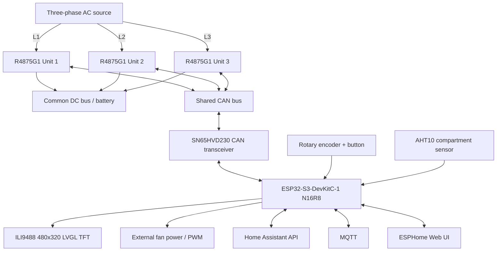
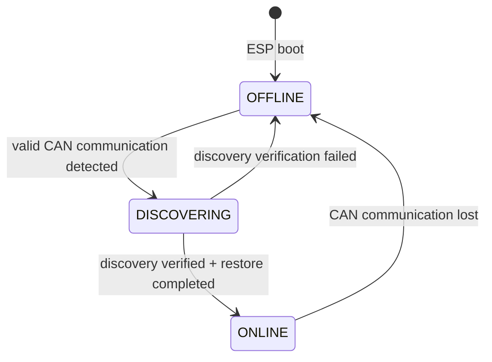
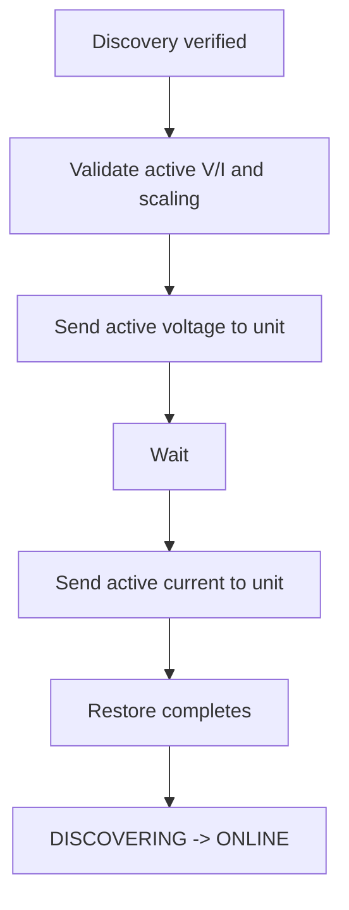

# 3-Phase Huawei R4875G1 Battery Charger Controller

ESPHome-based controller for **three Huawei R4875G1 rectifiers** operated as a coordinated three-phase battery charger with a common parallel DC output.

The project combines CAN control, live telemetry, Home Assistant, MQTT, a local web interface, a 480×320 TFT, automatic compartment cooling and a rotary encoder.

Core charger operation is intentionally local so the system remains usable during a network outage or an off-grid blackstart situation.

**Stable firmware:** `v4.3.0` on `main`  

For detailed state-machine and runtime diagrams, see [`R4875G1_CONTROL_FLOWS.md`](R4875G1_CONTROL_FLOWS.md).

Package ownership and maintenance rules are documented in [`packages/README.md`](packages/README.md).

> [!WARNING]
> This project controls equipment connected to mains voltage and a high-current DC battery bus. Three R4875G1 units can represent roughly 12 kW of charging power and more than 200 A on a 48–58 V DC bus.
>
> Firmware is not a substitute for correctly designed fuses, breakers, disconnects, BMS protection, earthing, isolation, conductor sizing and other hardware safety measures.

---

## Project purpose

The intended installation uses:

- one Huawei R4875G1 on each AC phase,
- all three DC outputs connected to one common battery/DC bus,
- identical DC voltage for all rectifiers,
- one common per-unit current command,
- a nominal three-unit charging-power target,
- an ESP32-S3 as the local controller,
- an ILI9488 TFT for local status and control,
- a rotary encoder with push button,
- an AHT10 compartment temperature/humidity sensor,
- optional external 3-pin and 4-pin cooling fans.

The controller supports normal networked operation and a network-independent local mode.

Home Assistant, MQTT and the web UI are useful interfaces, but they are **not required** for:

- CAN control,
- charger operation,
- TFT operation,
- rotary-encoder operation,
- local blackstart,
- automatic compartment cooling.

---

## Acknowledgements

This project originally grew from the Huawei R48xx CAN work published by **mjpalmowski** in:

**CAN-BUS-control-R4875G1-with-ESPHome-and-MQTT**

https://github.com/mjpalmowski/CAN-BUS-control-R4875G1-with-ESPHome-and-MQTT

That project provided important groundwork for Huawei CAN protocol research, telemetry decoding, control commands, property/capability discovery and ESPHome integration.

The current repository has evolved substantially around:

- a dedicated three-unit charger,
- ESP32-S3 hardware,
- local blackstart,
- per-unit lifecycle control,
- CAN outage recovery,
- state-aware polling,
- capability-derived current limiting,
- staged thermal derating,
- a four-page LVGL user interface,
- page-aware SELECT/EDIT encoder control,
- automatic external compartment cooling.

---

## System overview



CAN uses:

```text
125 kbit/s
29-bit extended identifiers
```

---

# Key features

## Charger control

* Three Huawei R4875G1 rectifiers controlled from one ESP32-S3.
* Common active DC voltage and current setpoints.
* Normal active setpoints routed only to verified `ONLINE` rectifiers with fresh CAN communication.
* Individual and broadcast ON/OFF controls.
* Fallback voltage/current configuration.
* Internal rectifier fan control and telemetry.
* Nominal three-unit DC power target with automatic current calculation.
* Runtime effective DC-current ceiling derived from detected rectifier capabilities.
* Conservative 50 A fail-safe ceiling while reachable-unit capabilities are incomplete.
* Periodic active-setpoint refresh only to verified online units.
* Per-unit targeted active-setpoint restoration after rediscovery.

## Local blackstart

Core blackstart operation does not require:

* Home Assistant,
* MQTT,
* Wi-Fi,
* Internet access.

The local TFT and rotary encoder provide:

* charger status,
* DC voltage selection,
* nominal three-unit DC power selection,
* local START/STOP,
* cooling controls.

START is allowed only for rectifiers that are:

* lifecycle `ONLINE`,
* CAN-fresh,
* explicitly `OFF`,
* thermally safe,
* not locked out.

STOP remains unrestricted.

## CAN reliability

* Independent raw CAN watchdog for every rectifier.
* Explicit per-unit lifecycle:

  * `OFFLINE`
  * `DISCOVERING`
  * `ONLINE`
* Normal watchdog timeout: **3 seconds**.
* Discovery watchdog timeout: **7 seconds**.
* High-rate telemetry/fan polling only for `ONLINE` rectifiers.
* `OFFLINE` units are probed sparsely in round-robin order.
* Single-Shot CAN is limited to slow OFFLINE reconnect probes.
* Static property discovery temporarily owns the bus.
* TWAI RX queue enlarged to 64 frames.
* Automatic and manual discovery operations are serialized.
* Discovery waits for the TWAI controller to return to `RUNNING`.
* Time spent in `BUS_OFF` recovery does not consume discovery retries.
* A rediscovered unit receives its active voltage/current before being returned to `ONLINE`.
* TWAI `BUS_OFF` recovery remains available as a final controller-level recovery mechanism.

## Thermal protection

Shared applied current is:

```text
min(
    requested current,
    effective hardware capability,
    thermal current limit
)
```

Temperature protection includes:

* warning at 70 °C,
* stronger derating at 80 °C,
* individual shutdown at 90 °C,
* hysteresis for recovery,
* persistent overtemperature lockout until safe temperature is restored.

## Local TFT

Four LVGL pages:

```text
Dashboard
Rectifiers
Cooling
System
```

All pages use a common 64 px header layout.

The TFT has no touchscreen. Scrolling and scrollbars are disabled.

---

# Firmware architecture

The firmware is split into modular ESPHome packages.

```text
r4875g1-3phase-charger.yaml

packages/
├── version.yaml
├── core.yaml
├── hardware.yaml
├── display.yaml
├── cooling.yaml
├── controls.yaml
├── rectifier-shared.yaml
├── rectifier-unit.yaml
│
├── display/
│   ├── hardware.yaml
│   ├── theme.yaml
│   ├── ui.yaml
│   └── pages/
│       ├── dashboard.yaml
│       ├── rectifiers.yaml
│       ├── cooling.yaml
│       └── system.yaml
│
└── rectifier-can/
    ├── property-start.yaml
    ├── property-end.yaml
    ├── cyclic-telemetry.yaml
    ├── fan-telemetry.yaml
    ├── address-data.yaml
    └── power-state.yaml
```

Main responsibilities:

| File                    | Responsibility                                     |
| ----------------------- | -------------------------------------------------- |
| `version.yaml`          | central firmware version                           |
| `core.yaml`             | ESP32, network, API, MQTT, OTA, web server, time   |
| `hardware.yaml`         | I²C and SPI buses                                  |
| `display.yaml`          | display package aggregation                        |
| `display/hardware.yaml` | ILI9488 hardware                                   |
| `display/theme.yaml`    | LVGL fonts, styles and shared theme                |
| `display/ui.yaml`       | page aggregation and wrapping                      |
| `display/pages/*.yaml`  | individual TFT pages                               |
| `cooling.yaml`          | external fan power, PWM, RPM and automatic cooling |
| `controls.yaml`         | charger-wide setpoints and controls                |
| `rectifier-unit.yaml`   | parameterized per-unit implementation              |
| `rectifier-shared.yaml` | lifecycle, discovery, limits and shared control    |
| `rectifier-can/*.yaml`  | CAN receive handlers                               |

---

# Versioning

The firmware version has one source of truth:

```text
packages/version.yaml
```

Example:

```yaml
substitutions:
  firmware_version: "4.2.2"
```

The same value is consumed by:

* `esphome.project.version`
* the TFT header
* deployment tooling

Repository convention:

> **Every normal program commit increments PATCH exactly once.**

Examples:

```text
4.2.0
4.2.1
4.2.2
```

Intentional release milestones may advance MINOR or MAJOR and reset PATCH.

---

# Hardware

## Main controller

Current target:

* **Espressif ESP32-S3-DevKitC-1**
* **ESP32-S3-WROOM-1-N16R8**
* 16 MB Quad-SPI flash
* 8 MB Octal-SPI PSRAM
* 240 MHz CPU
* ESP-IDF framework

Memory configuration:

```text
Flash: 16 MB QIO @ 80 MHz
PSRAM: 8 MB Octal @ 80 MHz
```

ESPHome minimum firmware version configured by the project:

```text
2026.7.4
```

---

## Rectifiers

The firmware is developed for:

```text
3 × Huawei R4875G1
```

Typical topology:

```text
Unit 1 -> L1
Unit 2 -> L2
Unit 3 -> L3

All DC outputs -> common battery/DC bus
All CAN-H/CAN-L -> common CAN bus
```

---

## CAN interface

The ESP32-S3 provides the TWAI controller.

The physical CAN layer uses:

* **SN65HVD230**
* 3.3 V logic
* GPIO15 CAN TX
* GPIO16 CAN RX
* 125 kbit/s
* 29-bit extended CAN identifiers

Use correctly terminated twisted-pair CAN wiring.

---

## Display

Display:

```text
ILI9488
480 × 320
RGB565
SPI
landscape
LVGL
```

The ESP32-S3 PSRAM allows a full RGB565 LVGL framebuffer.

Display GPIOs:

| Function  | GPIO |
| --------- | ---: |
| Backlight |    4 |
| TFT CS    |    5 |
| TFT RESET |    6 |
| TFT DC/RS |    7 |
| SPI MOSI  |   11 |
| SPI MISO  |   12 |
| SPI CLK   |   13 |

---

## Rotary encoder

Recommended 3.3 V operation:

| Function          | GPIO |
| ----------------- | ---: |
| KEY / push button |    2 |
| S1 / A            |   17 |
| S2 / B            |   18 |

Internal pull-ups are enabled.

The push button is active-low.

---

## Rectifier-compartment sensor

An AHT10 measures:

* compartment temperature,
* relative humidity.

It is installed in the shared rear connection/exhaust-air compartment behind the rectifiers.

Current I²C configuration:

| Function | GPIO |
| -------- | ---: |
| SDA      |    8 |
| SCL      |    9 |

I²C address:

```text
0x38
```

These measurements represent **shared compartment air**, not one specific rectifier's internal temperature.

---

## External cooling fans

The controller supports external cooling fans separately from the internal R4875G1 fans.

| Function         | GPIO |
| ---------------- | ---: |
| Fan power enable |   21 |
| Fan 3 tachometer |   39 |
| Fan 2 tachometer |   40 |
| Fan 1 tachometer |   41 |
| Shared PWM       |   42 |

PWM frequency:

```text
25 kHz
```

Supported fan concepts:

### 3-pin fan

```text
Power ON/OFF
Tachometer RPM
```

### 4-pin fan

```text
Power ON/OFF
PWM speed control
Tachometer RPM
```

The three tachometer inputs are independent.

---

## Complete GPIO map

| Function           | GPIO |
| ------------------ | ---: |
| Encoder button     |    2 |
| TFT backlight      |    4 |
| TFT CS             |    5 |
| TFT RESET          |    6 |
| TFT DC             |    7 |
| I²C SDA            |    8 |
| I²C SCL            |    9 |
| SPI MOSI           |   11 |
| SPI MISO           |   12 |
| SPI CLK            |   13 |
| CAN TX             |   15 |
| CAN RX             |   16 |
| Encoder A          |   17 |
| Encoder B          |   18 |
| External fan power |   21 |
| Fan 3 tach         |   39 |
| Fan 2 tach         |   40 |
| Fan 1 tach         |   41 |
| External fan PWM   |   42 |

---

# Four-page LVGL user interface

The local display consists of four pages:

```text
Dashboard
Rectifiers
Cooling
System
```

Page wrapping is enabled:

```text
Dashboard
   ↓
Rectifiers
   ↓
Cooling
   ↓
System
   ↓
Dashboard
```

The display has no touchscreen.

Therefore:

```text
scrollable: false
scrollbar_mode: OFF
```

is applied to the UI containers.

---

## Dashboard

The Dashboard provides the normal operating overview.

Displayed information includes:

* current date/time,
* firmware version,
* aggregate rectifier ON/OFF state,
* combined AC power,
* combined DC power,
* AC voltage/current summary,
* DC voltage/current summary,
* available-unit count,
* highest rectifier output temperature,
* conversion efficiency,
* selected DC voltage,
* nominal three-unit DC power,
* applied current per unit.

Run-state color policy:

```text
OFF      -> bright red
1/3 ON   -> bright red
2/3 ON   -> bright red
3/3 ON   -> bright green
```

Partial operation is intentionally presented as an attention state.

---

## Rectifiers

The Rectifiers page contains one card per phase:

```text
L1
L2
L3
```

Each card includes:

* Power State,
* CAN state,
* lifecycle,
* DC voltage,
* DC current,
* DC power,
* input temperature,
* output temperature,
* internal R4875G1 fan RPM,
* detected maximum-current capability.

Example:

```text
L1   PWR ON | CAN OK | ONLINE

DC    53.1 V   12.3 A   650 W
Temp  IN 32.4   OUT 36.1 C
Fan   2450 RPM   Cap 52.0 A
```

Status colors:

```text
CAN fault     -> red
DISCOVERING   -> amber
ONLINE        -> green
OFFLINE       -> muted
```

When CAN communication is unavailable, live telemetry is replaced by placeholders rather than leaving stale values visible.

The page is currently read-only from the encoder.

---

## Cooling

The Cooling page displays:

* compartment temperature,
* compartment humidity,
* Automatic cooling state,
* external fan power state,
* PWM command,
* active cooling stage,
* Fan 1 RPM,
* Fan 2 RPM,
* Fan 3 RPM.

Editable parameters:

```text
Automatic
Fan Power
PWM
```

`Fan Power` and `PWM` are manually selectable only when automatic cooling is disabled.

When automatic mode is active, they remain visible but are muted.

---

## System

The System page displays:

* firmware version,
* IP address,
* Wi-Fi RSSI,
* controller uptime,
* CPU temperature,
* free internal heap,
* free PSRAM,
* CAN state for L1/L2/L3.

Runtime values such as uptime, heap and PSRAM are obtained locally without creating duplicate TFT-only Home Assistant entities.

The System page is read-only from the encoder.

---

# Encoder Select/Edit model

Starting with v4.3.0 series, the rotary encoder uses a consistent **SELECT / EDIT** model across the TFT.

Two global interaction modes exist:

```text
SELECT
EDIT
```

## SELECT mode

In SELECT mode:

```text
Rotate        -> select an editable parameter
Short press   -> enter EDIT
Double press  -> next TFT page
Long press    -> global rectifier START/STOP
```

A selected parameter is indicated by:

```text
>
```

Example:

```text
> Voltage  53.0 V
  Power     3.00 kW
```

The page itself determines which parameters are selectable.

### Dashboard

```text
Voltage
Power
```

### Rectifiers

No editable parameters.

Rotation and short press therefore do nothing on this page.

Double-click page navigation and long-press START/STOP remain available.

### Cooling

Automatic mode:

```text
Automatic
```

Manual mode:

```text
Automatic
Fan Power
PWM
```

When `Automatic = ON`, manual `Fan Power` and `PWM` remain visible but are skipped by SELECT.

### System

No editable parameters.

Rotation and short press therefore do nothing.

Page navigation and global START/STOP remain active.

---

## EDIT mode

A short press on a selectable parameter enters EDIT.

The current real value is copied into a temporary edit buffer:

```text
encoder_edit_value
```

Rotation modifies **only that temporary value**.

The actual ESPHome entity is not changed yet.

This means that intermediate encoder steps do **not** immediately transmit changing charger setpoints over CAN.

Example:

```text
actual voltage = 53.0 V

enter EDIT

rotate:
53.1
53.2
53.3
53.4

actual ESPHome setpoint is still 53.0 V
```

Only the confirming short press commits:

```text
53.4 V
```

to the real ESPHome entity.

The controller then returns to SELECT.

EDIT controls:

```text
Rotate        -> adjust temporary value
Short press   -> save and return to SELECT
Double press  -> disabled
Long press    -> disabled
```

This prevents accidental:

* page changes,
* charger START,
* charger STOP,

while modifying a parameter.

---

## EDIT visual indication

SELECT uses the `>` marker.

EDIT removes the `>` and inverts the active value presentation:

```text
dark background
white text
```

The footer also changes.

Typical SELECT footer:

```text
Turn select | Press edit | Double page | Hold ON/OFF
```

EDIT footer:

```text
EDIT: Turn adjust | Press save
```

This deliberately makes SELECT and EDIT visually distinct.

---

## Current editable ranges

### DC Voltage

```text
49.0–58.0 V
step 0.1 V
```

### Nominal three-unit DC power

```text
0.25–12.0 kW
step 0.25 kW
```

### Cooling Automatic

```text
ON / OFF
```

### Cooling Fan Power

```text
ON / OFF
```

Available only when automatic cooling is disabled.

### Cooling Fan PWM

```text
0–100 %
step 1 %
```

Available only when automatic cooling is disabled.

---

# Automatic external cooling

External cooling uses the AHT10 compartment temperature.

Entity:

```text
Cooling Fan Automatic
```

Automatic mode defaults to enabled.

The controller evaluates the cooling state every:

```text
5 seconds
```

## Cooling curve

| Compartment temperature | External fan command |
| ----------------------- | -------------------: |
| `< 30 °C`               |      Power OFF / 0 % |
| `30–34.9 °C`            |      Power ON / 35 % |
| `35–39.9 °C`            |                 45 % |
| `40–44.9 °C`            |                 60 % |
| `45–49.9 °C`            |                 80 % |
| `>= 50 °C`              |                100 % |

Rising temperature immediately selects the required higher stage.

## Downward hysteresis

Cooling stages fall back at:

```text
48 °C
43 °C
38 °C
33 °C
28 °C
```

This provides approximately 2 °C hysteresis and prevents rapid stage oscillation.

## Sensor failure

If the compartment-temperature reading is invalid while automatic cooling is active:

```text
Fan Power = ON
PWM       = 100 %
```

This is an intentional fail-safe condition.

## Manual override

Disable:

```text
Cooling Fan Automatic
```

to expose manual control of:

```text
Cooling Fan Power
Cooling Fan PWM
```

Three-pin fans respond only to the common power supply.

Four-pin fans additionally use the shared PWM command.

The AHT10 automatic `<30 °C -> OFF` path has been verified on hardware.

Full PWM/RPM fan testing is pending installation of the external fan hardware.

---

# Electrical / power-control model

All three DC outputs share the same DC bus.

The firmware therefore uses:

* one common voltage target,
* one common current target.

The local power selector represents a **nominal three-unit power target**:

```text
I_each = P_target / (3 × V_DC)
```

The divisor remains fixed at three even if fewer rectifiers are operating.

Therefore, before conversion losses and current clamping:

```text
3 active units -> approximately 100% of configured target
2 active units -> approximately  67% of configured target
1 active unit  -> approximately  33% of configured target
```

The firmware deliberately does not increase current on remaining rectifiers to compensate for a missing unit.

A rectifier that lost CAN communication might still be electrically active, so automatic redistribution could otherwise create an unintended total-power increase.

---

# Rectifier lifecycle

Each rectifier has an independent operational lifecycle:



---

## OFFLINE

An offline rectifier:

* is excluded from fast polling,
* receives no normal active-setpoint refresh,
* cannot receive START,
* is probed only through the slow reconnect scheduler.

---

## DISCOVERING

A discovering rectifier has CAN communication but has not yet been operationally released.

The controller performs:

1. reconnect/startup stabilization,
2. static property discovery,
3. maximum-current capability discovery,
4. address/shelf discovery,
5. verification,
6. targeted active voltage/current restore.

Only after this sequence succeeds does the unit become:

```text
ONLINE
```

The normal 3-second connectivity watchdog is extended to approximately:

```text
7 seconds
```

while a unit is `DISCOVERING`.

This prevents the intentional 5-second discovery stabilization delay from being mistaken for a communication failure.

---

## ONLINE

An online rectifier:

* participates in normal high-rate telemetry,
* participates in internal fan polling,
* receives normal active-setpoint changes,
* receives periodic active-setpoint refreshes,
* can be considered for START.

---

# CAN watchdog and telemetry freshness

Each unit stores the timestamp of its most recent valid CAN activity:

```text
last_can_rx_1
last_can_rx_2
last_can_rx_3
```

Normal raw-CAN communication timeout:

```text
3 seconds
```

Discovery timeout:

```text
7 seconds
```

Live telemetry has a separate freshness timeout:

```text
5 seconds
```

A rectifier can therefore remain reachable while an individual telemetry item is temporarily unavailable.

On genuine communication loss:

* `CAN Communication Unit x` becomes false,
* CAN-reported power state becomes `UNKNOWN`,
* stale telemetry is excluded from aggregate calculations,
* lifecycle eventually returns to `OFFLINE`.

---

# State-aware CAN polling

## Fast polling

Normal online polling runs approximately every:

```text
577 ms
```

Only lifecycle-`ONLINE` rectifiers are queried.

Per online unit:

* cyclic telemetry,
* fan telemetry.

Fast polling is suspended while static property discovery owns the bus.

---

## Slow OFFLINE probing

Offline rectifiers are probed round-robin.

Scheduler slot:

```text
5 seconds
```

Sequence:

```text
Unit 1 -> Unit 2 -> Unit 3 -> Unit 1 -> ...
```

With all three units offline, each individual unit is therefore probed approximately every:

```text
15 seconds
```

Only this OFFLINE reconnect probe uses TWAI Single-Shot transmission.

---

# Single-Shot CAN strategy

Single-Shot:

```text
TWAI_MSG_FLAG_SS
```

is intentionally restricted to **slow OFFLINE reconnect probes**.

This avoids repeated hardware retransmission of an unacknowledged reconnect probe when a rectifier is absent.

Normal CAN transmission is used for:

* online cyclic telemetry polling,
* online fan polling,
* static property discovery,
* capability discovery,
* address discovery,
* active voltage/current setpoints,
* reconnect setpoint restore,
* ON/OFF control.

---

# Unit discovery

Automatic discovery begins when valid raw CAN communication returns while lifecycle is:

```text
OFFLINE
```

The unit immediately enters:

```text
DISCOVERING
```

The firmware then waits approximately:

```text
5 seconds
```

before submitting the unit to the serialized discovery queue.

A complete discovery consists of:

1. static properties,
2. maximum-current capability,
3. shelf/address information.

Static property discovery waits for a:

```text
500 ms
```

quiet period before requesting the property data.

Required property fields include:

* `BoardType`
* `BarCode`
* `Item`
* `Description`
* `Manufactured`

The TWAI RX queue is:

```text
64 frames
```

A physically observed R4875G1 property response contained:

```text
56 frames
```

providing useful queue headroom.

Before discovery requests, the controller waits for TWAI state:

```text
RUNNING
```

Time spent in:

```text
BUS_OFF
RECOVERING
STOPPED
```

does not consume normal discovery retries.

If discovery verification fails:

```text
DISCOVERING -> OFFLINE
```

If discovery succeeds:

```text
DISCOVERING
   ↓
targeted active setpoint restore
   ↓
ONLINE
```

---

# Maximum-current capability and current scaling

## Project ceiling

Absolute project/UI maximum:

```text
75 A per rectifier
```

Before all currently reachable rectifier capabilities are known, the effective current limit is conservatively held at:

```text
50 A
```

Once all reachable capabilities are known:

```text
effective current ceiling
    =
min(
    project 75 A ceiling,
    lowest capability of all reachable units
)
```

This ensures that the weakest currently reachable rectifier defines the permitted common current.

## Command scaling

Current-command scaling and current limiting are deliberately separate.

Once all reachable capabilities are available:

```text
command scaling
    =
1024 / highest reachable capability
```

while:

```text
effective current ceiling
    =
lowest reachable capability
```

This allows a shared command scale to remain conservative for mixed capability data while the actual permitted current is limited by the weakest reachable unit.

Until capability information is complete, the controller uses the conservative universal fallback scaling derived from the 75 A command range.

## Capability decoding

The maximum-current capability comes from the separate:

```text
0x108x50xx
```

discovery exchange.

It is not cyclic selector `0x80`.

Selector `0x80` is input temperature.

Capability decoding:

```text
maximum_current_A = capability_byte_5 / 2
```

A tested reduced-current R4875G1 configuration reported:

```text
52.0 A
```

## Capability mismatch

`Rectifier Capability Mismatch` remains unavailable until sufficient capability information exists.

When comparable unit capabilities differ beyond the configured tolerance, the diagnostic becomes active.

Capability mismatch is diagnostic only and does not automatically disable charging.

Mixed rectifier models/current-scaling behavior remain outside the primary intended configuration.

---

# Active and fallback setpoints

## Active voltage/current

Active setpoints from:

* encoder,
* Home Assistant,
* web UI,
* MQTT,

are routed only to units satisfying:

```text
lifecycle == ONLINE
CAN communication fresh
```

The firmware uses unit-specific CAN IDs instead of blindly broadcasting active voltage/current changes to unavailable rectifiers.

---

## Periodic refresh

Active voltage/current are periodically reasserted approximately every:

```text
30 seconds
```

only to eligible `ONLINE` units.

This refresh is not the reconnect mechanism.

A reconnecting unit follows the full discovery and targeted restore process.

---

## Fallback settings

Fallback voltage/current remain broadcast rectifier configuration parameters.

Broadcast CAN ID:

```text
0x108080FE
```

Selectors:

```text
0x01 = fallback voltage
0x04 = fallback current
```

---

# Reconnect setpoint restore

A successfully rediscovered rectifier receives current active settings before normal operation resumes.



The restore:

* targets exactly one unit,
* uses current active voltage/current,
* uses current command scaling,
* uses unit-specific CAN transmission,
* does not send an ON command.

---

# Physical CAN disconnect/reconnect behavior

The lifecycle has been tested by physically disconnecting and reconnecting a rectifier CAN connection while the R4875G1 remained powered.

Observed sequence:

```text
ONLINE
  ↓
CAN removed
  ↓
CAN watchdog expires
  ↓
OFFLINE
  ↓
slow round-robin probe
  ↓
CAN restored
  ↓
valid CAN response
  ↓
DISCOVERING
  ↓
stabilization delay
  ↓
property discovery
  ↓
capability/address discovery
  ↓
targeted active setpoint restore
  ↓
ONLINE
  ↓
normal fast polling
```

This works without an ESP reboot.

---

# TWAI BUS_OFF recovery

BUS_OFF recovery remains a final controller-level recovery mechanism.

The controller periodically checks TWAI state.

If TWAI enters:

```text
BUS_OFF
```

recovery is initiated.

After recovery reaches:

```text
STOPPED
```

the TWAI controller is restarted.

State-aware polling and Single-Shot offline probes reduce unnecessary transmit pressure, while BUS_OFF recovery remains available for more severe physical CAN faults.

---

# Local blackstart control

Global charger START/STOP is available from the encoder while the UI is in **SELECT mode**.

Long press:

```text
>= 3000 ms
```

Decision:

1. if any rectifier reports `ON`, STOP has priority;
2. otherwise START is considered only when at least one unit is `ONLINE` and CAN-fresh;
3. the blackstart script applies per-unit safety checks.

## START sequence

Current implementation:

1. recalculate common per-unit current from the nominal three-unit power target,
2. allow the number/update path to settle,
3. refresh active voltage/current to eligible online units,
4. evaluate each unit independently,
5. send individual ON only to units passing all safety requirements.

START requires:

```text
lifecycle == ONLINE
CAN fresh
power state == OFF
temperature valid
temperature < 90 °C
no overtemperature lockout
```

States such as:

```text
OFFLINE
DISCOVERING
UNKNOWN
ERROR
```

never satisfy START readiness.

## STOP

STOP is intentionally unrestricted.

When any unit reports ON, a long press sends the normal stop sequence.

Long press START/STOP is disabled while the UI is in EDIT mode.

---

# Staged thermal derating

Output temperature controls a shared thermal current ceiling.

Actual current:

```text
applied current =
min(
    requested current,
    hardware capability limit,
    thermal limit
)
```

| State       |       Enter |    Recovery |     Shared thermal limit |
| ----------- | ----------: | ----------: | -----------------------: |
| `NORMAL`    | below 70 °C |           — | project/hardware ceiling |
| `WARNING_1` |     >=70 °C | below 65 °C |                     50 A |
| `WARNING_2` |     >=80 °C | below 75 °C |                     30 A |
| `LOCKOUT`   |     >=90 °C | below 80 °C |           individual OFF |

The requested user value is not overwritten by derating.

When temperature recovers, the previously requested value can become active again, subject to the current hardware capability.

Stale temperature data never relaxes an existing thermal warning or lockout.

Diagnostic entities include:

```text
Thermal State Unit 1
Thermal State Unit 2
Thermal State Unit 3
Thermal DC Current Limit
Applied DC Current Limit
```

---

# Temperature protection

Independent hard trip:

```text
>= 90 °C
```

Lockout recovery:

```text
< 80 °C
```

At hard trip:

* the unit receives an individual OFF,
* overtemperature lockout is set,
* further ON attempts are blocked.

Cooling below the recovery threshold clears the lockout.

It does **not** automatically restart the rectifier.

---

# Telemetry

Per rectifier, the firmware decodes values including:

* AC input power,
* grid frequency,
* AC input current,
* AC input voltage,
* DC output power,
* DC output voltage,
* DC output current,
* configured maximum DC-current setpoint,
* input temperature,
* output temperature,
* operating hours,
* internal fan minimum duty,
* internal fan duty target,
* internal fan RPM,
* power state,
* maximum-current capability,
* shelf/address information,
* static identification properties.

Main cyclic selectors include:

| Selector | Meaning                                |
| -------- | -------------------------------------- |
| `0x0E`   | Operating hours                        |
| `0x70`   | AC input power                         |
| `0x71`   | Grid frequency                         |
| `0x72`   | AC input current                       |
| `0x73`   | DC output power                        |
| `0x75`   | DC output voltage                      |
| `0x76`   | Configured maximum DC-current setpoint |
| `0x78`   | AC input voltage                       |
| `0x7F`   | Output temperature                     |
| `0x80`   | Input temperature                      |
| `0x81`   | DC output current                      |

Most telemetry values use:

```text
engineering_value = raw / 1024
```

---

## Internal fan telemetry

Fan telemetry response IDs:

```text
Unit 1: 0x1081827E
Unit 2: 0x1082827E
Unit 3: 0x1083827E
```

Payload:

```text
bytes 2..3 = minimum fan duty
bytes 4..5 = fan duty target
bytes 6..7 = fan RPM
```

Duty conversion:

```text
fan duty % = raw / 256
```

RPM is a direct 16-bit value.

Internal R4875G1 fan telemetry is completely separate from the GPIO-controlled external compartment fans.

---

# Aggregate telemetry

Aggregate values use only rectifiers with valid, fresh communication.

Examples:

```text
Combined AC Power            -> sum
Combined DC Power            -> sum
Combined DC Current          -> sum
Average DC Voltage           -> average
Highest Output Temperature   -> maximum
Available Units              -> count
```

If no valid unit contributes, most aggregate measurements become unavailable rather than falsely reporting zero.

`Available Units` intentionally reports:

```text
0
```

when no units are available.

---

# CAN protocol map

This is a project-oriented map and not a complete Huawei CAN specification.

| CAN ID          | Direction     | Purpose                                  |
| --------------- | ------------- | ---------------------------------------- |
| `0x108140FE`    | ESP -> Unit 1 | Cyclic telemetry request / offline probe |
| `0x108240FE`    | ESP -> Unit 2 | Cyclic telemetry request / offline probe |
| `0x108340FE`    | ESP -> Unit 3 | Cyclic telemetry request / offline probe |
| `0x1081407F/7E` | Unit 1 -> ESP | Cyclic telemetry response                |
| `0x1082407F/7E` | Unit 2 -> ESP | Cyclic telemetry response                |
| `0x1083407F/7E` | Unit 3 -> ESP | Cyclic telemetry response                |
| `0x108182FE`    | ESP -> Unit 1 | Fan telemetry request                    |
| `0x108282FE`    | ESP -> Unit 2 | Fan telemetry request                    |
| `0x108382FE`    | ESP -> Unit 3 | Fan telemetry request                    |
| `0x1081827E`    | Unit 1 -> ESP | Fan telemetry response                   |
| `0x1082827E`    | Unit 2 -> ESP | Fan telemetry response                   |
| `0x1083827E`    | Unit 3 -> ESP | Fan telemetry response                   |
| `0x1081D2FE`    | ESP -> Unit 1 | Static property request                  |
| `0x1082D2FE`    | ESP -> Unit 2 | Static property request                  |
| `0x1083D2FE`    | ESP -> Unit 3 | Static property request                  |
| `0x1081D27F/7E` | Unit 1 -> ESP | Multi-frame static properties            |
| `0x1082D27F/7E` | Unit 2 -> ESP | Multi-frame static properties            |
| `0x1083D27F/7E` | Unit 3 -> ESP | Multi-frame static properties            |
| `0x108150FE`    | ESP -> Unit 1 | Capability/address request               |
| `0x108250FE`    | ESP -> Unit 2 | Capability/address request               |
| `0x108350FE`    | ESP -> Unit 3 | Capability/address request               |
| `0x1081507F/7E` | Unit 1 -> ESP | Capability/address response              |
| `0x1082507F/7E` | Unit 2 -> ESP | Capability/address response              |
| `0x1083507F/7E` | Unit 3 -> ESP | Capability/address response              |
| `0x1001117E`    | Unit 1 -> ESP | Power-state/status frame                 |
| `0x1002117E`    | Unit 2 -> ESP | Power-state/status frame                 |
| `0x1003117E`    | Unit 3 -> ESP | Power-state/status frame                 |
| `0x108080FE`    | ESP -> all    | Broadcast configuration/control          |
| `0x108180FE`    | ESP -> Unit 1 | Unit-specific control/setpoint           |
| `0x108280FE`    | ESP -> Unit 2 | Unit-specific control/setpoint           |
| `0x108380FE`    | ESP -> Unit 3 | Unit-specific control/setpoint           |

---

# Installation

## Requirements

* ESPHome 2026.7.4 or newer
* ESP32-S3-DevKitC-1 N16R8
* 3.3 V CAN transceiver such as SN65HVD230
* Huawei R4875G1 rectifiers
* ILI9488 TFT
* rotary encoder with push button
* AHT10 compartment sensor
* optional external cooling fans

---

## Configuration files

The root configuration is:

```text
r4875g1-3phase-charger.yaml
```

It includes the modular files under:

```text
packages/
```

Required secrets include values such as:

```yaml
wifi_ssid: "YOUR_WIFI_SSID"
wifi_password: "YOUR_WIFI_PASSWORD"

api_encryption_key: "YOUR_ESPHOME_API_ENCRYPTION_KEY"
fallback_ap_password: "YOUR_FALLBACK_AP_PASSWORD"

mqtt_host: "192.168.1.10"
mqtt_username: "YOUR_MQTT_USERNAME"
mqtt_password: "YOUR_MQTT_PASSWORD"

web_server_username: "admin"
web_server_password: "YOUR_WEB_SERVER_PASSWORD"
```

Do not commit real credentials.

---

## Validation

Using ESPHome CLI:

```bash
esphome config r4875g1-3phase-charger.yaml
esphome compile r4875g1-3phase-charger.yaml
```

The same validation can be performed from the ESPHome dashboard.

---

# Deployment from Windows

The repository includes:

```text
scripts/setup-ha-ssh.ps1
scripts/deploy-ha.ps1
```

The deployment script:

* reads `esphome.name`,
* derives the destination root YAML name,
* reads the version from `packages/version.yaml`,
* deploys the root project YAML,
* recursively deploys only:

```text
packages/**/*.yaml
```

* excludes README files and other non-YAML files,
* uploads through a staging directory,
* verifies SHA-256 hashes,
* optionally creates backups,
* verifies installed files,
* removes the staging directory,
* supports dry-run operation.

Example:

```powershell
.\scripts\deploy-ha.ps1 -DryRun
```

Normal deployment:

```powershell
.\scripts\deploy-ha.ps1
```

---

# Commissioning checks

Before high-power charging, verify at minimum:

* CAN-H/CAN-L polarity,
* CAN termination,
* CAN transceiver supply,
* CAN TX/RX GPIO assignment,
* 125 kbit/s bitrate,
* valid telemetry from each expected unit,
* discovered board type,
* static properties,
* detected maximum-current capability,
* effective current limit,
* capability mismatch state,
* safe voltage target,
* safe current/power target,
* AHT10 readings,
* independent hardware protection.

After a unit is detected, allow discovery to complete.

Normal operational lifecycle must reach:

```text
ONLINE
```

before relying on START control.

---

# Local blackstart procedure

> [!IMPORTANT]
> The ESP32, TFT and CAN electronics require their own power.
>
> If the primary battery/DC bus cannot power the controller, an appropriate independent auxiliary supply is required.

Typical procedure:

1. Verify that the external AC source for the rectifiers is available.
2. Power the ESP32 and CAN electronics.
3. Wait for required rectifiers to reach `ONLINE`.
4. On the Dashboard, select DC Voltage.
5. Press to enter EDIT.
6. Adjust the voltage and press again to save.
7. Select nominal DC Power.
8. Enter EDIT, adjust and save.
9. Remain in SELECT mode.
10. Hold the encoder button for at least three seconds.
11. The controller refreshes active setpoints and starts only eligible rectifiers.
12. Monitor battery voltage, charger current, temperatures and rectifier state.
13. Use another long press from SELECT mode to STOP.

Installation-specific voltage/current values must be chosen according to the battery, BMS, conductors and protection system.

---

# Troubleshooting

## Unit remains OFFLINE

Check:

* rectifier AC supply,
* CAN-H/CAN-L,
* transceiver power,
* ESP32 TX/RX,
* bus termination,
* 125 kbit/s bitrate,
* physical rectifier configuration.

Offline units are intentionally probed slowly.

With three offline units, an individual rectifier may only be probed approximately every:

```text
15 seconds
```

---

## Unit remains DISCOVERING

Check logs for:

* property discovery,
* capability discovery,
* address discovery,
* TWAI state,
* CAN communication,
* detected maximum current,
* active-setpoint restore.

A failed discovery returns the unit to:

```text
OFFLINE
```

rather than promoting an incompletely verified unit.

---

## CAN communication is lost during discovery

Discovery uses the extended watchdog and waits for TWAI `RUNNING`.

If TWAI enters recovery, recovery time does not consume normal discovery retries.

Look for:

```text
BUS_OFF
RECOVERING
STOPPED
RUNNING
```

in diagnostic logs.

---

## Blackstart START is ignored

Check:

1. UI is in SELECT mode.
2. At least one unit is lifecycle `ONLINE`.
3. CAN communication is fresh.
4. Power state is explicitly `OFF`.
5. Output temperature is valid.
6. Temperature is below the hard trip threshold.
7. No overtemperature lockout exists.
8. External AC is available.
9. Voltage/current targets are valid.

Long press is intentionally disabled in EDIT mode.

---

## Current is clamped

Check:

```text
Effective DC Current Limit
Thermal DC Current Limit
Applied DC Current Limit
```

A reachable unit with unknown capability forces the conservative current ceiling.

Once all reachable capabilities are known, the lowest capability determines the hardware current ceiling.

---

## Cooling remains at 100 %

Check:

```text
Rectifier Compartment Temperature
Cooling Fan Automatic
```

An invalid AHT10 temperature intentionally causes:

```text
Power ON
PWM 100 %
```

as a fail-safe.

---

## Fan RPM remains zero

If no fan hardware is installed, this is expected.

If fans are installed and actually rotating, check:

* tach wiring,
* pull-up behavior,
* selected GPIO,
* pulses per revolution,
* common ground.

---

# Known limitations

* Firmware is optimized for **three R4875G1 units**.
* Nominal power calculation always divides by three.
* It does not automatically increase remaining-unit current when another rectifier disappears.
* Capability mismatch is diagnostic and does not automatically inhibit charging.
* Mixed rectifier models/current-scaling behavior are not a primary supported configuration.
* Blackstart still requires ESP32/CAN electronics to have power.
* SNTP date/time requires network synchronization after a cold start.
* External fan RPM-failure alarms are not implemented yet.
* Full external fan PWM/RPM hardware testing remains pending installation of the fans.
* Software does not replace correctly engineered hardware protection.

---

# Repository structure

```text
.
├── FreeCAD/
│   └── ... mechanical mounting designs
│
├── KiCAD/
│   └── Charger/
│       └── ... charger controller schematic / PCB design
│
├── packages/
│   ├── core.yaml
│   ├── hardware.yaml
│   ├── cooling.yaml
│   ├── controls.yaml
│   ├── display.yaml
│   ├── rectifier-shared.yaml
│   ├── rectifier-unit.yaml
│   ├── version.yaml
│   ├── README.md
│   │
│   ├── display/
│   │   ├── hardware.yaml
│   │   ├── theme.yaml
│   │   ├── ui.yaml
│   │   └── pages/
│   │       ├── dashboard.yaml
│   │       ├── rectifiers.yaml
│   │       ├── cooling.yaml
│   │       └── system.yaml
│   │
│   └── rectifier-can/
│       └── ...
│
├── scripts/
│   ├── setup-ha-ssh.ps1
│   └── deploy-ha.ps1
│
├── .gitignore
├── LICENSE
├── README.md
├── R4875G1_CONTROL_FLOWS.md
└── r4875g1-3phase-charger.yaml
```

`R4875G1_CONTROL_FLOWS.md` remains the detailed behavioral reference for:

* lifecycle,
* polling,
* discovery,
* reconnect,
* current scaling,
* START/STOP,
* thermal protection,
* safety flows.

---

# Change discipline

Repository development follows these conventions:

* firmware version is centralized in `packages/version.yaml`;
* every normal software commit increments PATCH;
* release commits may advance MINOR/MAJOR;
* README documentation is updated whenever documented behavior changes;
* commit messages should contain a descriptive subject and meaningful change summary;
* meaningful firmware changes should be validated with ESPHome before commit.

Recommended validation:

```bash
git diff --check

esphome config r4875g1-3phase-charger.yaml
esphome compile r4875g1-3phase-charger.yaml
```

Display and encoder changes must additionally be verified on the physical TFT/controller.

---

# Credits and license

The repository is distributed under the MIT License.

Upstream work:

```text
Copyright (c) 2024 mjpalmowski
```

Additional project development:

```text
Copyright (c) 2026 Andreas Wansner
```

See `LICENSE` for the complete license text and retained notices.

---

## Documentation synchronization

This README has been reconstructed from the earlier full project documentation and updated for the current **4.3.0** implementation.

It includes the current:

* modular package architecture,
* ESP32-S3 N16R8 hardware configuration,
* GPIO map,
* CAN lifecycle and recovery behavior,
* capability-derived current limiting,
* staged thermal protection,
* four-page LVGL interface,
* automatic compartment cooling,
* page-aware Encoder SELECT/EDIT model,
* Windows/Home Assistant deployment workflow.

```
