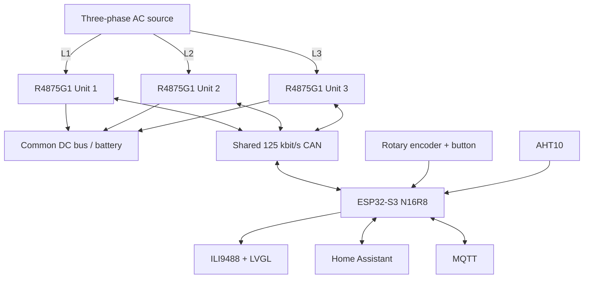

# 3-Phase Huawei R4875G1 Battery Charger Controller

ESPHome controller for **three Huawei R4875G1 rectifiers** operated as a coordinated three-phase battery charger with a common parallel DC output.

**Current stable firmware: 4.1.0** on `main`. **Current UI development firmware: 4.1.4** on `v4-lvgl-menu`.

Version 4.1 promotes the hardware-tested four-page LVGL interface and encoder page navigation to the stable baseline while retaining the validated charger, CAN-recovery, thermal-protection and local-blackstart model. Development v4.1.4 completes the Rectifiers diagnostic content and cleans up the non-touch LVGL presentation without changing charger control behavior.

For detailed runtime behavior, see `R4875G1_CONTROL_FLOWS.md`. Package ownership and maintenance rules are documented in `packages/README.md`.

> [!WARNING]
> This project controls mains-powered equipment and a high-current DC battery bus. Firmware is not a substitute for correctly engineered fuses, breakers, disconnects, BMS protection, earthing, isolation and conductor sizing.

## Project purpose

The intended installation uses one R4875G1 on each AC phase, all three DC outputs on one common battery/DC bus, identical DC voltage, a common per-unit current command and a nominal three-unit charging-power target. Core charger operation is local: Home Assistant, MQTT and Wi-Fi are useful interfaces but are not required for CAN control, the TFT/encoder or blackstart.

## System overview



CAN uses 29-bit extended identifiers.

# Key features

## Charger control

- Three R4875G1 rectifiers controlled by one ESP32-S3.
- Common active DC voltage/current setpoints.
- Active setpoints routed only to verified `ONLINE` + CAN-fresh units.
- Individual and broadcast ON/OFF controls.
- Nominal three-unit power target with automatic current calculation.
- 50 A fail-safe capability ceiling until every reachable rectifier has fresh capability data.
- Effective current ceiling uses the lowest known reachable capability, capped at 75 A.
- Shared current command scaling uses the highest reachable capability once all reachable capabilities are known.
- Periodic active-setpoint refresh only to eligible online units.

## CAN reliability

- Independent per-unit raw-CAN watchdog.
- Normal watchdog timeout: 3 s.
- During `DISCOVERING`, the watchdog timeout is extended to 7 s so the intentional 5 s discovery-stabilization delay does not falsely mark the unit unreachable.
- Explicit lifecycle: `OFFLINE`, `DISCOVERING`, `ONLINE`.
- Fast telemetry/fan polling only for `ONLINE` units.
- Slow round-robin probing for `OFFLINE` units.
- TWAI Single-Shot restricted to slow OFFLINE reconnect probes.
- Discovery waits for TWAI to return to `RUNNING`; BUS_OFF/recovery wait time does not consume discovery retries.
- Serialized property/capability/address discovery.
- 64-frame TWAI RX queue for the multi-frame property response.
- Targeted active-setpoint restore before a rediscovered unit returns to `ONLINE`.
- TWAI BUS_OFF recovery as a final controller-level recovery mechanism.

## Local blackstart and menu navigation

Current encoder behavior:

- rotate: edit the selected DC voltage or nominal three-unit DC-power target;
- short press: select `Voltage` or `Power` editing;
- double press: advance to the next LVGL page (`Dashboard → Rectifiers → Cooling → System → Dashboard`);
- long press (≥3 s): START/STOP;
- STOP has priority and is unrestricted;
- START is issued only to units that are `ONLINE`, CAN-fresh, explicitly `OFF`, below the temperature trip threshold and not locked out.

Single-click recognition deliberately waits 350 ms after release so the first click of a double-click cannot also toggle the Voltage/Power edit mode.

## Thermal protection

Shared applied current is `min(requested current, effective hardware capability, thermal limit)`. Thermal states use 70/80/90 °C thresholds with hysteresis. Warning stages reduce the shared current ceiling to 50 A and 30 A. At ≥90 °C the affected unit is switched off and locked out until a fresh temperature below 80 °C is received. Derating never overwrites the user's requested current.

# Firmware architecture

```text
r4875g1-3phase-charger.yaml
packages/
├── version.yaml
├── core.yaml
├── hardware.yaml
├── display.yaml
├── display/
│   ├── hardware.yaml
│   ├── theme.yaml
│   ├── ui.yaml
│   └── pages/
│       ├── dashboard.yaml
│       ├── rectifiers.yaml
│       ├── cooling.yaml
│       └── system.yaml
├── cooling.yaml
├── controls.yaml
├── rectifier-shared.yaml
├── rectifier-unit.yaml
└── rectifier-can/
    ├── property-start.yaml
    ├── property-end.yaml
    ├── cyclic-telemetry.yaml
    ├── fan-telemetry.yaml
    ├── address-data.yaml
    └── power-state.yaml
```

The display stack is deliberately separated: hardware transport in `display/hardware.yaml`, shared LVGL/fonts/styles in `display/theme.yaml`, page aggregation in `display/ui.yaml`, and one file per screen in `display/pages/`.

# Versioning

The firmware version has one source of truth in `packages/version.yaml`. `esphome.project.version` and the TFT consume `${firmware_version}`. Every normal repository commit increments PATCH by one; intentional release milestones may advance MAJOR/MINOR and reset PATCH.

# Hardware

- Espressif ESP32-S3-DevKitC-1 / ESP32-S3-WROOM-1-N16R8
- 16 MB Quad-SPI flash / 8 MB Octal-SPI PSRAM
- SN65HVD230 CAN transceiver, 125 kbit/s, 29-bit extended identifiers
- ILI9488 TFT, 16-bit RGB565, 40 MHz SPI, full LVGL framebuffer in PSRAM
- AHT10 compartment temperature/humidity sensor
- external fan enable/PWM plus three tachometer inputs

## GPIO map

| Function | GPIO |
|---|---:|
| Encoder button | 2 |
| TFT backlight | 4 |
| TFT CS / RESET / DC | 5 / 6 / 7 |
| I²C SDA / SCL | 8 / 9 |
| SPI MOSI / MISO / CLK | 11 / 12 / 13 |
| CAN TX / RX | 15 / 16 |
| Encoder A / B | 17 / 18 |
| External fan enable | 21 |
| Fan tach 3 / 2 / 1 | 39 / 40 / 41 |
| Fan PWM | 42 |

# Four-page UI

The installation has no touchscreen. Scrolling and `scrollbar_mode: OFF` are configured both globally in the shared LVGL theme and explicitly on every page/header/card container. The explicit per-container settings avoid LVGL scrollbar-part inheritance differences and guarantee that no unusable horizontal or vertical scrollbars are rendered. New cards must follow the same rule and must not rely on touch scrolling.

`Dashboard` provides the compact operating overview: date/time and firmware, overall ON/OFF state, combined AC/DC summaries, available-unit count, highest output temperature, conversion efficiency and local Voltage/Power/Applied-current setpoints.

`Rectifiers` shows one card each for L1/L2/L3. Every card contains a compact single-line `PWR / CAN / lifecycle` status followed by aligned DC voltage/current/power, input/output temperature, internal R4875G1 fan RPM and discovered maximum-current capability. Status color is red for CAN fault, amber while discovering, green while online and muted while offline. `UNKNOWN` power state is abbreviated to `?` so the status remains on one line. CAN-unreachable units retain state context but replace live telemetry with placeholders.

`Cooling` shows compartment temperature/humidity, external fan power, PWM command and external fan 1/2/3 RPM.

`System` shows firmware, IP address, Wi-Fi RSSI, controller uptime, CPU temperature, free internal heap, free PSRAM and compact CAN communication status for L1/L2/L3. Uptime is derived locally from the controller monotonic clock; heap and PSRAM are read directly from ESP-IDF heap capabilities so no duplicate Home Assistant entities are required for the TFT.

# Electrical / power-control model

All three rectifier outputs share the DC bus. The local nominal power selector uses `I_each = P_target / (3 × V_DC)`. The divisor remains fixed at three even when fewer rectifiers are active, intentionally avoiding increased current on remaining units when another unit disappears.

Capability handling is CAN-aware: unknown reachable capability forces the 50 A fail-safe ceiling; once all reachable capabilities are known, the effective ceiling uses the lowest reachable capability (max 75 A) while command scaling uses `1024 / highest reachable capability`.

# Rectifier lifecycle and reconnect

Every unit starts `OFFLINE`. A valid heartbeat triggers `DISCOVERING`; the discovery stabilization period is 5 seconds and uses a 7-second connectivity watchdog instead of the normal 3 seconds. Serialized discovery reads static properties, maximum-current capability and address information. Before each discovery request, firmware waits for TWAI `RUNNING`; time spent in BUS_OFF/recovery does not consume a retry. Verification is followed by targeted active voltage/current restore, then the unit is promoted to `ONLINE`.

# Deployment from Windows

`scripts/deploy-ha.ps1` derives the destination YAML filename from `esphome.name`, reads the firmware version from `packages/version.yaml`, deploys the root YAML plus only `packages/**/*.yaml`, excludes README/non-YAML files, stages and SHA-256-verifies uploads, optionally backs up managed target files, verifies installed hashes and cleans its staging directory. `-DryRun` is supported.

# Known limitations / continued development

- Optimized for three R4875G1 units.
- Nominal total-power calculation always divides by three.
- Capability mismatch is diagnostic and does not automatically disable charging.
- Mixed rectifier models/scaling behavior are not a primary supported configuration.
- Blackstart still requires power for ESP32/CAN electronics.
- SNTP date/time requires network synchronization after a cold start.
- External fan control has no automatic thermal curve or RPM-failure alarm yet.
- Software does not replace hardware protection.

# Credits and license

The repository is distributed under the MIT License and builds on the Huawei R48xx CAN research published by `mjpalmowski` in the `CAN-BUS-control-R4875G1-with-ESPHome-and-MQTT` project.

Copyright (c) 2024 mjpalmowski  
Additional project development: Copyright (c) 2026 Andreas Wansner

# Documentation status

Stable `main` remains at **v4.1.0**. This README documents development firmware **v4.1.4** on `v4-lvgl-menu`, including the completed Rectifiers diagnostics, status-color polish and global non-touch scrollbar policy. Charger-control behavior remains unchanged.
