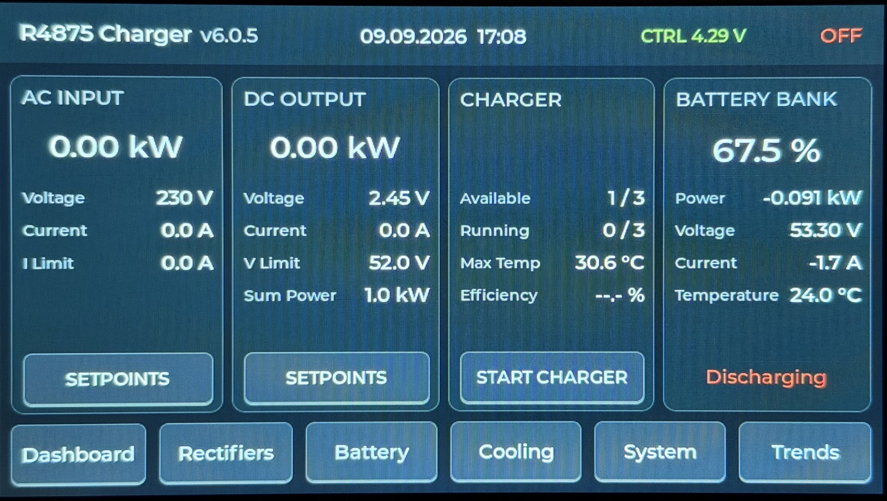

# 3-Phase Huawei R4875G1 Battery Charger Controller

ESPHome-based controller for three Huawei R4875G1 rectifiers operated as a coordinated three-phase battery charger with a common parallel DC output.

[](docs/images/ui/dashboard.jpg)

<p align="center"><em>Shared V6 Dashboard running on the Charger Controller.</em></p>

The V6 firmware generation uses two coordinated targets based on the **Waveshare ESP32-S3-Touch-LCD-7**:

- the Charger Controller, physically attached to the rectifiers and responsible for CAN, charger control, safety and local blackstart
- the Remote HMI, which uses the shared Dashboard presentation while receiving authoritative charger state and sending Dashboard command requests through Home Assistant

Remote HMI Dashboard commands use Home Assistant transport and remain subject to authoritative validation and execution by the Charger Controller. The Remote HMI displays the resulting Controller state returned through Home Assistant rather than assuming that a command succeeded.

The Charger Controller currently provides:

- local charger control
- CAN communication with three independent R4875G1 rectifiers
- automatic discovery and reconnect handling
- capability-aware current limiting
- thermal protection and derating
- network-independent local blackstart operation
- a 7-inch LVGL touchscreen interface
- backup rotary-encoder hardware inputs
- external compartment cooling
- controller backup-battery monitoring
- Home Assistant solar-battery-bank monitoring
- Home Assistant, MQTT and ESPHome web integration

The charger core is intentionally designed to remain operational without Wi-Fi, Home Assistant, MQTT or Internet access.

For detailed runtime and state-machine behavior, see [`R4875G1_CONTROL_FLOWS.md`](R4875G1_CONTROL_FLOWS.md).

For package ownership and firmware architecture, see [`packages/README.md`](packages/README.md).

Repository development rules are defined in [`AGENTS.md`](AGENTS.md) and the [`rules/`](rules/) directory.

> [!WARNING]
> This project controls equipment connected to mains voltage and a high-current
> DC battery bus.
>
> Three Huawei R4875G1 rectifiers can represent roughly 12 kW of charging power
> and more than 200 A on a 48–58 V DC bus.
>
> Firmware is not a substitute for correctly designed fuses, breakers,
> disconnects, BMS protection, earthing, isolation, conductor sizing and other
> required electrical safety measures.

---

## System Architecture

The intended installation uses one rectifier per AC phase while all three DC outputs feed the same battery/DC bus.

```text
Three-phase AC
    │
    ├── L1 -> R4875G1 Unit 1 ──┐
    ├── L2 -> R4875G1 Unit 2 ──┼── Common DC bus / battery
    └── L3 -> R4875G1 Unit 3 ──┘
                 │
                 └── Shared CAN bus
                          │
                          ▼
              Waveshare ESP32-S3 Controller
```

All rectifiers use:

```text
CAN bit rate:       125 kbit/s
CAN identifiers:    29-bit extended
DC voltage command: shared
DC current command: common per-unit request
```

Each rectifier maintains its own communication, lifecycle, discovery, thermal and telemetry state.

---

## V6 Hardware Targets

The current firmware targets:

```text
Waveshare ESP32-S3-Touch-LCD-7
ESP32-S3 N16R8
16 MB Flash
8 MB PSRAM
7-inch 800 × 480 RGB LCD
GT911 capacitive touchscreen
CH422G onboard I/O expander
onboard CAN transceiver
```

The controller uses the onboard ESP32-S3 TWAI peripheral and CAN transceiver.
No external SN65HVD230 module is required by the V6 hardware.

### External I2C Architecture

The shared controller I2C bus uses:

```text
GPIO8  -> SDA
GPIO9  -> SCL
400 kHz
```

External I2C peripherals use a dedicated second physical I2C bus. This isolates their addresses from the Waveshare onboard CH422G and allows the onboard display/touch bus to remain at 400 kHz.

```text
ESP32-S3
│
├── Onboard I2C — GPIO8 / GPIO9 — 400 kHz
│   ├── CH422G
│   └── GT911 touchscreen
│
└── External I2C — GPIO44 / GPIO43
    ├── MCP23017 @ 0x20
    │   ├── backup rotary encoder
    │   ├── external fan power enable
    │   ├── Cooling Fan 1 tachometer
    │   └── Cooling Fan 2 tachometer
    ├── AHT10 @ 0x38
    │   ├── rectifier-compartment temperature
    │   └── rectifier-compartment humidity
    └── EMC2101 @ 0x4C
        ├── external fan PWM
        └── Cooling Fan 3 tachometer
```

Unused MCP23017 pins remain available for future expansion.

---

## CAN Communication

The three Huawei rectifiers share one CAN bus.

The firmware implements independent per-unit communication state and explicit rectifier lifecycle handling:

```text
OFFLINE
   │
   │ CAN communication detected
   ▼
DISCOVERING
   │
   │ required discovery completed
   │ active setpoints restored
   ▼
ONLINE
```

A rectifier that loses valid communication returns to `OFFLINE`.

Normal high-rate telemetry polling is restricted to `ONLINE` units.

`OFFLINE` units are probed at a much lower rate using single-shot CAN transmission so an absent rectifier cannot continuously force the ESP32 TWAI controller toward `BUS_OFF`.

The firmware also implements explicit TWAI recovery if the complete physical CAN network disappears.

### Discovery

Discovery retrieves information including:

- static rectifier identification properties
- maximum DC-current capability
- shelf/address information

Discovery traffic is serialized so only one discovery operation owns the CAN bus at a time.

A successfully rediscovered unit receives the currently active DC voltage and current commands before its lifecycle returns to `ONLINE`.

---

## Charger Control

The controller manages three rectifiers as one coordinated charger while preserving independent per-unit safety and communication state.

Supported charger-wide controls include:

```text
Active DC voltage
Active per-unit DC current
Nominal three-unit DC power target
START
STOP
Fallback DC voltage
Fallback DC current
```

The nominal DC power target is converted into a common per-unit current request.

The requested current and the actually applied current are intentionally kept separate.

The final applied current is limited by:

```text
min(
    requested current,
    effective hardware capability,
    thermal current limit
)
```

This allows the requested charger target to remain unchanged while hardware or thermal protection temporarily reduces the current actually sent to the rectifiers.

---

## Capability-Aware Current Limiting

R4875G1 variants can report different maximum-current capabilities.

The controller therefore discovers the capability of each reachable unit and derives a safe shared limit.

The basic policy is:

```text
No reachable rectifier
    -> conservative fail-safe current ceiling

Reachable rectifier with unknown capability
    -> conservative fail-safe current ceiling

All reachable capabilities known
    -> effective ceiling = lowest reachable capability
```

Command scaling is derived independently from the detected rectifier capabilities so mixed-capability installations remain fail-safe.

A diagnostic entity reports capability mismatches between simultaneously reachable rectifiers.

---

## Thermal Protection

Each rectifier has an independent thermal state:

```text
NORMAL
WARNING_1
WARNING_2
LOCKOUT
```

The current configuration uses staged derating:

```text
70 °C -> first warning / reduced current
80 °C -> stronger current reduction
90 °C -> individual overtemperature shutdown
```

Hysteresis prevents rapid state oscillation while temperatures fall.

A thermal lockout is not cleared by missing or stale telemetry. Valid temperature data must confirm that the rectifier has returned to a safe temperature.

The shared thermal current ceiling is derived from the most restrictive active per-unit thermal state.

---

## Local Blackstart

Core charger operation is designed to remain available without network services.

Blackstart does not depend on:

```text
Home Assistant
MQTT
Wi-Fi
Internet access
```

Before a rectifier receives a START command, the controller verifies that it:

```text
is lifecycle ONLINE
has fresh CAN communication
reports explicit power state OFF
has valid output-temperature telemetry
is below the configured overtemperature trip threshold
has no active overtemperature lockout
```

Only units passing all checks receive the ON command.

STOP remains unrestricted.

This allows a partially available charger to remain controllable while preventing unknown or unsafe units from being started.

---

## Local User Interface

The controller uses the Waveshare 7-inch 800 × 480 RGB display with GT911 capacitive touch.

The display backlight is automatically disabled after the configured LVGL idle timeout while charger control and telemetry continue running normally. Touching and releasing the sleeping touchscreen wakes the display without activating the control underneath the wake-up touch.

The LVGL interface contains six primary functional pages:

```text
Dashboard
Rectifiers
Battery
Cooling
System
Trends
```

The Rectifiers page also provides one shared hierarchical detail view for Units 1, 2 and 3.

### Dashboard

The Dashboard uses four equal-width overview cards for AC input, DC output, charger state and the external solar battery bank.

It provides charger-wide operating information including:

```text
AC input power
AC voltage
AC current
AC current limit
DC output power
DC voltage
combined DC current
active DC voltage limit
nominal total DC power target
available rectifier count
running rectifier count
highest rectifier output temperature
conversion efficiency
charger START/STOP state
solar battery-bank SOC
solar battery-bank power
solar battery-bank voltage
solar battery-bank current
solar battery-bank temperature
solar battery-bank operating state
```

AC and DC setpoints are edited through dedicated modal dialogs opened from the corresponding Dashboard cards.

Solar battery-bank information is imported from Home Assistant for monitoring only. Missing Home Assistant battery telemetry is shown explicitly and does not affect charger control or safety behavior.

### Rectifiers

The Rectifiers page provides one overview card for each unit.

Each rectifier maintains independent:

```text
lifecycle state
power state
CAN state
AC telemetry
DC telemetry
temperature
internal fan telemetry
```

Selecting a unit opens the shared Rectifier Detail page.

### Rectifier Detail

The detail view exposes extended per-unit information including:

```text
AC voltage
AC current
AC power
AC frequency
DC voltage
DC current
DC power
input temperature
output temperature
internal fan RPM
internal fan target duty
internal fan minimum duty
maximum-current capability
operating hours
fallback voltage
fallback current
```

One LVGL page is reused dynamically for all three rectifiers.

### Battery

The Battery page provides one monitoring card for each of four parallel solar-battery units.

Each card displays:

```text
voltage
current
power
state of charge
temperature
cell drift
warning state
fault state
```

A consolidated per-battery status shows:

```text
HA OFFLINE
NO DATA
OK
WARNING
FAULT
```

`HA OFFLINE` indicates that no Home Assistant state-subscription connection is available.
`NO DATA` indicates that Home Assistant is connected but one or more required battery entities are unavailable or invalid.

Fault has priority over warning. Missing or invalid Home Assistant data is displayed explicitly instead of being treated as a healthy battery state.

All solar-battery telemetry is monitoring-only. It does not participate in charger setpoint calculation, START eligibility, thermal protection, CAN control or other charger safety decisions.

### Cooling

The Cooling page displays the shared rear-compartment environmental data and internal rectifier-fan telemetry.

External chassis-fan control is implemented independently by `packages/cooling.yaml`.

### System

The System page provides controller and communication diagnostics including:

```text
network state
Wi-Fi signal
controller uptime
CPU temperature
memory information
CAN / rectifier status
controller backup-battery voltage
controller backup-battery state of charge
```

### Trends

Five independent ten-minute ring buffers are maintained continuously:

```text
Combined DC Power
Combined DC Current
Average DC Voltage
Highest Rectifier Output Temperature
Rectifier Compartment Temperature
```

Sampling uses:

```text
5-second interval
120 samples
10-minute history
```

Invalid source values are preserved as gaps instead of being converted to artificial zero values.

---

## Backup Rotary Encoder Hardware

A mechanical rotary encoder is connected through the MCP23017.

```text
MCP23017 GPA0 -> Encoder A
MCP23017 GPA1 -> Encoder B
MCP23017 GPA2 -> Encoder button
```

The three inputs are implemented as internal MCP23017-backed GPIO entities.

The current V6 firmware does not assign charger-control or navigation actions to these backup encoder inputs.

---

## External Cooling System

The external chassis cooling system is independent of the internal fans built into the Huawei rectifiers.

Three external fans are supported.

```text
MCP23017 GPA3 -> common fan-supply enable
MCP23017 GPA4 -> Fan 1 tachometer
MCP23017 GPA5 -> Fan 2 tachometer

EMC2101 PWM   -> common four-pin fan PWM
EMC2101 TACH  -> Fan 3 tachometer
```

Every fan retains its own tachometer signal.

The EMC2101 generates the shared hardware PWM signal at approximately:

```text
25.7 kHz
```

Cooling Fan 3 ventilates the rear rectifier compartment where the AHT10 temperature/humidity sensor is installed.

### Web Controls and EMC2101 Telemetry

The ESPHome Web UI exposes the external cooling controls and EMC2101 telemetry:

```text
Cooling Fan Automatic
Cooling Fan Power
Cooling Fan Manual PWM
Cooling Fan PWM Actual
Cooling Fan Controller Temperature
Cooling Fan 1 RPM
Cooling Fan 2 RPM
Cooling Fan 3 RPM
```

`Cooling Fan Controller Temperature` reports the EMC2101 internal chip temperature. `Cooling Fan PWM Actual` reports the PWM duty cycle read back from the EMC2101 controller; it represents the programmed hardware setting rather than an independent measurement of the electrical PWM waveform.

Automatic and manual PWM control maintain separate state. While `Cooling Fan Automatic` is enabled, the compartment-temperature controller drives the EMC2101 PWM output directly and the manual PWM value remains stored without affecting the active output. When automatic mode is disabled, the stored `Cooling Fan Manual PWM` value is applied immediately and subsequent slider changes control the PWM output directly.

`Cooling Fan Power` controls the common external fan supply independently and remains available for manual operation when automatic mode is disabled.

### Automatic Cooling

Automatic cooling is enabled by default.

The current temperature curve is:

| Compartment temperature | Fan command |
| --- | ---: |
| `< 30 °C` | OFF / 0 % |
| `30–34.9 °C` | 35 % |
| `35–39.9 °C` | 45 % |
| `40–44.9 °C` | 60 % |
| `45–49.9 °C` | 80 % |
| `>= 50 °C` | 100 % |

Downward transitions use hysteresis.

If compartment-temperature telemetry becomes unavailable, the cooling system fails safe by enabling the external fans at 100 %.

---

## Controller Backup Battery

The Waveshare controller supports a 1S lithium backup battery through its J3 battery connector.

The board provides an existing divider:

```text
VBAT -> 200 kΩ -> TP1 -> 100 kΩ -> GND
```

TP1 is externally connected to:

```text
J8 pin 3 / AD -> GPIO6
```

The ADC therefore sees one third of the battery voltage and the firmware restores the actual value using a factor of 3.

The measured voltage is filtered and exposed as:

```text
Controller Battery Voltage
```

A second sensor derives an approximate voltage-based state of charge:

```text
Controller Battery State of Charge
```

The SOC value is intended for monitoring only. It is not a replacement for coulomb counting or a dedicated fuel-gauge IC.

---

## Solar Battery Bank Monitoring

The controller can import monitoring data for an external four-unit solar battery bank from Home Assistant through the ESPHome native API.

All configurable Home Assistant entity mappings are centralized in:

```text
packages/battery-bank.yaml
```

The imported aggregate bank data includes:

```text
voltage
current
power
state of charge
temperature
operating state
```

Each of the four individual battery units provides:

```text
voltage
current
power
state of charge
temperature
cell drift
warning state
fault state
```

The Home Assistant battery-bank and individual battery power entities are normalized internally from watts to kilowatts.

Battery warning and fault entities are imported as text states so `on`, `off`, `unknown` and `unavailable` remain distinguishable.

Home Assistant battery telemetry is intentionally isolated from charger control. The charger remains locally operational when Wi-Fi or Home Assistant is unavailable.

---

## Network Interfaces

Network services provide additional monitoring and control but are not part of the local charger safety path.

The firmware integrates:

```text
ESPHome native API
MQTT
ESPHome Web Server
OTA
SNTP time synchronization
```

Home Assistant can therefore expose charger telemetry, diagnostics, setpoints and control entities while local operation remains independent.

---

## Firmware Architecture

The firmware is assembled from modular ESPHome packages.

```text
r4875g1-3phase-charger.yaml
trend_helpers.h

packages/
├── version.yaml
├── core.yaml
├── hardware.yaml
├── controls.yaml
├── cooling.yaml
├── battery-bank.yaml
├── display.yaml
├── rectifier-shared.yaml
├── rectifier-unit.yaml
│
├── display/
│   ├── hardware.yaml
│   ├── theme.yaml
│   ├── ui.yaml
│   ├── header.yaml
│   ├── command-state.yaml
│   ├── controller-battery.yaml
│   ├── dashboard.yaml
│   ├── rectifiers.yaml
│   ├── rectifier-detail.yaml
│   ├── battery.yaml
│   ├── cooling.yaml
│   ├── system.yaml
│   ├── trends.yaml
│   │
│   └── pages/
│       ├── dashboard.yaml
│       ├── rectifiers.yaml
│       ├── rectifier-detail.yaml
│       ├── battery.yaml
│       ├── cooling.yaml
│       ├── system.yaml
│       └── trends.yaml
│
└── rectifier-can/
    ├── property-start.yaml
    ├── property-end.yaml
    ├── cyclic-telemetry.yaml
    ├── fan-telemetry.yaml
    ├── address-data.yaml
    └── power-state.yaml
```

### Package Responsibilities

| Package | Responsibility |
| --- | --- |
| `version.yaml` | firmware version source of truth |
| `core.yaml` | ESP32, network, API, MQTT, OTA, web and time services |
| `hardware.yaml` | controller buses, I2C expansion, touch, CAN, encoder and backup battery |
| `controls.yaml` | charger-wide user setpoints and controls |
| `cooling.yaml` | external chassis-fan control and RPM monitoring |
| `display.yaml` | complete LVGL package aggregation |
| `rectifier-shared.yaml` | shared lifecycle, safety, discovery, CAN scheduling and control |
| `rectifier-unit.yaml` | parameterized per-unit state and telemetry |
| `rectifier-can/*.yaml` | parameterized CAN receive handlers |
| `trend_helpers.h` | native LVGL chart support |
| `battery-bank.yaml` | Home Assistant solar-battery telemetry import and availability state |

The detailed ownership model is documented in [`packages/README.md`](packages/README.md).

---

## Display Architecture

The V6 display implementation separates static UI layout from periodic runtime updates.

```text
display.yaml
│
├── hardware.yaml
├── theme.yaml
├── ui.yaml
│
├── persistent runtimes
│   ├── header.yaml
│   ├── command-state.yaml
│   └── controller-battery.yaml
│
├── page runtimes
│   ├── dashboard.yaml
│   ├── rectifiers.yaml
│   ├── rectifier-detail.yaml
│   ├── battery.yaml
│   ├── cooling.yaml
│   ├── system.yaml
│   └── trends.yaml
│
└── page layouts
    └── pages/*.yaml
```

Only the currently visible page receives its normal page-specific runtime updates.

Persistent header, command-state handling and controller backup-battery presentation continue independently.

This reduces unnecessary LVGL update load and keeps the controller responsive.

---

## Building

The main ESPHome configuration is:

```text
r4875g1-3phase-charger.yaml
```

Validate or compile using the normal ESPHome toolchain, for example:

```bash
esphome config r4875g1-3phase-charger.yaml
esphome compile r4875g1-3phase-charger.yaml
```

Hardware-dependent changes should always be validated on the actual controller after successful compilation.

---

## Versioning

The firmware version has exactly one source of truth:

```text
packages/version.yaml
```

Do not duplicate the current firmware version in documentation.

Version changes follow:

```text
rules/versioning.md
```

Pure documentation and repository-cleanup changes do not require a firmware version increment unless they also change runtime behavior.

---

## Repository Development Rules

AI-assisted and human development follows the repository rules in:

```text
AGENTS.md
rules/
```

`AGENTS.md` is the entry point for agents.

All human-readable repository content created or substantially modified by the project is written in English.

The repository rules define:

```text
development workflow
Git workflow
versioning
documentation
YAML comment style
```

---

## V4 Hardware Variant

The previous ESP32-S3-DevKitC-1 hardware implementation remains maintained separately on:

```text
v4-maintenance
```

V4 is a permanent hardware variant rather than the active V6 controller target.

Changes that are genuinely shared between both hardware generations may be ported when appropriate, but V6-specific display, I/O and hardware assumptions must not be applied blindly to the V4 branch.

---

## Acknowledgements

This project originally grew from the Huawei R48xx CAN work published by **mjpalmowski** in:

`CAN-BUS-control-R4875G1-with-ESPHome-and-MQTT`

That work provided important groundwork for Huawei CAN protocol research, telemetry decoding, control commands, property/capability discovery and ESPHome integration.

The current project has since evolved into a dedicated three-unit charger with independent per-unit lifecycle management, local/offline control, automatic CAN recovery, capability-aware current limiting, thermal protection, a touchscreen controller platform and external cooling management.

---

## Disclaimer

This repository is provided for development and experimentation with Huawei R4875G1 rectifiers.

Anyone building or operating hardware based on this project is responsible for the electrical, thermal and mechanical safety of the resulting system.
