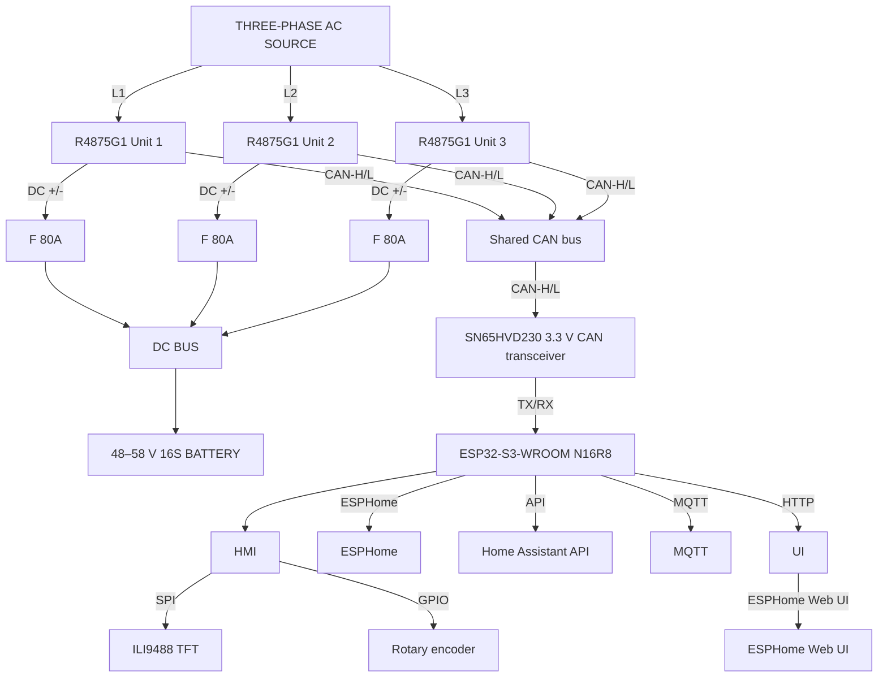

# 3-Phase Huawei R4875G1 Battery Charger Controller

ESPHome-based controller for **three Huawei R4875G1 rectifier units** operated as a coordinated 3-phase battery charger with a common parallel DC output.

The project combines CAN-bus control, live telemetry, Home Assistant integration, MQTT, an onboard web interface, a 480×320 TFT display, and a local rotary-encoder interface. Its main design goal is to remain useful even when the normal home automation infrastructure is unavailable — including a **local blackstart workflow that does not depend on Wi-Fi, MQTT, or Home Assistant**.

> [!WARNING]
> This project works with mains AC, high DC currents, and large battery systems. Three R4875G1 units can represent roughly 12 kW of charging power and more than 200 A on a 48–58 V DC bus. Incorrect wiring, protection, earthing, fusing, conductor sizing, CAN isolation, or charger settings can cause fire, electric shock, equipment damage, or battery failure. This repository is a DIY engineering project, not a certified commercial charger. Use suitable protective devices and follow all applicable electrical regulations.

---

## Table of Contents

- [3-Phase Huawei R4875G1 Battery Charger Controller](#3-phase-huawei-r4875g1-battery-charger-controller)
  - [Table of Contents](#table-of-contents)
- [Project Purpose](#project-purpose)
- [Acknowledgements and Upstream Project](#acknowledgements-and-upstream-project)
- [System Overview](#system-overview)
- [Key Features](#key-features)
  - [Charger control](#charger-control)
  - [Local blackstart operation](#local-blackstart-operation)
  - [Telemetry](#telemetry)
  - [Reliability and fault handling](#reliability-and-fault-handling)
  - [Display](#display)
- [Hardware](#hardware)
  - [Main Controller](#main-controller)
  - [Rectifier Units](#rectifier-units)
  - [CAN Interface](#can-interface)
  - [Ambient Sensor](#ambient-sensor)
  - [Display](#display-1)
  - [Rotary Encoder](#rotary-encoder)
  - [GPIO Assignment](#gpio-assignment)
- [Electrical Architecture](#electrical-architecture)
- [Software](#software)
  - [ESPHome Platform Configuration](#esphome-platform-configuration)
  - [Networking](#networking)
    - [Offline-oriented behaviour](#offline-oriented-behaviour)
  - [CAN Communication](#can-communication)
  - [Telemetry Decoding](#telemetry-decoding)
    - [Voltage/value scaling](#voltagevalue-scaling)
    - [Current scaling](#current-scaling)
  - [CAN Communication Watchdog](#can-communication-watchdog)
  - [Combined AC and DC Values](#combined-ac-and-dc-values)
    - [Combined AC power](#combined-ac-power)
    - [Combined DC power](#combined-dc-power)
    - [Additional aggregate values](#additional-aggregate-values)
    - [AC values on the display](#ac-values-on-the-display)
  - [Local Blackstart Control](#local-blackstart-control)
    - [DC voltage](#dc-voltage)
    - [Total DC power](#total-dc-power)
    - [Blackstart start sequence](#blackstart-start-sequence)
    - [Stop sequence](#stop-sequence)
  - [Display User Interface](#display-user-interface)
    - [Header](#header)
    - [Per-unit lines](#per-unit-lines)
    - [Local setpoints](#local-setpoints)
    - [Charger state](#charger-state)
    - [Footer](#footer)
  - [Display Power Management](#display-power-management)
  - [Temperature Protection](#temperature-protection)
  - [Unit Discovery](#unit-discovery)
  - [Home Assistant, Web UI and MQTT](#home-assistant-web-ui-and-mqtt)
    - [Home Assistant API](#home-assistant-api)
    - [Web server](#web-server)
    - [MQTT](#mqtt)
  - [Energy Counters](#energy-counters)
- [Installation](#installation)
  - [Requirements](#requirements)
  - [1. Copy the YAML](#1-copy-the-yaml)
  - [2. Configure secrets](#2-configure-secrets)
  - [3. Validate](#3-validate)
  - [4. Compile](#4-compile)
  - [5. First flash](#5-first-flash)
  - [6. Verify CAN wiring](#6-verify-can-wiring)
  - [7. Run Unit Discovery](#7-run-unit-discovery)
- [secrets.yaml](#secretsyaml)
- [Local Operation](#local-operation)
  - [Rotate while DC Voltage is selected](#rotate-while-dc-voltage-is-selected)
  - [Short button press](#short-button-press)
  - [Rotate while DC Power is selected](#rotate-while-dc-power-is-selected)
  - [Long button press](#long-button-press)
- [Blackstart Procedure](#blackstart-procedure)
- [CAN Protocol Overview](#can-protocol-overview)
- [Important Limits and Behaviour](#important-limits-and-behaviour)
  - [75 A per-unit current cap](#75-a-per-unit-current-cap)
  - [Identical-unit assumption](#identical-unit-assumption)
  - [Communication loss](#communication-loss)
  - [Offline networking](#offline-networking)
  - [Setpoint refresh](#setpoint-refresh)
- [Troubleshooting](#troubleshooting)
  - [Display shows `CAN bus communication fault!`](#display-shows-can-bus-communication-fault)
  - [Only one or two units appear in AC Input](#only-one-or-two-units-appear-in-ac-input)
  - [Encoder values react slowly or continue changing after rotation](#encoder-values-react-slowly-or-continue-changing-after-rotation)
  - [Encoder button behaves incorrectly](#encoder-button-behaves-incorrectly)
  - [Display does not turn off](#display-does-not-turn-off)
  - [Charger does not start during blackstart](#charger-does-not-start-during-blackstart)
- [Known Limitations](#known-limitations)
- [Repository Structure](#repository-structure)
- [Credits and Licensing Notes](#credits-and-licensing-notes)
  - [Disclaimer](#disclaimer)

---

# Project Purpose

This project controls **three Huawei R4875G1 telecom rectifier units** from a single ESP32-S3 controller.

The three rectifiers are intended to be used as a coordinated charger:

- one rectifier per AC phase,
- all DC outputs connected to the same battery/DC bus,
- identical DC voltage setpoint for all units,
- identical current setpoint for all units,
- combined charging power controlled as one logical 3-phase charger.

The controller has two operating philosophies at the same time:

1. **Normal connected operation**
   - Home Assistant API
   - MQTT
   - ESPHome web interface
   - live telemetry and diagnostics
   - remote voltage/current configuration
   - energy counters

2. **Local emergency / blackstart operation**
   - no Home Assistant required,
   - no MQTT broker required,
   - no Wi-Fi connection required,
   - voltage and the nominal three-unit DC power target can be set with a rotary encoder
   - a long encoder-button press starts or stops the rectifiers directly via CAN.

This is especially useful for an **off-grid or islanded energy system** where the battery/inverter side may be too deeply discharged to start the normal system. If an external AC source is still available, the charger can be operated locally to bring the battery/DC bus back to a usable voltage.

---

# Acknowledgements and Upstream Project

This project originally started from the excellent work by **mjpalmowski**:

**CAN-BUS-control-R4875G1-with-ESPHome-and-MQTT**  
https://github.com/mjpalmowski/CAN-BUS-control-R4875G1-with-ESPHome-and-MQTT

That project provided the original foundation for controlling Huawei R48xx rectifier units through CAN bus from ESPHome, including CAN protocol research, telemetry decoding, configuration commands, MQTT/Home Assistant integration, and multi-unit operation.

The current project has since evolved significantly around a specific use case:

- three R4875G1 units,
- 3-phase charger operation,
- ESP32-S3 hardware,
- 480×320 local display,
- rotary-encoder control,
- offline blackstart capability,
- per-unit CAN watchdogs,
- CAN-aware combined power values,
- local fault visualization,
- display power management,
- extensive inline documentation.

Please visit the upstream repository for the original work, protocol research, additional supported R48xx variants, protocol spreadsheets, discussions, and historical context.

The upstream repository is released under the **MIT License** and carries the copyright notice:

> Copyright (c) 2024 mjpalmowski

If substantial portions of upstream code are copied or adapted, retain the applicable upstream copyright and MIT permission notice as required by that license.

---

# System Overview



The ESP32 does not carry the CAN physical layer directly. This build uses an **SN65HVD230 3.3 V CAN transceiver module** between the ESP32 CAN TX/RX signals and CAN-H/CAN-L; the exact module is linked in the [CAN Interface](#can-interface) section.

---

# Key Features

## Charger control

- Control of three Huawei R4875G1 units from one ESP32-S3.
- Broadcast voltage setpoint for all units.
- Broadcast current setpoint for all units.
- Individual unit ON/OFF commands.
- Broadcast ON/OFF commands.
- Fan full-speed and automatic fan commands.
- Fallback voltage and current settings.
- Periodic retransmission of voltage/current setpoints.

## Local blackstart operation

- Works independently of Home Assistant.
- Works independently of MQTT.
- Wi-Fi failure does not reboot the controller.
- API failure does not reboot the controller.
- MQTT broker failure does not reboot the controller.
- Rotary encoder adjusts:
  - DC output voltage,
  - nominal three-unit DC charging power target.
- Controller calculates the required current per rectifier automatically.
- Local START requires valid CAN communication with at least one rectifier.

## Telemetry

Per unit, the controller decodes values including:

- AC input power,
- DC output power,
- AC/grid frequency,
- AC input current,
- AC input voltage,
- DC output voltage,
- DC output current,
- configured maximum output current,
- input temperature,
- output temperature,
- fan speed,
- actual fan duty,
- requested fan duty,
- power state,
- ambient temperature,
- ambient relative humidity,
- unit capability and identification information.

## Reliability and fault handling

- Independent CAN communication watchdog for each rectifier.
- A unit is considered offline when valid cyclic telemetry has not been received for 3 seconds.
- Live per-unit telemetry sensors use a 5-second freshness timeout and become unavailable when no new CAN value is received.
- The telemetry timeout applies to live voltage, current, power, frequency, temperature, current-setpoint and fan-speed measurements.
- Static discovery information, hardware capabilities and lifetime operating-hour counters retain their last valid values across temporary CAN communication loss.
- The reported power state is changed to `UNKNOWN` when a unit loses CAN communication.
- Stale `ON`/`OFF` states are never used for local charger start/stop decisions.
- Local START is inhibited when no rectifier has valid CAN communication.
- Failed units are excluded from combined AC/DC power calculations.
- Stale unit values are not included in combined power.
- Display replaces unavailable unit values with a clear CAN communication fault message.
- AC and DC overviews continue operating with one or two units if other units lose communication.
- AC and DC overview headers show how many of the three rectifier units currently contribute valid telemetry.
- The DC overview displays a CAN communication fault instead of an invalid `nan` value when no rectifier telemetry is available.
- Maximum-current capabilities of all three rectifiers are compared automatically.
- A diagnostic problem entity reports a mismatch between rectifier hardware capabilities.
- Capability consistency remains `unknown` until all three rectifiers have supplied valid capability data.

## Display

- 480×320 ILI9488 TFT.
- 500 ms refresh interval.
- Live AC and DC information.
- Per-unit DC values and temperatures.
- Per-unit CAN fault indication.
- Local voltage and total-power setpoints.
- Selected encoder field highlighted.
- Charger state display (`OFF`, `1/3 ON`, `2/3 ON`, `3/3 ON`).
- IP address, CPU temperature, and Wi-Fi RSSI footer.
- Backlight automatically fades out after inactivity.

---

# Hardware

## Main Controller

The current configuration targets:

**Androegg ESP32-S3 UNO**  
https://www.androegg.de/shop/esp32-s3-uno-usb-c-esp32-wroom-n16r8-entwickler-board/

Module:

- **ESP32-S3-WROOM-1-N16R8**
- 16 MB Quad-SPI flash
- 8 MB Octal-SPI PSRAM
- CPU configured for 240 MHz
- ESP-IDF framework
- UART0 serial logging

The ESPHome configuration explicitly enables the full flash and PSRAM capabilities of the module.

## Rectifier Units

This installation is designed around:

- **3 × Huawei R4875G1** rectifier units

The project assumes that the three rectifiers are electrically suitable for parallel operation on the DC side and are configured as a symmetric charger set.

Typical project topology:

- Unit 1 → AC phase L1
- Unit 2 → AC phase L2
- Unit 3 → AC phase L3
- DC outputs → common DC bus / battery
- CAN-H/CAN-L → common CAN bus

The local power-control algorithm treats the configured power as a nominal three-rectifier target and calculates the common current command as:

```text
Current per unit = Nominal three-unit DC power target / (DC voltage × 3)
```

For example:

```text
Nominal three-unit target: 6.0 kW
DC voltage:                53.0 V

6000 W / (53 V × 3) = 37.74 A per rectifier
```

The factor of three remains fixed during partial-unit operation. If fewer than three rectifiers are actually operating, actual combined output power is correspondingly lower.

The calculated current is limited by the runtime `Effective DC Current Limit`, which can never exceed the project's 75 A per-unit ceiling.

## CAN Interface

The ESP32-S3 contains the CAN/TWAI controller, but an external physical-layer transceiver is required.

This project uses the following 3.3 V CAN transceiver module:

- **[CAN Bus Module SN65HVD230 Transceiver](https://www.ebay.de/itm/187121483571?mkevt=1&mkpid=0&emsid=e11412.m144671.l197929&mkcid=7&ch=osgood&euid=a3c94179b4b74512bcd68a2bfb44fee2&bu=43162872420&exe=0&ext=0&osub=-1%7E1&crd=20260816180453&segname=11412)**
- Transceiver IC: **SN65HVD230**
- Logic supply: **3.3 V**
- Purpose: converts the ESP32-S3 CAN/TWAI TX/RX logic signals to the differential **CAN-H / CAN-L** physical bus used by the three rectifier units.

The SN65HVD230 is a suitable match for the ESP32-S3 because it is designed for 3.3 V logic operation. Other electrically compatible CAN transceivers can also be used, but the wiring and supply requirements may differ.

Current GPIO assignment:

- CAN TX: **GPIO15**
- CAN RX: **GPIO16**
- CAN bitrate: **125 kbit/s**
- Extended 29-bit CAN identifiers are used.

The CAN bus should use proper twisted-pair wiring and suitable termination for the physical topology.

## Ambient Sensor

Ambient temperature and relative humidity are measured using an **AHT10** I²C sensor.

Connection:

- supply: **3.3 V**
- SDA: **GPIO10**
- SCL: **GPIO9**
- I²C address: **0x38**

The sensor provides:

- `Ambient Temperature`
- `Ambient Humidity`

Both values are updated every 60 seconds and are available through Home Assistant, the ESPHome API and the local web interface.

## Display

The local UI uses an:

- **ILI9488** TFT controller
- resolution: **480 × 320**
- SPI interface
- 8-bit color palette
- landscape orientation via hardware transform

Display pins:

- SPI CLK: GPIO13
- SPI MOSI: GPIO11
- SPI MISO: GPIO12
- TFT CS: GPIO5
- TFT DC/RS: GPIO7
- TFT RESET: GPIO6
- Backlight PWM: GPIO4

The display backlight is exposed as a dimmable ESPHome light entity.

## Rotary Encoder

The local user interface uses a rotary encoder with push button.

Recommended supply:

- VCC: **3.3 V**
- GND: GND

Connections:

- S1 / A: **GPIO17**
- S2 / B: **GPIO18**
- KEY / push button: **GPIO2**

The ESP32 internal pull-ups are enabled.

The encoder is intentionally designed to work without any network connectivity.

## GPIO Assignment

| Function | GPIO | Notes |
|---|---:|---|
| Display backlight PWM | GPIO4 | LEDC PWM |
| TFT CS | GPIO5 | ILI9488 |
| TFT RESET | GPIO6 | ILI9488 |
| TFT DC/RS | GPIO7 | ILI9488 |
| I²C SCL | GPIO9 | AHT10 environmental sensor |
| I²C SDA | GPIO10 | AHT10 environmental sensor |
| SPI MOSI | GPIO11 | TFT / SPI bus |
| SPI MISO | GPIO12 | TFT / SPI bus |
| SPI CLK | GPIO13 | TFT / SPI bus |
| Encoder A / S1 | GPIO17 | Local input |
| Encoder B / S2 | GPIO18 | Local input |
| CAN CTX | GPIO15 | ESP32 CAN/TWAI |
| CAN CRX | GPIO16 | ESP32 CAN/TWAI |
| Encoder button / KEY | GPIO2 | Local input, active low |

---

# Electrical Architecture

The three rectifiers share the same DC bus. Therefore they must all operate at the same DC voltage.

The firmware treats charger power as a total system target and attempts to distribute it evenly between the three rectifiers by commanding the same calculated current to each unit.

$$
P_{total} = 3 \cdot U_{DC} \cdot I_{Unit}
$$

Therefore:

$$
I_{Unit} = \frac{P_{total}}{3 \cdot U_{DC}}
$$

`Set DC Sum Power` is a **nominal three-rectifier power target**.

The divisor in the current calculation intentionally remains fixed at three, even when one or more rectifiers are unavailable, offline or excluded by a temperature lockout.

The controller does not automatically redistribute the requested total power across the remaining units.

Therefore, before current limiting and conversion losses:

```text
3 active units -> approximately 100% of the configured target
2 active units -> approximately  67% of the configured target
1 active unit  -> approximately  33% of the configured target
```

For example, a 6 kW target at 53 V produces a common current command of approximately 37.7 A per rectifier. If only two rectifiers are operating, their combined nominal output is therefore approximately 4 kW rather than increasing their current to maintain 6 kW.

This behavior is intentional and conservative. A rectifier that has lost CAN communication may still be physically operating, so automatically increasing the current of the remaining visible units could cause the actual total power to exceed the requested value.

This approach is particularly convenient for local control because the operator only needs to choose:

1. desired DC voltage,
2. desired nominal three-unit DC power target.

The per-unit current becomes an implementation detail calculated by the controller.

> [!IMPORTANT]
> The physical DC conductors, busbars, fuses, disconnects, battery protection, BMS, and charger wiring must be rated for the actual possible current. At 12 kW and approximately 53 V, total DC current is around 226 A.

---

# Software

The controller is implemented almost entirely in a single ESPHome YAML configuration.

Minimum configured ESPHome version:

```text
2026.7.4
```

## ESPHome Platform Configuration

The ESP32 configuration uses:

- `variant: esp32s3`
- 16 MB flash
- QIO flash mode
- 80 MHz flash frequency
- 240 MHz CPU
- ESP-IDF toolchain
- 8 MB Octal PSRAM at 80 MHz
- execution from PSRAM enabled

PSRAM is also enabled for Wi-Fi allocations. This leaves more internal memory available for the large display framebuffer and other runtime components.

## Networking

The project supports all of the following simultaneously:

- Wi-Fi
- Home Assistant native API
- ESPHome web server
- MQTT
- OTA firmware updates
- fallback access point
- captive portal
- SNTP time synchronization

### Offline-oriented behaviour

For blackstart reliability, the configuration intentionally disables automatic restart when infrastructure is unavailable:

```yaml
api:
  reboot_timeout: 0s

wifi:
  reboot_timeout: 0s

mqtt:
  reboot_timeout: 0s
```

This means the ESP32 keeps running its local CAN, encoder, display and charger-control logic even if:

- the Wi-Fi access point is down,
- Home Assistant is offline,
- the MQTT broker is unreachable.

Wi-Fi power saving is disabled for maximum stability during normal connected operation.

## CAN Communication

The CAN interface uses:

```text
125 kbit/s
29-bit extended CAN identifiers
```

The controller periodically polls all three units for cyclic telemetry.

Current polling sequence:

```text
Unit 1 request: 0x108140FE
wait 183 ms
Unit 2 request: 0x108240FE
wait 193 ms
Unit 3 request: 0x108340FE
```

This sequence is started approximately every 577 ms.

The corresponding cyclic telemetry responses are:

```text
Unit 1: 0x1081407F
Unit 2: 0x1082407F
Unit 3: 0x1083407F
```

Each valid response refreshes that unit's CAN communication watchdog timestamp.

## Telemetry Decoding

For the `0x108x407F` telemetry frames, bytes 0 and 1 identify the value type while bytes 4–7 contain a 32-bit raw value.

The implementation currently decodes identifiers including:

| Data selector | Meaning |
|---|---|
| `0x70` | AC power input |
| `0x71` | Grid frequency |
| `0x72` | Input current |
| `0x73` | DC power output |
| `0x75` | Output voltage |
| `0x76` | Set maximum output current |
| `0x78` | Input grid voltage |
| `0x7F` | Output temperature |
| `0x80` | Input temperature |
| `0x81` | Output current |

Raw values are published into ESPHome template sensors and converted using the configured scaling factors.

### Fan telemetry

Each rectifier also provides a dedicated fan telemetry frame:

```text
Unit 1: 0x1081827E
Unit 2: 0x1082827E
Unit 3: 0x1083827E
```

Valid fan telemetry frames use message selector `0x01 / 0x87`.

The payload contains three 16-bit big-endian values:

```text
bytes 2..3 = minimum fan duty
bytes 4..5 = fan duty target
bytes 6..7 = fan RPM
```

The two duty values use a fixed-point representation with 256 counts per percentage point:

```text
fan duty [%] = raw value / 256
```

For example:

```text
raw 0x0F00 = 3840
3840 / 256 = 15%
```

The first duty value represents the minimum fan duty reported by the rectifier. It must not be interpreted as the actual instantaneous fan duty.

The second duty value represents the fan duty target currently reported by the rectifier.

Fan speed is reported directly as a 16-bit RPM value and requires no additional scaling:

```text
RPM = (byte 6 << 8) | byte 7
```

The resulting per-unit entities are:

```text
Fan Minimum Duty Unit 1..3
Fan Duty Target Unit 1..3
Fan RPM Unit 1..3
```

All fan telemetry entities are CAN-driven and use a 5-second freshness timeout. If no new fan frame is received within that period, the corresponding values become unavailable instead of retaining stale measurements.

### Voltage/value scaling

The default general scaling factor is:

```text
1024
```

Many raw telemetry values are therefore converted using:

```text
engineering value = raw CAN value / 1024
```

### Current scaling

Current commands use a model-dependent fixed-point scaling factor.

Because this project specifically targets the 75 A Huawei R4875G1, the
controller starts with the known model-specific fallback:

```text
current_scaling_factor = 1024 / 75
                       ≈ 13.653333
```

This fallback is available immediately after controller startup so local blackstart operation does not depend on successful capability discovery.

The scaling factor is a hardware-derived value and is therefore not restored from persistent ESP32 storage. Each boot starts from the known R4875G1 fallback.

Whenever Unit 1 becomes reachable on the CAN bus, the controller automatically runs its capability discovery sequence. The reported maximum-current capability is then used to recalculate:

```text
current_scaling_factor = 1024 / maximum_current
```

For the intended 75 A R4875G1 units this resolves to approximately:

```text
1024 / 75 ≈ 13.653
```

Unit 1 remains the canonical source for the shared current scaling factor.
Unit 2 and Unit 3 capability values are decoded separately for diagnostic comparison but do not overwrite the shared factor.

This architecture assumes the intended installation of three identical R4875G1 rectifiers. Mixed rectifier models require additional capability validation.

### Rectifier capability consistency

Once the maximum-current capability of all three rectifiers has been received,
the controller compares the reported values automatically.

A diagnostic binary sensor is exposed:

```text
Rectifier Capability Mismatch
```

Its states are:

```text
unknown = capability data for all three rectifiers is not currently confirmed
OFF     = all three maximum-current capabilities match
ON      = at least one rectifier reports a different maximum-current capability
```

The reported capability has a resolution of 0.5 A. The comparison therefore uses a 0.25 A tolerance so every real capability difference is detected without depending on exact floating-point equality.

A mismatch may indicate that a different Huawei R48xx model has been installed, that a rectifier was replaced with a unit having different current capability, or that the detected hardware configuration is otherwise inconsistent.


The controller also derives one shared runtime safety limit:

```text
Effective DC Current Limit
```

The limit starts at the project's 75 A R4875G1 ceiling and is reduced to the
lowest valid maximum-current capability reported by any rectifier.

For example:

```text
Unit 1: 75 A
Unit 2: 50 A
Unit 3: 75 A

Effective DC Current Limit: 50 A
```

This effective limit is used consistently for the normal DC-current command, fallback current and local total-power-to-current calculation.

If capability discovery lowers the effective limit below an existing current setpoint, the controller immediately reduces that setpoint.

The effective limit is a protective current ceiling only. It does not make mixed rectifier models fully compatible because the shared CAN current scaling factor is still derived from Unit 1.

The diagnostic does not currently inhibit charger operation. Unit 1 remains the canonical source for the shared current_scaling_factor. A capability mismatch should therefore be investigated before relying on normal three-unit operation.

## CAN Communication Watchdog

Each unit has its own diagnostic sensor:

```text
can_com_ok_1
can_com_ok_2
can_com_ok_3
```

A unit is considered online when valid CAN communication from that rectifier has been received within the previous **3 seconds**.

Internally the firmware stores:

```text
last_can_rx_1
last_can_rx_2
last_can_rx_3
```

These values contain the `millis()` timestamp of the most recent valid CAN activity received from the corresponding rectifier.

The watchdog timestamp is refreshed by:

* valid cyclic telemetry frames,
* valid property START/DATA frames,
* valid property END frames.

Cyclic telemetry remains the normal communication heartbeat during regular charger operation.

Property frames also refresh the watchdog while unit discovery is active. This is necessary because normal cyclic telemetry and fan polling are intentionally suspended during property discovery to give the multi-frame property response exclusive access to the CAN bus.

Without refreshing the watchdog from property frames, a long property-discovery sequence could incorrectly cause:

```text
CAN communication lost
```

even though the rectifier is actively transmitting valid discovery data.

Using actual received property frames as watchdog activity preserves fail-safe behaviour. Discovery itself does not force a unit to remain online; if the rectifier stops responding and no valid CAN frames are received, the watchdog still expires normally.

The timeout calculation uses unsigned arithmetic:

```cpp
(uint32_t) (millis() - last_can_rx)
```

so it remains safe across the normal `millis()` wrap-around.

When no valid CAN communication has been received from a unit within the configured watchdog period, its `can_com_ok_x` sensor becomes false.

When communication is lost, the corresponding CAN-reported power-state sensor is also changed to:

```text
UNKNOWN
```

because the previous ON/OFF state can no longer be trusted.

This prevents stale rectifier state from being interpreted as current operating status.

The CAN watchdog is more reliable than simply checking individual telemetry sensors for `NaN`, because an ESPHome sensor can retain its last valid value after CAN communication has stopped. Without the watchdog, stale measurements could appear to remain valid indefinitely.

Combined measurements, display logic and start-safety checks therefore use the CAN communication state to distinguish currently reachable rectifiers from stale data.

When a rectifier becomes reachable again, the watchdog changes back to online and the automatic unit-discovery sequence is started after the configured stabilization delay.

## Combined AC and DC Values

### Combined AC power

`combined_ac_power` includes only units that:

1. currently have valid CAN communication, and
2. have a valid non-NaN AC power value.

Offline units are excluded instead of contributing stale measurements.

If no valid unit is available, the sensor returns `NAN`/unavailable rather than falsely reporting `0 kW`.

### Combined DC power

`combined_dc_power` uses the same CAN-aware logic for DC output power.

### Additional aggregate values

Additional CAN-aware aggregate sensors are provided for monitoring:

- `Available Units` — number of rectifiers currently reachable over CAN,
- `Combined DC Current All Units` — summed DC output current,
- `Average DC Voltage All Units` — average output voltage of reachable units,
- `Highest Output Temperature All Units` — highest valid rectifier output temperature,
- `Conversion Efficiency All Units` — combined DC output power divided by AC input power for units with valid paired telemetry.

Aggregate measurements exclude units without valid CAN communication or without the required live telemetry.

`Conversion Efficiency All Units` only includes rectifiers that simultaneously provide valid AC and DC power telemetry. The value becomes unavailable below 100 W total AC input power to avoid meaningless or unstable efficiency values near idle operation.

`Available Units` is different from the other aggregates: it intentionally reports `0` when no rectifiers are reachable instead of becoming unavailable.

### AC values on the display

The display does not depend on Unit 1 alone.

For all currently reachable units with valid telemetry:

- AC voltage → average
- AC current → average
- grid frequency → average
- AC power → sum

The display also shows how many units are included:

```text
AC Input: 8.437 kW  (3/3)
```

or, after one CAN failure:

```text
AC Input: 5.612 kW  (2/3)
```

The displayed AC current is therefore a representative **average per active rectifier/phase**, not the arithmetic sum of three phase currents.

If all three units lose communication:

```text
AC Input: CAN bus communication fault!
No charger unit reachable
```

## Local Blackstart Control

The local blackstart interface is one of the main differences between this project and a conventional network-only ESPHome charger controller.

The rotary encoder controls two values:

```text
Mode 0: DC Voltage
Mode 1: DC Sum Power
```

### DC voltage

Configured range:

```text
49.0–58.0 V
step: 0.1 V
```

### Total DC power

The local power control is configured as a nominal **three-unit DC power target**.

The current command is always calculated using:

$$
I_{unit} = \frac{P_{target}}{3 \cdot U_{DC}}
$$

The factor of three is fixed and does not change during partial-unit operation.

If fewer than three rectifiers are actually operating, the controller does not
raise the current of the remaining units to compensate. Actual combined output
power is therefore lower than the configured target.

Configured range:

```text
0.25–12.0 kW
step: 0.25 kW
```

The calculated current is constrained to:

```text
minimum: 1 A
maximum: lowest of
         - 75 A project ceiling
         - valid detected rectifier current capabilities
```

For the intended three 75 A R4875G1 rectifiers, the effective maximum is 75 A.

If a lower-capability rectifier is detected, the total-power calculation is
automatically limited to that lower current.

### Blackstart start sequence

A long encoder-button press executes the blackstart start script.

The sequence is intentionally deterministic:

1. calculate current from total power and voltage,
2. wait for the calculation script to complete,
3. explicitly send the voltage setpoint,
4. wait 50 ms,
5. explicitly send the calculated current setpoint,
6. wait 250 ms,
7. evaluate the safety state of each rectifier independently,
8. send an individual ON command only to units that pass all start-safety checks.

A rectifier is eligible for START only when:

- valid cyclic CAN communication is available,
- the CAN-reported power state is explicitly `OFF`,
- a fresh output-temperature value is available,
- output temperature is not above 90 °C,
- no overtemperature lockout is active.

Rectifiers reporting `ERROR` or `UNKNOWN` are never started. Requiring an explicit `OFF` state prevents an ON command from being issued before the rectifier's actual operating state has been confirmed over CAN.

This also makes controller startup fail-safe. After an ESP32 reboot, a rectifier cannot be started until its first valid output-temperature telemetry has been received.

A rectifier whose temperature telemetry becomes stale is again prevented from starting until fresh telemetry is available.

The three-unit broadcast ON control is stricter because it cannot exclude an individual rectifier: all three units must pass the start-safety checks before the broadcast ON command is transmitted.

### Stop sequence

A long press while any unit is currently reported ON sends the broadcast OFF command.

The decision is based on the actual CAN-reported unit power-state sensors, not merely on a local software toggle.

## Display User Interface

The display is refreshed every **500 ms**.

### Header

The top of the display contains:

- project title,
- local date/time from SNTP,
- CAN-aware AC input overview,
- combined DC output power.

### Per-unit lines

Each rectifier receives its own line containing:

```text
DC voltage
DC current
DC power
input temperature
output temperature
```

Example:

```text
L1: 53.20 V - 37.7 A - 2005 W - 31.5 °C / 45.2 °C
```

If CAN communication fails for that unit, stale or NaN values are not shown. Instead:

```text
L1: CAN bus communication fault!
```

The fault is displayed in bold red text.

### Local setpoints

The selected local control field is shown in bold blue with a `>` marker:

```text
> DC Voltage: 53.0 V
  DC Target(3U): 6.00 kW - 37.7 A/u
```

After a short encoder-button press:

```text
  DC Voltage: 53.0 V
> DC Target(3U): 6.00 kW - 37.7 A/u
```

`DC Target(3U)` is the nominal power target for the complete three-rectifier system. The actual measured combined output is shown separately in the `DC Output` header.

### First-boot setpoint defaults

All persistent user-adjustable setpoints have explicit first-boot defaults.

These values are used only when no previously stored value is available:

| Setpoint | First-boot default |
|---|---:|
| Fan minimum speed | 0 % |
| DC voltage limit | 53.0 V |
| DC current limit | 1 A |
| DC fallback voltage | 53.0 V |
| DC fallback current | 1 A |
| AC current limit | 0 A / disabled |
| Nominal three-unit DC power target | 1.0 kW |

After a value has been changed and stored, `restore_value` restores the previous setting on subsequent boots instead of using the first-boot default.

The direct DC-current default is intentionally kept at the minimum 1 A. During local blackstart, the actual current target is recalculated from the configured DC voltage and nominal three-unit power target before the rectifiers are started.

### Charger state

The display derives the number of active rectifiers from the three CAN-reported power-state sensors:

```text
OFF
1/3 ON
2/3 ON
3/3 ON
```

### Footer

The footer shows:

- IP address,
- ESP32 internal CPU temperature,
- Wi-Fi RSSI.

These network-related values are informational only and are not required for blackstart operation.

## Display Power Management

The backlight uses PWM and is controlled by a restartable inactivity timer.

Behaviour:

1. any encoder rotation wakes the display,
2. any encoder-button press wakes the display,
3. the 5-minute inactivity timer restarts,
4. after 5 minutes without input, the backlight fades out over 10 seconds,
5. new input immediately wakes the display and restarts the timer.

The display logic itself continues running while the backlight is off.

This reduces unnecessary display illumination without compromising local operation.

## Temperature Protection

Each unit's output temperature is monitored independently.

If a unit reports an output temperature above:

```text
90 °C
```

the controller:
1. engages an overtemperature lockout for that unit,
2. sends an individual OFF command to the affected rectifier,
3. blocks subsequent ON commands for that unit while the lockout remains active.

The overtemperature trip is edge-triggered. Only the transition into the overtemperature condition sends the OFF command; subsequent telemetry values above 90 °C do not continuously retransmit the same command.

A 10 °C hysteresis prevents rapid cycling around the shutdown threshold:

```text
Trip:     > 90 °C
Recovery: < 80 °C
```
Temperatures between 80 °C and 90 °C keep the lockout active.

If temperature telemetry becomes unavailable while a lockout is active, the lockout is retained. Missing or stale temperature data cannot automatically clear an overtemperature condition.

Unknown temperature is also treated fail-safe for startup. A unit with no valid current output-temperature value cannot receive an ON command. This prevents a controller reboot or temporary loss of temperature telemetry from bypassing the temperature protection before the actual thermal state of the rectifier is known.

The shutdown and lockout logic operate locally and do not require Home Assistant, MQTT, Wi-Fi, or another network connection.

## Unit Discovery

Each rectifier is discovered automatically when valid CAN communication with that unit becomes available.

The CAN communication watchdog detects the transition from offline to online. Automatic discovery does not start immediately after the first valid CAN frame. Instead, the controller waits for a short stabilization period before starting the discovery sequence.

The current automatic startup stabilization period is **5 seconds**.

This delay allows the rectifier to complete its internal power-up sequence and gives the ESP32 TWAI transmit queue time to recover from previously unacknowledged CAN traffic that may have accumulated while no rectifier was online.

After the stabilization period, CAN communication is checked again.

If the rectifier is still reachable, its discovery request is submitted to one shared global discovery queue.

All automatic and manual discovery operations use this same queue.

The queue is intentionally serialized: only one rectifier discovery operation can run at a time. Additional discovery requests wait until the currently active discovery has completely finished.

This prevents multiple rectifiers from simultaneously transmitting large multi-frame property responses onto the shared CAN bus.

When several rectifiers become available at approximately the same time, discovery therefore proceeds sequentially rather than in parallel.

For example:

```text
Unit 1 becomes available
Unit 2 becomes available
Unit 3 becomes available

        ↓

Unit 1 discovery
        ↓
Unit 1 complete
        ↓
Unit 2 discovery
        ↓
Unit 2 complete
        ↓
Unit 3 discovery
        ↓
Unit 3 complete
```

A complete per-unit discovery sequence consists of:

1. static unit-property discovery,
2. maximum-current capability discovery,
3. hardware pin/shelf address discovery.

The property and capability stages for an individual unit are also executed sequentially using ESPHome script synchronization. The capability/address stage does not begin until the property stage has either completed successfully or exhausted its configured retry limit.

If CAN communication is lost during the initial startup stabilization period, automatic discovery is cancelled. It will be attempted again the next time the rectifier transitions from offline to online.

Automatic discovery therefore also works when a rectifier:

* is already powered when the ESP32 starts,
* is powered up after the controller has already started,
* temporarily loses CAN communication and later reconnects.

The static property response is transmitted by the rectifier as a burst of several dozen CAN frames.

The ESP32 TWAI receive queue is configured for **64 frames**, substantially larger than the driver's small default queue. This provides sufficient buffering for a complete multi-frame property response while allowing ESPHome to process the incoming frames reliably.

Normal cyclic telemetry and fan polling are temporarily suspended while a property-discovery script is active.

Before the first property request is transmitted, the controller waits for a **500 ms CAN-bus quiet period**. This allows any already-running telemetry polling sequence to finish before the rectifier begins transmitting its multi-frame property response.

The resulting property-discovery sequence is:

1. the serialized discovery worker selects one rectifier,
2. property discovery becomes active,
3. normal cyclic telemetry and fan polling are suspended,
4. an already-running polling sequence is allowed to finish,
5. the controller waits for the configured CAN-bus quiet period,
6. the property request is transmitted,
7. the complete multi-frame response is received and reconstructed,
8. the property data is validated and parsed,
9. capability/address discovery is performed,
10. the unit discovery completes,
11. the next queued rectifier discovery may begin.

This prevents normal telemetry traffic and discovery traffic from competing with a high-rate property response and also prevents property responses from multiple rectifiers from overlapping.

A property response begins with a protocol-defined start frame and ends with a dedicated end frame. Property data is accepted only after a valid start frame has been received.

If an end frame arrives without a valid start/data sequence, the incomplete response is discarded instead of attempting to parse corrupted property data. The configured retry mechanism can then issue another property request.

Valid property START/DATA and END frames also refresh the corresponding unit's CAN communication watchdog timestamp.

This keeps the unit correctly marked as reachable while normal cyclic telemetry polling is intentionally suspended during property discovery. If the rectifier stops responding completely, no property frames are received and the normal CAN watchdog can still expire.

The discovery process queries information including:

* board type,
* barcode / serial information,
* item number,
* description,
* manufacturing information,
* maximum current capability,
* hardware pin/shelf information.

Property queries use unit-specific CAN IDs and reconstruct multi-frame text responses before extracting key/value fields.

Each property discovery stage has a defined retry limit. A failed or incomplete property response does not block the controller indefinitely. Once the configured retry count is exhausted, the property stage terminates and the sequence continues to the capability/address stage.

Capability and address discovery also use a configurable retry limit and terminate when either all required information has been received or the retry limit has been reached.

Complete raw property responses are logged only at DEBUG level. Normal INFO logging still reports discovery progress, extracted property values and whether all required fields were received successfully.

The `Discover Rectifier Units` button remains available as a manual service and retry function.

Manual discovery is submitted to the same global serialized discovery queue used by automatic discovery. A manual full discovery therefore cannot overlap an automatic per-unit discovery already in progress.

The manual full sequence processes:

```text
Unit 1
↓
Unit 2
↓
Unit 3
```

and waits for each unit's complete discovery process before continuing with the next unit.

For the intended 75 A R4875G1 units, the controller still starts with the known model-specific current-scaling fallback. Successful Unit 1 capability discovery verifies or updates the shared current scaling factor automatically.

Unit 1 remains the canonical source for the shared current scaling factor. Unit 2 and Unit 3 capability values are retained for diagnostics and hardware-consistency checks.

## Home Assistant, Web UI and MQTT

### Home Assistant API

The native ESPHome API is enabled with encryption.

This exposes normal ESPHome entities to Home Assistant while keeping the local charger logic independent of Home Assistant availability.

Controller diagnostics, CAN health, rectifier capability information and static unit identification data are exposed using Home Assistant's `diagnostic` entity category, keeping operational telemetry and controls separate from service data.

### Web server

ESPHome Web Server v3 provides a direct browser-based interface to charger
telemetry, diagnostics and controls.

Browser access is protected using HTTP Digest authentication. The credentials
are stored in `secrets.yaml` and must not be committed to the repository.

```yaml
web_server:
  version: 3
  port: 80
  local: true
  include_internal: false
  auth:
    username: !secret web_server_username
    password: !secret web_server_password
    type: digest
  ota: false
```

`local: true` embeds the required web-interface assets in the ESP32 firmware.
The web UI therefore remains usable on the local network even when internet
access is unavailable.

Internal ESPHome helper entities are not exposed through the web interface.

Firmware upload through the normal web interface is disabled. Firmware updates
continue to use the separately configured native ESPHome OTA platform.

Web-server authentication affects only HTTP access. Local CAN communication,
the TFT display, rotary-encoder control and blackstart operation remain fully
independent of the web server.

### MQTT

MQTT is enabled alongside the native ESPHome API.

Home Assistant uses the native API as the canonical entity integration.
MQTT entity discovery is therefore disabled to avoid duplicate Home Assistant
entities, while MQTT remains available for external command and state transport.

Four stable custom command topics are assigned directly to the corresponding
ESPHome number entities:

```text
home/canbus/set_dc_voltage
home/canbus/set_dc_current
home/canbus/set_dc_voltage_fallback
home/canbus/set_dc_current_fallback
```

The common command namespace is defined once in the YAML as:

```yaml
mqtt_command_prefix: "home/canbus"
```

MQTT commands use ESPHome's native number command handling. Payloads must be
valid numeric values and must remain within the configured range of the
corresponding number entity.

No intermediate MQTT subscribe text sensors are required.

MQTT failure does not restart the ESP32 and does not affect local CAN or
blackstart operation.

## Energy Counters

The configuration includes two daily energy counters:

- `AC Energy Today` — AC input energy accumulated since midnight,
- `DC Energy Today` — DC output energy accumulated since midnight.

Both counters are calculated from the CAN-aware combined power sensors and
reset at midnight using the configured SNTP time source.

Because failed units are excluded from combined power calculations, stale
measurements from a disconnected rectifier do not continue to inflate the
daily energy values.

---

# Installation

## Requirements

- ESPHome **2026.7.4 or newer**
- ESP32-S3-WROOM-1-N16R8 controller board
- **[CAN Bus Module SN65HVD230 Transceiver](https://www.ebay.de/itm/187121483571?mkevt=1&mkpid=0&emsid=e11412.m144671.l197929&mkcid=7&ch=osgood&euid=a3c94179b4b74512bcd68a2bfb44fee2&bu=43162872420&exe=0&ext=0&osub=-1%7E1&crd=20260816180453&segname=11412)** or another suitable 3.3 V CAN transceiver
- ILI9488 display if local display functionality is required
- rotary encoder with push button if local blackstart control is required
- one to three compatible rectifier units; this project is specifically developed for three R4875G1 units

## 1. Copy the YAML

Place the project YAML in your ESPHome configuration directory, for example:

```text
/config/esphome/3PhaseCharger.yaml
```

## 2. Configure secrets

Create or update `secrets.yaml` with the required network and API credentials.

See the example below.

## 3. Validate

From an ESPHome CLI installation:

```bash
esphome config 3PhaseCharger.yaml
```

or validate it from the ESPHome dashboard.

## 4. Compile

```bash
esphome compile 3PhaseCharger.yaml
```

## 5. First flash

For the first installation, connect the ESP32-S3 by USB and use ESPHome's normal serial installation process.

For example:

```bash
esphome run 3PhaseCharger.yaml
```

After the first successful installation, OTA updates can normally be used.

## 6. Verify CAN wiring

Before enabling high-power charging, verify:

- correct CAN-H/CAN-L polarity,
- correct CAN bus termination,
- common reference/ground requirements of your chosen CAN transceiver,
- 125 kbit/s operation,
- correct unit addresses/physical configuration,
- valid telemetry from each unit.

The Home Assistant diagnostic entities:

```text
CAN Communication Unit 1
CAN Communication Unit 2
CAN Communication Unit 3
```

should become connected/ON when valid cyclic telemetry is being received.

## 7. Verify Unit Discovery

Unit discovery starts automatically when valid CAN communication becomes available.

Check that the expected unit identification and maximum-current values are populated.

The `Discover Rectifier Units` button can be used to manually repeat the full discovery sequence for diagnostics or after hardware changes.

---

# secrets.yaml

Example only:

```yaml
wifi_ssid: "YOUR_WIFI_SSID"
wifi_password: "YOUR_WIFI_PASSWORD"

api_encryption_key: "YOUR_ESPHOME_API_ENCRYPTION_KEY"

fallback_ap_password: "YOUR_FALLBACK_AP_PASSWORD"

mqtt_host: "192.168.1.10"
mqtt_username: "YOUR_MQTT_USERNAME"
mqtt_password: "YOUR_MQTT_PASSWORD"

web_server_username: "admin"
web_server_password: "YOUR_WEB_SERVER_PASSWORD"
```

Do not commit real credentials to a public repository.

A typical `.gitignore` should therefore contain at least:

```gitignore
secrets.yaml
```

If your repository contains additional private configuration files, add them as appropriate.

---

# Local Operation

The rotary encoder is designed to provide a deliberately small local control surface.

## Rotate while DC Voltage is selected

- clockwise → increase voltage by 0.1 V
- anticlockwise → decrease voltage by 0.1 V

Changing voltage recalculates the common per-unit current required for the selected nominal three-unit DC power target.

## Short button press

A short press switches between:

```text
DC Voltage
DC Sum Power
```

Current timing in the YAML:

```text
50 ms to 2800 ms = short press
```

## Rotate while DC Power is selected

- clockwise → increase the nominal three-unit DC power target by 0.25 kW
- anticlockwise → decrease the nominal three-unit DC power target by 0.25 kW

This does not redistribute the target across fewer available rectifiers.

The current per rectifier is recalculated automatically.

## Long button press

Current threshold:

```text
>= 3000 ms
```

If all units are reported OFF, a long press starts the blackstart sequence.

If any unit is reported ON, a long press sends the stop command.

---

# Blackstart Procedure

The intended use case is an island/off-grid system where the normal inverter/battery system cannot boot because the DC bus is too low.

> [!IMPORTANT]
> The ESP32 controller itself must have power before it can perform a blackstart. If the battery/DC bus is completely dead, power the ESP32/display/CAN electronics from an independent safe auxiliary supply such as USB or a suitable isolated/regulated 5 V source.

A typical procedure is:

1. Make sure the external AC source feeding the rectifiers is available and safe.
2. Power the ESP32 controller and CAN interface.
3. Wait for the display to start.
4. Verify whether the rectifier units are reachable via CAN.
5. Select the desired DC voltage with the rotary encoder.
6. Short-press the encoder button to select total DC power.
7. Select a conservative initial charging power.
8. Hold the encoder button for at least 3 seconds.
9. The controller sends:
   - current calculation,
   - voltage setpoint,
   - current setpoint,
   - individual ON commands to rectifiers that pass the startup safety checks.
10. Monitor the DC bus/battery voltage, temperatures and charger state.
11. Once the battery/inverter system has recovered, normal system control can resume.

Example conservative startup values might be:

```text
DC Voltage: 53.0 V
DC Target(3U): 1.0 kW
```

The correct values depend on the battery chemistry, BMS, inverter requirements and installation. Do not use example values blindly.

---

# CAN Protocol Overview

The following table documents the main CAN IDs used by this project. It is intended as a project map, not a complete Huawei CAN specification.

| CAN ID pattern | Direction | Purpose |
|---|---|---|
| `0x108140FE` | ESP → Unit 1 | Request cyclic telemetry |
| `0x108240FE` | ESP → Unit 2 | Request cyclic telemetry |
| `0x108340FE` | ESP → Unit 3 | Request cyclic telemetry |
| `0x1081407F` | Unit 1 → ESP | Cyclic telemetry data |
| `0x1082407F` | Unit 2 → ESP | Cyclic telemetry data |
| `0x1083407F` | Unit 3 → ESP | Cyclic telemetry data |
| `0x1081D2FE` | ESP → Unit 1 | Request unit properties |
| `0x1082D2FE` | ESP → Unit 2 | Request unit properties |
| `0x1083D2FE` | ESP → Unit 3 | Request unit properties |
| `0x1081D27F / 7E` | Unit 1 → ESP | Multi-frame unit properties |
| `0x1082D27F / 7E` | Unit 2 → ESP | Multi-frame unit properties |
| `0x1083D27F / 7E` | Unit 3 → ESP | Multi-frame unit properties |
| `0x108150FE` | ESP → Unit 1 | Request capability/data packets |
| `0x108250FE` | ESP → Unit 2 | Request capability/data packets |
| `0x108350FE` | ESP → Unit 3 | Request capability/data packets |
| `0x1081507F / 7E` | Unit 1 → ESP | Capability/data responses |
| `0x1082507F / 7E` | Unit 2 → ESP | Capability/data responses |
| `0x1083507F / 7E` | Unit 3 → ESP | Capability/data responses |
| `0x1001117E` | Unit 1 → ESP | Power state / alternate current data |
| `0x1002117E` | Unit 2 → ESP | Power state / alternate current data |
| `0x1003117E` | Unit 3 → ESP | Power state / alternate current data |
| `0x108080FE` | ESP → all | Broadcast configuration/control |
| `0x108180FE` | ESP → Unit 1 | Individual control |
| `0x108280FE` | ESP → Unit 2 | Individual control |
| `0x108380FE` | ESP → Unit 3 | Individual control |
| `0x1081827E` | Unit 1 → ESP | Fan duty, duty setpoint and RPM |
| `0x1082827E` | Unit 2 → ESP | Fan duty, duty setpoint and RPM |
| `0x1083827E` | Unit 3 → ESP | Fan duty, duty setpoint and RPM |

Broadcast command payloads in the current project include functions for:

- output voltage,
- output current,
- fallback voltage,
- fallback current,
- ON/OFF,
- fan control.

For deeper protocol information, see the upstream project and its protocol resources:

https://github.com/mjpalmowski/CAN-BUS-control-R4875G1-with-ESPHome-and-MQTT

---

# Important Limits and Behaviour

## 75 A per-unit current cap

The project has an absolute current ceiling of 75 A per rectifier.

At runtime, the actual effective limit may be lower if capability discovery reports a rectifier with a lower maximum-current rating.

The firmware therefore uses:

```text
effective current limit = min(75 A, all valid detected rectifier capabilities)
```

For the intended three 75 A R4875G1 units, the effective limit remains 75 A.

Therefore the configured 12 kW power selector does not guarantee that 12 kW can be produced at every voltage.

Example at 49 V with a 75 A effective limit:

```text
12,000 W / (49 V × 3) = 81.63 A/unit
```

The firmware limits this to 75 A/unit, so actual achievable power is lower:

```text
49 V × 75 A × 3 ≈ 11.0 kW
```

A lower detected rectifier capability reduces the achievable power further.

## Identical-unit assumption

The local power distribution assumes three equivalent rectifier units and sends one common current target.

The global current scaling factor is also derived from Unit 1.

Do not assume correct behaviour with mixed rectifier models or different current capabilities without adapting the logic.

## Communication loss

If one unit loses CAN:

- its individual display line shows a CAN communication fault,
- its stale power value is excluded from combined AC/DC power,
- AC average values are calculated from the remaining valid units.
- The nominal three-unit power target is not redistributed across remaining units.
- Losing one rectifier therefore reduces actual charger power instead of increasing the current command of the remaining units.

If all units lose CAN:

- AC display shows a communication fault,
- combined AC/DC power sensors become unavailable rather than 0.

## Offline networking

The controller intentionally remains running without network infrastructure.

However, offline operation naturally affects network-derived information:

- SNTP time may not be valid if the unit has not synchronized since boot,
- IP address may be absent or show fallback-network information,
- Wi-Fi RSSI may be unavailable or meaningless.

None of these values are required for CAN control or local blackstart.

## Setpoint refresh

Voltage and current setpoints are periodically retransmitted over CAN every 30 seconds in addition to immediate updates when the values change.

This helps keep the units synchronized with the controller's intended settings.

---

# Troubleshooting

## Display shows `CAN bus communication fault!`

Check:

- rectifier has AC power,
- unit addressing / slot configuration,
- CAN-H and CAN-L polarity,
- transceiver power supply,
- ESP32 CAN TX/RX wiring,
- CAN bitrate is 125 kbit/s,
- termination resistors,
- common reference where required,
- cable quality and topology.

The CAN watchdog needs a valid cyclic telemetry frame within 3 seconds.

## Only one or two units appear in AC Input

This is intentional fault-tolerant behaviour.

The `(x/3)` indicator shows how many units currently have valid CAN communication and valid telemetry.

Example:

```text
AC Input: 5.4 kW (2/3)
```

means only two units are currently contributing to the displayed AC values.

## Encoder values react slowly or continue changing after rotation

Do not force a full TFT refresh for every encoder detent.

The current design changes the internal setpoint immediately and lets the display refresh at its normal 500 ms interval. This avoids queuing many expensive 480×320 SPI refreshes.

## Encoder button behaves incorrectly

Check:

- KEY connected to GPIO2,
- 3.3 V logic,
- ground connection,
- internal pull-up enabled,
- active-low/inverted input,
- mechanical switch quality.

The configuration uses a 30 ms `delayed_on_off` debounce filter.

## Display does not turn off

The inactivity timer is reset by:

- clockwise encoder movement,
- anticlockwise encoder movement,
- encoder-button press.

After the last input, it waits 5 minutes and then fades the backlight out over 10 seconds.

## Charger does not start during blackstart

Check in this order:

1. ESP32/controller has independent power.
2. CAN communication is valid.
3. External AC source is available to the rectifiers.
4. Voltage setpoint is appropriate.
5. Total power/current is appropriate.
6. Long press is held for at least 3 seconds.
7. Unit power-state sensors change to ON.
8. BMS or external DC protection is not blocking current.

---

# Known Limitations

- The firmware is optimized for **three identical R4875G1 units**.
- The current calculation always divides total requested power by three, even if one unit has lost CAN communication. The local setpoint model therefore assumes the intended three-unit system is available for charging.
- Current scaling is global and derived from Unit 1.
- If all units are offline, the combined DC power sensor becomes unavailable. The current DC header on the TFT formats the combined sensor directly, so depending on ESPHome display formatting it may show an unavailable/NaN representation until a dedicated DC-header communication-fault branch is added.
- SNTP-based time requires network access to synchronize after a cold start.
- This project does not replace correctly engineered hardware safety mechanisms such as fuses, breakers, contactors, BMS protection, thermal protection, earthing or isolation.

---

# Repository Structure

A minimal repository can look like:

```text
.
├── 3PhaseCharger.yaml      # Main ESPHome configuration
├── README.md               # Project documentation
├── secrets.yaml            # Local credentials - DO NOT COMMIT
└── .gitignore
```

Recommended `.gitignore` entry:

```gitignore
secrets.yaml
```

If screenshots, wiring diagrams, enclosure CAD or PCB files are later added, a structure such as the following can keep the repository organized:

```text
.
├── docs/
│   ├── images/
│   ├── wiring/
│   └── can-notes/
├── hardware/
├── 3PhaseCharger.yaml
└── README.md
```

---

# Credits and Licensing Notes

This project is a derivative/evolution of work originally published by **mjpalmowski** in:

**CAN-BUS-control-R4875G1-with-ESPHome-and-MQTT**  
https://github.com/mjpalmowski/CAN-BUS-control-R4875G1-with-ESPHome-and-MQTT

The upstream project is licensed under the MIT License:

```text
MIT License
Copyright (c) 2024 mjpalmowski
```

The MIT license requires the upstream copyright notice and permission notice to be included in copies or substantial portions of the upstream software.

This README does **not** automatically assign a license to the additional work in this repository. Add an appropriate `LICENSE` file for this project according to how you want your own additions to be licensed, while preserving any notices required for upstream-derived portions.

Special thanks to the upstream author and contributors for documenting the Huawei R48xx CAN protocol and making the original ESPHome implementation publicly available.

---

## Disclaimer

This software and documentation are provided for experimental and educational DIY use. No guarantee is made regarding correctness, electrical safety, battery compatibility, regulatory compliance, or suitability for any particular installation.

Before connecting high-power rectifiers to a battery or inverter system, verify all limits independently and design the installation so that software failure cannot defeat essential electrical protection.
