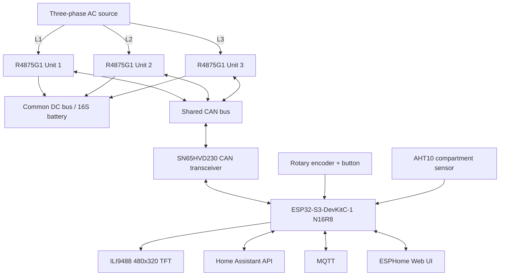
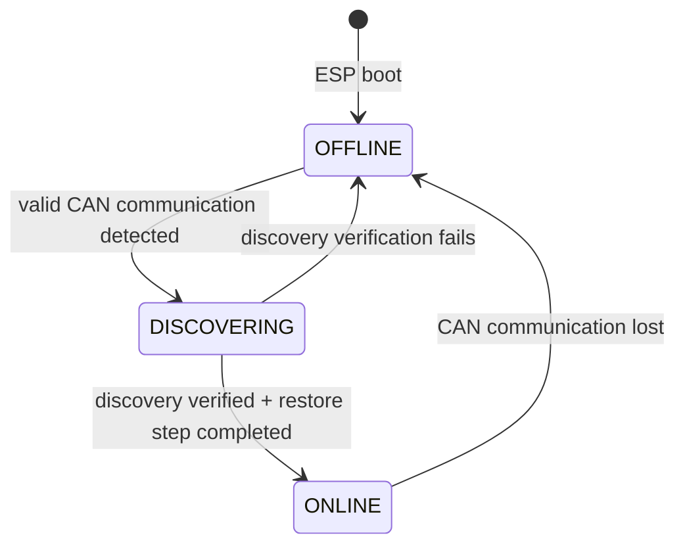
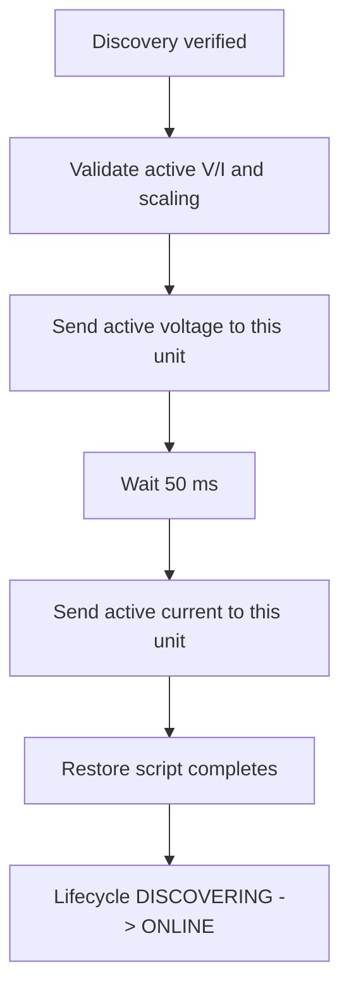

# 3-Phase Huawei R4875G1 Battery Charger Controller

ESPHome-based controller for **three Huawei R4875G1 rectifiers** operated as a coordinated three-phase battery charger with a common parallel DC output.

The project combines CAN control, live telemetry, Home Assistant, MQTT, a local web interface, a 480×320 TFT and a rotary encoder. Core charger operation is intentionally local so the system remains usable during a network outage or an off-grid blackstart situation.

For detailed state-machine and runtime diagrams, see [`R4875G1_CONTROL_FLOWS.md`](R4875G1_CONTROL_FLOWS.md).

> [!WARNING]
> This project controls equipment connected to mains voltage and a high-current DC battery bus. Three R4875G1 units can represent roughly 12 kW of charging power and more than 200 A on a 48–58 V DC bus. Firmware is not a substitute for correctly designed fuses, breakers, disconnects, BMS protection, earthing, isolation, conductor sizing and other hardware safety measures.

---

## Project purpose

The intended installation uses:

- one R4875G1 on each AC phase,
- all three DC outputs connected to one common battery/DC bus,
- identical DC voltage for all rectifiers,
- one common per-unit current command,
- a nominal three-unit charging-power target,
- an ESP32-S3 as the local controller.

The controller supports normal networked operation and a network-independent local mode. Home Assistant, MQTT and the web UI are useful interfaces, but they are not required for CAN control, the TFT, rotary-encoder operation or local blackstart.

---

## Acknowledgements

This project originally grew from the Huawei R48xx CAN work published by **mjpalmowski** in:

**CAN-BUS-control-R4875G1-with-ESPHome-and-MQTT**  
https://github.com/mjpalmowski/CAN-BUS-control-R4875G1-with-ESPHome-and-MQTT

That project provided important groundwork for Huawei CAN protocol research, telemetry decoding, control commands, property/capability discovery and ESPHome integration.

The current repository has evolved substantially around a dedicated three-unit charger, ESP32-S3 hardware, local blackstart, per-unit lifecycle control, CAN outage recovery, state-aware polling, capability-derived current limiting and a local TFT/encoder interface.

---

## System overview



CAN uses **125 kbit/s** and **29-bit extended identifiers**.

---

# Key features

## Charger control

- Three Huawei R4875G1 rectifiers controlled from one ESP32-S3-DevKitC-1.
- Common active DC voltage and current setpoints.
- Normal active setpoints routed only to verified `ONLINE` rectifiers with fresh CAN communication.
- Individual and broadcast ON/OFF controls.
- Fallback voltage/current configuration.
- Fan minimum-duty, automatic-mode and full-speed control.
- Nominal three-unit DC power target with automatic current calculation.
- Runtime effective DC-current ceiling derived from detected rectifier capabilities.
- Periodic active-setpoint refresh only to verified online units.

## Local blackstart

- No Home Assistant required.
- No MQTT broker required.
- No Wi-Fi connection required.
- Rotary encoder selects DC voltage and nominal three-unit DC power target.
- Long press starts or stops locally.
- START is allowed only for rectifiers that are fully `ONLINE`, CAN-fresh, explicitly `OFF`, thermally safe and not locked out.
- STOP remains unrestricted.

## CAN reliability

- Independent raw CAN watchdog for every rectifier.
- Explicit per-unit lifecycle: `OFFLINE`, `DISCOVERING`, `ONLINE`.
- High-rate telemetry/fan polling only for `ONLINE` rectifiers.
- `OFFLINE` units are probed sparsely in round-robin order.
- **Single-Shot CAN is intentionally limited to slow OFFLINE reconnect probes.**
- Normal online telemetry/fan polling uses the regular ESPHome CAN path.
- Static property and capability/address discovery use the regular ESPHome CAN path.
- Static property discovery temporarily owns the bus and uses an enlarged 64-frame TWAI RX queue.
- Automatic and manual discoveries use one serialized queue.
- A rediscovered unit receives its active voltage/current before it is returned to `ONLINE`.
- Reconnect setpoint restore uses the normal unit-specific active-setpoint path.
- TWAI `BUS_OFF` recovery remains available as a final controller-level recovery mechanism.

---

# Versioning

The ESPHome firmware publishes project metadata using:

```yaml
esphome:
  project:
    name: "anwa.3phase-charger"
    version: "2.2.2"
```

The project uses `MAJOR.MINOR.PATCH` firmware versions:

- **MAJOR/MINOR** changes define tagged project milestones, for example `v2.2.0`.
- **PATCH** is incremented for every subsequent firmware commit: `2.2.1`, `2.2.2`, ...
- When MAJOR or MINOR changes, PATCH resets to `0` and that milestone is tagged.

The value in `esphome.project.version` is the authoritative firmware version exposed by ESPHome/Home Assistant.

---

# Hardware

## Main controller

Current target:

- **Espressif ESP32-S3-DevKitC-1**
- **ESP32-S3-WROOM-1-N16R8** module
- 16 MB Quad-SPI flash
- 8 MB Octal-SPI PSRAM
- 240 MHz CPU
- ESP-IDF framework

The N16R8 memory configuration matches the firmware settings: 16 MB Quad-SPI flash (`qio`, 80 MHz) and 8 MB Octal-SPI PSRAM at 80 MHz.

ESPHome minimum version configured by the firmware:

```text
2026.7.4
```

## Rectifiers

The firmware is developed for:

```text
3 × Huawei R4875G1
```

Typical topology:

```text
Unit 1 -> L1
Unit 2 -> L2
Unit 3 -> L3
All DC outputs -> common battery/DC bus
All CAN-H/CAN-L -> common CAN bus
```

## CAN interface

The ESP32-S3 provides the TWAI controller; an external CAN transceiver provides the physical layer.

Current build:

- transceiver: **SN65HVD230**
- logic supply: **3.3 V**
- CAN TX: **GPIO15**
- CAN RX: **GPIO16**
- bitrate: **125 kbit/s**
- extended CAN identifiers: **29 bit**

Use proper twisted-pair wiring and termination appropriate for the physical bus topology.

## Display

- ILI9488
- 480 × 320
- SPI
- landscape orientation

| Function | GPIO |
|---|---:|
| TFT CS | 5 |
| TFT RESET | 6 |
| TFT DC/RS | 7 |
| SPI MOSI | 11 |
| SPI MISO | 12 |
| SPI CLK | 13 |
| Backlight PWM | 4 |

## Rotary encoder

Recommended 3.3 V operation:

| Function | GPIO |
|---|---:|
| S1 / A | 17 |
| S2 / B | 18 |
| KEY / push button | 2 |

Internal pull-ups are enabled. The button is active-low.

## Rectifier-compartment sensor

An AHT10 measures temperature and relative humidity in the common rear connection/exhaust-air compartment behind the rectifiers.

| Function | GPIO |
|---|---:|
| I2C SCL | 9 |
| I2C SDA | 8 |

I2C address: `0x38`.

The resulting measurements are shared compartment-air values, not the internal temperature of one particular rectifier.

## ESP32-S3-DevKitC-1 GPIO compatibility

The existing GPIO allocation was checked against the official ESP32-S3-DevKitC-1 pinout and remains compatible with the N16R8 board. No firmware pin changes are required.

| Function | GPIOs | Result |
|---|---|---|
| Encoder push button | 2 | Compatible |
| TFT backlight PWM | 4 | Compatible |
| TFT CS / RESET / DC | 5, 6, 7 | Compatible |
| I2C SDA / SCL | 8, 9 | Compatible |
| TFT SPI MOSI / MISO / CLK | 11, 12, 13 | Compatible |
| CAN / TWAI TX / RX | 15, 16 | Compatible |
| Rotary encoder A / B | 17, 18 | Compatible |
| Cooling FAN_ENABLE | 21 | Compatible |
| Cooling FAN3_TACH / FAN2_TACH / FAN1_TACH | 39, 40, 41 | Compatible |
| Cooling FAN_PWM | 42 | Compatible |

None of the currently used pins are ESP32-S3 strapping pins (`GPIO0`, `GPIO3`, `GPIO45`, `GPIO46`). The firmware also avoids the native USB/JTAG pins `GPIO19`/`GPIO20` and the GPIOs associated with the module's Octal-memory interface (`GPIO33`–`GPIO37`). GPIO43/44 remain unused because UART0 hardware logging is disabled; ESPHome logs remain available over the network/API.

The onboard addressable RGB LED is outside the project GPIO map: ESP32-S3-DevKitC-1 v1.1 uses `GPIO38`, while the initial board revision uses `GPIO48`.

Official hardware reference: https://docs.espressif.com/projects/esp-dev-kits/en/latest/esp32s3/esp32-s3-devkitc-1/

## External cooling fans

The controller includes a basic external/chassis fan interface in addition to the R4875G1 internal fan telemetry/control.

- `FAN_ENABLE` on GPIO21 switches the common fan supply.
- `FAN_PWM` on GPIO42 provides one shared **25 kHz** PWM command for 4-pin fans.
- `FAN1_TACH`, `FAN2_TACH`, `FAN3_TACH` use GPIO41, GPIO40 and GPIO39.
- Tachometer conversion currently assumes **2 pulses per revolution**.
- `Cooling Fan Power` is the common ON/OFF control and is enabled during ESP boot.
- `Cooling Fan PWM` is a persistent 0–100% manual command and defaults to **100%**.
- Three-pin fans ignore PWM and therefore operate as ON/OFF-only fans.

The current implementation is intentionally rudimentary: no automatic temperature curve, minimum-RPM supervision or fan-failure alarm is implemented yet.

The PWM output assumes the planned inverting open-collector transistor interface on the fan PCB; ESPHome therefore configures the GPIO output as inverted so the user-facing percentage keeps the intuitive 0–100% meaning.

---

# Electrical / power-control model

All three DC outputs share the same DC bus, so the firmware uses one common voltage and one common current target.

The local power selector represents a **nominal three-unit power target**:

```text
I_each = P_target / (3 × V_DC)
```

The divisor remains fixed at three even if fewer rectifiers are operating.

Therefore, before conversion losses and current clamping:

```text
3 active units -> approximately 100% of configured target
2 active units -> approximately  67% of configured target
1 active unit  -> approximately  33% of configured target
```

The firmware deliberately does not increase current on the remaining visible rectifiers to compensate for a missing unit. A rectifier that lost CAN communication might still be electrically active, so automatic redistribution could otherwise create an unintended total-power increase.

---

# Rectifier lifecycle

Each rectifier has an independent operational lifecycle:



## OFFLINE

An offline rectifier:

- is excluded from fast polling,
- receives no normal active-setpoint refresh,
- cannot receive START,
- is probed only through the slow reconnect scheduler.

## DISCOVERING

A discovering rectifier has been detected but is not yet operationally released.

The controller performs:

1. reconnect/startup stabilization,
2. static property discovery,
3. maximum-current capability discovery,
4. address/shelf discovery,
5. verification,
6. targeted active voltage/current restore.

Only after that sequence succeeds does the unit become `ONLINE`.

## ONLINE

An online rectifier:

- participates in normal high-rate telemetry and fan polling,
- can receive normal active-setpoint changes and periodic refreshes,
- can be considered for START if all additional safety requirements are satisfied.

---

# CAN watchdog and telemetry freshness

Each unit stores the timestamp of its most recent valid per-unit CAN activity:

```text
last_can_rx_1
last_can_rx_2
last_can_rx_3
```

Raw CAN communication is considered valid while the most recent activity is younger than **3 seconds**.

Valid heartbeat activity includes normal cyclic telemetry and valid property START/DATA/END frames while discovery owns the bus.

Live telemetry has a separate **5-second freshness timeout**. This distinction matters because a rectifier may still be reachable while an individual telemetry value is temporarily unavailable.

On genuine communication loss:

- `CAN Communication Unit x` becomes false,
- the CAN-reported power state is changed to `UNKNOWN`,
- stale measurements are excluded from aggregate calculations,
- the lifecycle returns to `OFFLINE` after the discovery/grace exclusions no longer apply.

---

# State-aware CAN polling

## Fast polling

The normal polling cycle runs approximately every **577 ms**.

Only lifecycle-`ONLINE` units are queried.

Per online unit the controller requests:

- cyclic telemetry,
- fan telemetry.

These normal online requests use ESPHome `canbus.send`.

Fast polling is suspended while a static property response is being received so that the large multi-frame property burst has exclusive bus access.

## Slow OFFLINE probing

Offline rectifiers are not hammered with normal polling.

A round-robin slot occurs every **5 seconds**:

```text
Unit 1 -> Unit 2 -> Unit 3 -> Unit 1 -> ...
```

Only if the selected unit is currently `OFFLINE` does the controller send one **Single-Shot** cyclic-telemetry probe.

With three continuously offline units this means each particular unit is probed approximately every **15 seconds**.

The probe scheduler is suspended while the serialized discovery worker is active.

---

# Single-Shot CAN strategy

The stable CAN baseline deliberately restricts TWAI Single-Shot (`TWAI_MSG_FLAG_SS`) to **slow OFFLINE reconnect probes only**.

That path exists to prevent one missing rectifier from causing automatic hardware retransmission of the same unacknowledged probe frame.

The following traffic uses normal ESPHome CAN transmission:

- online cyclic telemetry polling,
- online fan polling,
- static property discovery,
- capability/address discovery,
- active voltage/current setpoints,
- reconnect setpoint restore,
- ON/OFF control.

`BUS_OFF` recovery remains implemented because normal CAN traffic can still encounter physical bus faults or acknowledgement problems.

---

# Unit discovery

Automatic discovery begins when raw CAN communication returns while the unit lifecycle is `OFFLINE`.

The lifecycle immediately changes to `DISCOVERING`, then the firmware waits **5 seconds** before submitting that unit to the global discovery queue.

All automatic and manual discovery operations are serialized so only one large property exchange can run at a time.

A complete per-unit discovery consists of:

1. static properties,
2. maximum-current capability,
3. shelf/address information.

Static property discovery waits for a **500 ms** bus quiet period before sending its request.

The property response contains multiple text fragments and is reconstructed before parsing required keys such as:

- `BoardType`,
- `BarCode`,
- `Item`,
- `Description`,
- `Manufactured`.

The TWAI RX queue is configured for **64 frames**. In the physical 2026-08-27 reconnect test, the R4875G1 property response contained **56 captured frames**, leaving useful queue headroom.

Capability/address discovery then verifies the hardware data. A unit is accepted only when raw CAN is still valid and all required discovery flags are present.

If verification fails, the lifecycle returns to `OFFLINE`.

If verification succeeds, the controller restores active setpoints to that specific unit and only then changes the lifecycle to `ONLINE`.

Property and capability/address requests use normal ESPHome `canbus.send` in the current stable baseline.

---

# Maximum-current capability and current scaling

## Project ceiling and detected capability

The absolute project/UI ceiling is:

```text
75 A per rectifier
```

The runtime effective current ceiling is:

```text
effective current limit
  = min(75 A, every valid detected rectifier capability)
```

The maximum-current capability is obtained from the separate `0x108x50xx` discovery exchange. It is **not** the cyclic telemetry selector `0x80`; selector `0x80` is input temperature.

The capability value is decoded in 0.5 A steps:

```text
maximum_current_A = capability_byte_5 / 2
```

The tested R4875G1 with the reduced-current connector configuration reported:

```text
52.0 A
```

The firmware therefore automatically reduced the effective current limit to 52 A in that setup.

## Shared command scaling

Unit 1 is the canonical source for current-command scaling:

```text
current_scaling_factor = 1024 / Unit_1_max_current
raw_current = int(current_A × current_scaling_factor)
```

For a 52 A capability:

```text
current_scaling_factor = 1024 / 52
                       ≈ 19.6923077
```

Verified values from the physical CAN trace:

| Requested current | Raw decimal | Raw CAN |
|---:|---:|---:|
| 10 A | 196 | `0x00C4` |
| 20 A | 393 | `0x0189` |
| 30 A | 590 | `0x024E` |
| 40 A | 787 | `0x0313` |
| 50 A | 984 | `0x03D8` |

A nominal 3 kW target at 55.4 V gives approximately 18.0505 A per rectifier and encodes to:

```text
int(18.0505 × 1024 / 52) = 355 = 0x0163
```

Unit 2 and Unit 3 capabilities are retained for diagnostics and for the common effective current ceiling, but they do not replace Unit 1 as the shared scaling source.

## Capability mismatch diagnostic

`Rectifier Capability Mismatch` remains `unknown` until all three capabilities are valid.

When all three are known, pairwise comparison uses a 0.25 A tolerance:

```text
OFF = all capabilities match
ON  = at least one differs
```

This diagnostic does not automatically inhibit operation. Mixed rectifier models or differing current-scaling behavior therefore remain outside the intended configuration.

---

# Active and fallback setpoints

## Active DC voltage/current

Active voltage/current changes from the encoder, Home Assistant, web interface or MQTT are routed only to rectifiers that satisfy both:

```text
lifecycle == ONLINE
CAN communication fresh
```

The controller uses unit-specific CAN IDs rather than blindly broadcasting active setpoints to `OFFLINE` or `DISCOVERING` units.

## Periodic refresh

Every **30 seconds**, active voltage and current are reasserted only to verified online, CAN-fresh rectifiers.

This refresh is not the reconnect mechanism for an offline rectifier. A reconnecting unit follows discovery and receives its dedicated restore before becoming `ONLINE`.

## Fallback settings

Fallback voltage and current remain broadcast rectifier configuration parameters.

They use broadcast CAN ID `0x108080FE` with:

```text
0x01 = fallback voltage
0x04 = fallback current
```

---

# Reconnect setpoint restore

A rediscovered unit receives active settings before normal operation resumes.



This restore:

- is targeted to exactly one unit,
- uses the currently active voltage/current,
- uses the current scaling already refreshed by discovery,
- uses the normal unit-specific active-setpoint transmission path,
- does **not** send an ON command.

The discovery queue waits for the restore script to complete, but it does not separately verify a CAN acknowledgement for those setpoint frames before promoting the lifecycle to `ONLINE`.

---

# Physical CAN disconnect/reconnect behavior

The lifecycle behavior was verified by physically unplugging and reconnecting the CAN connector while the R4875G1 itself remained powered.

Observed sequence:

```text
ONLINE
  ↓
CAN connector removed
  ↓
~3 s raw CAN timeout
  ↓
OFFLINE
  ↓
slow round-robin Single-Shot probes
  ↓
CAN connector restored
  ↓
next valid per-unit telemetry response
  ↓
DISCOVERING
  ↓
5 s stabilization
  ↓
56-frame static property response
  ↓
capability/address discovery
  ↓
52.0 A effective capability detected in tested configuration
  ↓
targeted active voltage/current restore
  ↓
ONLINE
  ↓
normal fast polling resumes
```

The reconnect completed without an ESP reboot and did not require `BUS_OFF` as a prerequisite.

The physical trace verifies the lifecycle and protocol sequence. It does not imply Single-Shot transport for normal polling, discovery or restore; in the current stable baseline only the slow OFFLINE probe itself is Single-Shot.

---

# TWAI BUS_OFF recovery

`BUS_OFF` recovery remains implemented as a final safety/recovery layer.

Every **2 seconds** the firmware checks TWAI controller state.

If the controller enters `BUS_OFF`:

```text
twai_initiate_recovery()
```

is called.

When recovery completes and the driver reaches `STOPPED`:

```text
twai_start()
```

restarts the controller.

State-aware polling and Single-Shot offline probes reduce unnecessary transmit pressure when rectifiers are absent. `BUS_OFF` remains a final recovery path for more severe CAN faults.

---

# Local blackstart control

The rotary encoder controls two values:

```text
DC Voltage
DC Sum Power
```

## DC voltage

```text
Range: 49.0–58.0 V
Step:  0.1 V
```

## Nominal three-unit DC power

```text
Range: 0.25–12.0 kW
Step:  0.25 kW
```

Current is recalculated as:

```text
I_each = P_target / (3 × V_DC)
```

The requested current is preserved; the applied current is limited by hardware capability and the current thermal state.

## Button operation

Short press:

```text
50–2800 ms -> toggle DC Voltage / DC Sum Power editing
```

Long press:

```text
>= 3000 ms
```

Decision:

1. if any rectifier currently reports `ON`, STOP has priority;
2. otherwise START is considered only when at least one rectifier is lifecycle-`ONLINE` and CAN-fresh;
3. the blackstart script then applies the full per-unit safety checks.

## START sequence

Current implementation:

1. recalculate common per-unit current from the nominal three-unit target,
2. wait 25 ms for the number/update path to settle,
3. refresh active voltage/current only to lifecycle-`ONLINE`, CAN-fresh units,
4. wait 100 ms,
5. evaluate each rectifier independently,
6. send an individual ON command only to units that pass all checks.

A unit is eligible only when:

- lifecycle state is `ONLINE`,
- raw CAN communication is fresh,
- CAN-reported power state is explicitly `OFF`,
- output temperature is valid,
- output temperature is below 90 °C,
- no overtemperature lockout is active.

`OFFLINE`, `DISCOVERING`, `UNKNOWN` and `ERROR` never satisfy START readiness.

## STOP sequence

STOP sends OFF without START-style safety preconditions.

---


# Staged thermal derating

Output temperature now controls a shared thermal current ceiling while preserving the user's requested current. The actual active current sent to `ONLINE` rectifiers is:

```text
applied current = min(requested current, hardware capability limit, thermal limit)
```

The most severe thermal state among the three rectifiers determines the common thermal limit:

| State | Enter | Leave / hysteresis | Shared thermal limit |
|---|---:|---:|---:|
| `NORMAL` | below 70 °C | — | 75 A project ceiling |
| `WARNING_1` | >= 70 °C | back to `NORMAL` below 65 °C | 50 A |
| `WARNING_2` | >= 80 °C | back to `WARNING_1` below 75 °C | 30 A |
| `LOCKOUT` | >= 90 °C | lockout clears below 80 °C | 30 A + individual OFF |

The warning stages do not switch a rectifier off; they reduce the common applied current. At `>= 90 °C` the affected rectifier receives an individual OFF command and its overtemperature lockout is set. Cooling below 80 °C clears the lockout but never sends an automatic ON command.

The requested active-current value is not overwritten by thermal or hardware derating. When the thermal state recovers, the previously requested value becomes effective again automatically, subject to the hardware capability limit.

Thermal states are only relaxed by fresh numeric output-temperature telemetry. A stale/unavailable temperature never clears an existing warning or lockout.

Diagnostic entities include:

- `Thermal State Unit 1..3`
- `Thermal DC Current Limit`
- `Applied DC Current Limit`

# Temperature protection

Each rectifier has an independent output-temperature lockout.

```text
Hard trip: >= 90 °C
Recovery: < 80 °C
```

When a valid temperature crosses the trip threshold:

- the unit lockout is set,
- an individual OFF command is sent,
- future ON commands are blocked.

Temperatures between 80 °C and 90 °C keep the lockout active.

Missing/stale temperature data never clears an existing lockout and never qualifies a unit for START.

---

# Telemetry

Per rectifier, the firmware decodes values including:

- AC input power,
- grid frequency,
- AC input current,
- AC input voltage,
- DC output power,
- DC output voltage,
- DC output current,
- configured maximum DC-current setpoint,
- input temperature,
- output temperature,
- operating hours,
- fan minimum duty,
- fan duty target,
- fan RPM,
- power state,
- maximum-current capability,
- shelf/address information,
- static identification properties.

Main cyclic telemetry selectors include:

| Selector | Meaning |
|---|---|
| `0x0E` | Operating hours |
| `0x70` | AC input power |
| `0x71` | Grid frequency |
| `0x72` | AC input current |
| `0x73` | DC output power |
| `0x75` | DC output voltage |
| `0x76` | Configured maximum DC-current setpoint |
| `0x78` | AC input voltage |
| `0x7F` | Output temperature |
| `0x80` | Input temperature |
| `0x81` | DC output current |

Most engineering values use:

```text
engineering_value = raw / 1024
```

## Fan telemetry

Fan telemetry response IDs:

```text
Unit 1: 0x1081827E
Unit 2: 0x1082827E
Unit 3: 0x1083827E
```

Payload:

```text
bytes 2..3 = minimum fan duty
bytes 4..5 = fan duty target
bytes 6..7 = fan RPM
```

Duty values use:

```text
fan duty % = raw / 256
```

RPM is a direct 16-bit value.

---

# Aggregate telemetry and TFT behavior

Aggregate values include only rectifiers with fresh CAN communication and valid required telemetry.

Examples:

- Combined AC Power -> sum
- Combined DC Power -> sum
- Combined DC Current -> sum
- Average DC Voltage -> average
- Highest Output Temperature -> maximum
- Available Units -> count

If no valid unit contributes, most aggregates become unavailable rather than falsely reporting zero. `Available Units` intentionally returns `0`.

The TFT distinguishes:

```text
CAN bus communication fault!
```

from:

```text
Telemetry incomplete!
```

A unit can therefore be reachable while a particular live value is temporarily stale or missing.

---

# CAN protocol map

This is a project-oriented map, not a complete Huawei protocol specification.

| CAN ID | Direction | Purpose |
|---|---|---|
| `0x108140FE` | ESP -> Unit 1 | Cyclic telemetry request / offline probe |
| `0x108240FE` | ESP -> Unit 2 | Cyclic telemetry request / offline probe |
| `0x108340FE` | ESP -> Unit 3 | Cyclic telemetry request / offline probe |
| `0x1081407F/7E` | Unit 1 -> ESP | Cyclic telemetry response |
| `0x1082407F/7E` | Unit 2 -> ESP | Cyclic telemetry response |
| `0x1083407F/7E` | Unit 3 -> ESP | Cyclic telemetry response |
| `0x108182FE` | ESP -> Unit 1 | Fan telemetry request |
| `0x108282FE` | ESP -> Unit 2 | Fan telemetry request |
| `0x108382FE` | ESP -> Unit 3 | Fan telemetry request |
| `0x1081827E` | Unit 1 -> ESP | Fan telemetry response |
| `0x1082827E` | Unit 2 -> ESP | Fan telemetry response |
| `0x1083827E` | Unit 3 -> ESP | Fan telemetry response |
| `0x1081D2FE` | ESP -> Unit 1 | Static property request |
| `0x1082D2FE` | ESP -> Unit 2 | Static property request |
| `0x1083D2FE` | ESP -> Unit 3 | Static property request |
| `0x1081D27F/7E` | Unit 1 -> ESP | Multi-frame static properties |
| `0x1082D27F/7E` | Unit 2 -> ESP | Multi-frame static properties |
| `0x1083D27F/7E` | Unit 3 -> ESP | Multi-frame static properties |
| `0x108150FE` | ESP -> Unit 1 | Capability/address request |
| `0x108250FE` | ESP -> Unit 2 | Capability/address request |
| `0x108350FE` | ESP -> Unit 3 | Capability/address request |
| `0x1081507F/7E` | Unit 1 -> ESP | Capability/address response |
| `0x1082507F/7E` | Unit 2 -> ESP | Capability/address response |
| `0x1083507F/7E` | Unit 3 -> ESP | Capability/address response |
| `0x1001117E` | Unit 1 -> ESP | Power-state/status frame |
| `0x1002117E` | Unit 2 -> ESP | Power-state/status frame |
| `0x1003117E` | Unit 3 -> ESP | Power-state/status frame |
| `0x108080FE` | ESP -> all | Broadcast configuration/control |
| `0x108180FE` | ESP -> Unit 1 | Unit-specific control/setpoint |
| `0x108280FE` | ESP -> Unit 2 | Unit-specific control/setpoint |
| `0x108380FE` | ESP -> Unit 3 | Unit-specific control/setpoint |

---

# Installation

## Requirements

- ESPHome 2026.7.4 or newer
- Espressif ESP32-S3-DevKitC-1 with ESP32-S3-WROOM-1-N16R8 module
- suitable 3.3 V CAN transceiver such as SN65HVD230
- one to three compatible Huawei rectifiers; firmware is specifically developed for three R4875G1 units
- optional ILI9488 TFT
- optional rotary encoder with push button
- optional AHT10 compartment sensor

## Configuration

Place:

```text
r4875g1-3phase-charger.yaml
```

in the ESPHome configuration directory and provide the required secrets.

Example `secrets.yaml` keys:

```yaml
wifi_ssid: "YOUR_WIFI_SSID"
wifi_password: "YOUR_WIFI_PASSWORD"
api_encryption_key: "YOUR_ESPHOME_API_ENCRYPTION_KEY"
fallback_ap_password: "YOUR_FALLBACK_AP_PASSWORD"
mqtt_host: "192.168.1.10"
mqtt_username: "YOUR_MQTT_USERNAME"
mqtt_password: "YOUR_MQTT_PASSWORD"
web_server_username: "admin"
web_server_password: "YOUR_WEB_SERVER_PASSWORD"
```

Do not commit real credentials.

Validate and compile using the ESPHome dashboard or CLI:

```bash
esphome config r4875g1-3phase-charger.yaml
esphome compile r4875g1-3phase-charger.yaml
```

For first installation, use the normal ESPHome serial/USB process.

---

# Commissioning checks

Before enabling high-power charging, verify at minimum:

- CAN-H/CAN-L polarity,
- CAN termination,
- transceiver supply and logic wiring,
- CAN TX/RX GPIO assignment,
- 125 kbit/s bitrate,
- valid telemetry from each expected unit,
- discovered board type and static properties,
- maximum-current capability of each rectifier,
- effective current limit,
- capability mismatch diagnostic,
- safe voltage/current targets,
- independent hardware protection.

After a unit is detected, allow its automatic lifecycle/discovery sequence to complete and verify that its control state reaches:

```text
ONLINE
```

before relying on START controls.

---

# Local blackstart procedure

> [!IMPORTANT]
> The ESP32, display and CAN electronics require their own power. If the main battery/DC bus is too low to power the controller, use an appropriate independent auxiliary supply.

Typical procedure:

1. Verify that the external AC source for the rectifiers is safe and available.
2. Power the ESP32 and CAN interface.
3. Wait for the required rectifiers to reach lifecycle `ONLINE`.
4. Select the desired DC voltage.
5. Select a conservative nominal three-unit power target.
6. Hold the encoder button for at least three seconds.
7. The controller recalculates current, refreshes active setpoints only to eligible online units and sends individual ON commands only to units that pass all safety checks.
8. Monitor battery/DC voltage, charger current, temperatures and rectifier state.
9. Use another long press to STOP when required.

Example values are installation-dependent and must not be copied without checking the battery, BMS, conductors and protection system.

---

# Troubleshooting

## Unit remains OFFLINE

Check:

- rectifier AC supply,
- CAN-H/CAN-L,
- transceiver power,
- ESP32 CAN TX/RX wiring,
- termination,
- 125 kbit/s bitrate,
- unit addressing / physical configuration.

Offline units are probed only approximately every 15 seconds per unit in a three-slot configuration, so reconnect detection is intentionally not instantaneous.

## Unit stays DISCOVERING

Check the logs for:

- property discovery completion,
- capability/address discovery,
- valid raw CAN state,
- maximum-current detection,
- active-setpoint restore validation.

A failed discovery does not promote the unit to `ONLINE`; it returns to `OFFLINE` and can be discovered again on a later reconnect/probe.

## `CAN bus communication fault!`

The raw 3-second CAN watchdog expired. The previous power state is no longer trusted and is changed to `UNKNOWN`.

## `Telemetry incomplete!`

The unit is still CAN-reachable, but at least one live value required by the TFT has exceeded its 5-second freshness timeout or has not yet been received.

This is intentionally different from a CAN communication fault.

## Blackstart START is ignored

Check:

1. at least one unit is lifecycle `ONLINE`,
2. its CAN communication is fresh,
3. its power state is explicitly `OFF`,
4. output temperature is valid and <= 90 °C,
5. no overtemperature lockout is active,
6. the external AC source is present,
7. voltage/current targets are valid.

## Current is clamped below 75 A

Check `Effective DC Current Limit` and each unit's detected maximum-current capability.

A lower reported capability intentionally reduces the common current ceiling. The tested reduced-current R4875G1 configuration reports 52.0 A.

---

# Known limitations

- The firmware is optimized for **three R4875G1 units**.
- The nominal total-power calculation always divides by three, even if one or more rectifiers are unavailable.
- Current-command scaling is globally based on Unit 1 capability.
- Capability mismatch is diagnostic and does not automatically disable charging.
- Mixed rectifier models/current-scaling behavior are not fully supported.
- Network-independent blackstart still requires the ESP32/CAN electronics to have power.
- SNTP time requires network synchronization after a cold start.
- Software does not replace correctly engineered hardware protection.

---

# Repository structure

```text
.
├── FreeCAD/
│   └── ... mechanical R4875G1 mounting design
├── KiCAD/
│   └── Charger/ ... charger controller schematic and PCB project
├── .gitignore
├── LICENSE
├── README.md
├── R4875G1_CONTROL_FLOWS.md
└── r4875g1-3phase-charger.yaml
```

`R4875G1_CONTROL_FLOWS.md` is the detailed behavioral reference for lifecycle, polling, discovery, reconnect, current scaling, START/STOP and safety flows.

---

# Credits and license

The repository is distributed under the MIT License.

Upstream work:

```text
Copyright (c) 2024 mjpalmowski
```

Additional project development:

```text
Copyright (c) 2026 Andreas Wansner
```

See `LICENSE` for the complete license text and retained notices.

---

## Documentation synchronization

This README and `R4875G1_CONTROL_FLOWS.md` describe the current stable `main` implementation of `r4875g1-3phase-charger.yaml` and were resynchronized on **2026-08-27**, including the physically verified CAN disconnect/reconnect behavior and 52 A current-scaling trace.
