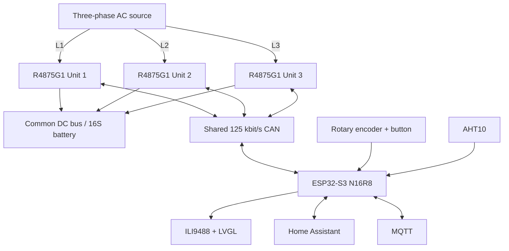

# 3-Phase Huawei R4875G1 Battery Charger Controller

ESPHome controller for **three Huawei R4875G1 rectifiers** operated as a coordinated three-phase battery charger with a common parallel DC output.

**Current firmware: 4.0.4**

Version 4 keeps the validated charger, CAN-recovery, thermal-protection and local-blackstart model from v3 and introduces a new **LVGL-based local TFT interface**. The default UI is a 320×480 portrait dashboard rendered on the ILI9488 through a 16-bit RGB565 full framebuffer.

For detailed runtime behavior, see `R4875G1_CONTROL_FLOWS.md`. Package ownership and maintenance rules are documented in `packages/README.md`.

> [!WARNING]
> This project controls mains-powered equipment and a high-current DC battery bus. Firmware is not a substitute for correctly engineered fuses, breakers, disconnects, BMS protection, earthing, isolation and conductor sizing.

## Project purpose

The intended installation uses one R4875G1 on each AC phase, all three DC outputs on one common battery/DC bus, identical DC voltage, a common per-unit current command and a nominal three-unit charging-power target. Core charger operation is local: Home Assistant, MQTT and Wi-Fi are useful interfaces but are not required for CAN control, the TFT/encoder or blackstart.

## System overview



CAN uses 29-bit extended identifiers.

# Key features

## Charger control

- Three R4875G1 rectifiers controlled by one ESP32-S3.
- Common active DC voltage/current setpoints.
- Active setpoints routed only to verified `ONLINE` + CAN-fresh units.
- Individual and broadcast ON/OFF controls.
- Nominal three-unit power target with automatic current calculation.
- 50 A fail-safe capability ceiling until every reachable rectifier has fresh capability data.
- Effective current ceiling uses the lowest known reachable capability, capped at 75 A.
- Shared current command scaling uses the highest reachable capability once all reachable capabilities are known.
- Periodic active-setpoint refresh only to eligible online units.

## CAN reliability

- Independent 3-second raw CAN watchdog per rectifier.
- Explicit lifecycle: `OFFLINE`, `DISCOVERING`, `ONLINE`.
- Fast telemetry/fan polling only for `ONLINE` units.
- Slow round-robin probing for `OFFLINE` units.
- TWAI Single-Shot restricted to slow OFFLINE reconnect probes.
- Serialized property/capability/address discovery.
- 64-frame TWAI RX queue for the multi-frame property response.
- Targeted active-setpoint restore before a rediscovered unit returns to `ONLINE`.
- TWAI BUS_OFF recovery as a final controller-level recovery mechanism.

## Local blackstart

- Works without Home Assistant, MQTT or Wi-Fi.
- Encoder edits DC voltage and nominal three-unit DC power.
- Short press selects the edit target.
- Long press (≥3 s) performs START/STOP.
- STOP has priority and is unrestricted.
- START is issued only to units that are `ONLINE`, CAN-fresh, explicitly `OFF`, below the temperature trip threshold and not locked out.

## Thermal protection

Shared applied current is:

```text
min(requested current, effective hardware capability, thermal limit)
```

Thermal states use 70/80/90 °C thresholds with hysteresis. Warning stages reduce the shared current ceiling to 50 A and 30 A. At ≥90 °C the affected unit is switched off and locked out until a fresh temperature below 80 °C is received. Derating never overwrites the user's requested current.

# Firmware architecture

The modular charger architecture introduced in v3 remains the control foundation in v4. Version 4 adds a deliberately separated display stack:

```text
r4875g1-3phase-charger.yaml
packages/
├── core.yaml
├── hardware.yaml
├── display.yaml
├── display/
│   ├── hardware.yaml
│   ├── theme.yaml
│   └── ui.yaml
├── cooling.yaml
├── controls.yaml
├── rectifier-shared.yaml
├── rectifier-unit.yaml
└── rectifier-can/
    ├── property-start.yaml
    ├── property-end.yaml
    ├── cyclic-telemetry.yaml
    ├── fan-telemetry.yaml
    ├── address-data.yaml
    └── power-state.yaml
```

`r4875g1-3phase-charger.yaml` owns project-wide substitutions, package assembly, the three unit instances, boot behavior, encoder input and aggregate entities. `rectifier-unit.yaml` is instantiated three times. `rectifier-shared.yaml` owns cross-unit lifecycle/discovery/current/thermal logic and the single physical CAN controller.

# Versioning

The firmware version has one source of truth in `packages/version.yaml`:

```yaml
substitutions:
  firmware_version: "4.0.4"
```

`esphome.project.version` and the TFT header both consume `${firmware_version}`. The project uses `MAJOR.MINOR.PATCH`; every repository commit increments PATCH by one.

# Hardware

## Main controller

- Espressif ESP32-S3-DevKitC-1
- ESP32-S3-WROOM-1-N16R8
- 16 MB Quad-SPI flash
- 8 MB Octal-SPI PSRAM
- ESP-IDF framework
- ESPHome minimum version: 2026.7.4

## GPIO map

| Function | GPIO |
|---|---:|
| Encoder button | 2 |
| TFT backlight | 4 |
| TFT CS / RESET / DC | 5 / 6 / 7 |
| I²C SDA / SCL | 8 / 9 |
| SPI MOSI / MISO / CLK | 11 / 12 / 13 |
| CAN TX / RX | 15 / 16 |
| Encoder A / B | 17 / 18 |
| External fan enable | 21 |
| Fan tach 3 / 2 / 1 | 39 / 40 / 41 |
| Fan PWM | 42 |

The current allocation avoids ESP32-S3 strapping pins, native USB/JTAG GPIO19/20 and the N16R8 Octal-memory GPIOs.

## CAN interface

- SN65HVD230 3.3 V transceiver
- 125 kbit/s
- 29-bit extended identifiers
- proper twisted-pair wiring and termination required

## ILI9488 display — v4

The physical panel is 480×320 over SPI. The proven panel transform is retained and LVGL supplies the UI layer.

Current v4 configuration:

- ESPHome `mipi_spi`, model ILI9488;
- 40 MHz SPI display data rate;
- 16-bit RGB565 color depth;
- LVGL full framebuffer (`buffer_size: 100%`) in PSRAM;
- default `display_rotation: 90`, yielding a 320×480 portrait dashboard;
- rotation `0` available for landscape;
- Roboto 14/18/26 px fonts;
- explicit scrollbar disabling on page/cards;
- 500 ms dynamic UI update;
- 5-minute backlight inactivity timeout.

The portrait dashboard contains:

- header with charger title, date/time, firmware version and overall ON/OFF state;
- AC input and DC output summary cards;
- three rectifier status rows;
- local voltage/power/current setpoints;
- temperature and conversion efficiency;
- IP/Wi-Fi diagnostics;
- encoder START/STOP reminder.

The display layer reads existing charger entities and does not duplicate CAN or control behavior.

## AHT10 compartment sensor

The shared rear rectifier compartment uses an AHT10 at I²C address `0x38` for temperature and humidity.

## External cooling fans

External/chassis fans are independent from the R4875G1 internal fans. GPIO21 enables the common fan supply, GPIO42 provides shared 25 kHz PWM, and GPIO41/40/39 read fan 1/2/3 tachometer signals. Tach conversion assumes two pulses/revolution. Automatic temperature curves and fan-failure alarms are not implemented yet.

# Electrical / power-control model

All three rectifier outputs share the DC bus. The local nominal power selector uses:

```text
I_each = P_target / (3 × V_DC)
```

The divisor remains fixed at three even when fewer rectifiers are active. This intentionally avoids increasing current on remaining units when another unit disappears.

Capability handling is CAN-aware:

```text
startup/no reachable units               -> 50 A
reachable capability missing             -> 50 A
all reachable capabilities known         -> lowest reachable capability, max 75 A
command scaling when complete             -> 1024 / highest reachable capability
```

A disconnected unit is immediately removed from these calculations. A reconnecting unit returns the shared limit to the 50 A fail-safe until its capability is rediscovered.

# Rectifier lifecycle and reconnect

Every unit starts `OFFLINE`. A valid heartbeat triggers `DISCOVERING`; after 5 seconds the serialized discovery worker reads static properties, maximum-current capability and address information. Verification is followed by targeted active voltage/current restore. Only then is the unit promoted to `ONLINE`.

A continuously offline rectifier is probed approximately every 15 seconds. The physical CAN disconnect/reconnect test from 2026-08-27 remains the validated runtime baseline: reconnect completed without ESP reboot, included a 56-frame property response and successfully restored the unit to `ONLINE`.

# Current capability and scaling

Maximum current is decoded from capability data in 0.5 A steps. The tested reduced-current connector configuration reported 52 A.

The current v4 shared scaling logic is not permanently tied to Unit 1. When all currently reachable capabilities are known, scaling uses the **highest reachable capability**, while the effective engineering-current ceiling uses the **lowest reachable capability**. If capability knowledge is incomplete, scaling falls back to `1024 / 75` and the effective ceiling remains 50 A.

`Rectifier Capability Mismatch` considers currently reachable units and becomes unknown when insufficient/fresh capability data is unavailable. It is diagnostic rather than a direct charging inhibit.

# Telemetry

Per-unit telemetry includes AC/DC voltage, current and power, grid frequency, input/output temperature, operating hours, internal fan data, power state, maximum-current capability, address information and static identification properties.

CAN-aware aggregate entities include combined AC/DC power, combined DC current, average DC voltage, highest output temperature, conversion efficiency and available-unit count. Stale/unreachable measurements are excluded instead of being treated as valid zero values.

# Installation

Place the root YAML and the complete `packages/` tree in the same ESPHome configuration directory and provide the required secrets. Do not commit real credentials.

Validate with:

```bash
esphome config r4875g1-3phase-charger.yaml
esphome compile r4875g1-3phase-charger.yaml
```

For commissioning, verify CAN polarity/termination, transceiver supply, 125 kbit/s bitrate, telemetry from expected units, discovered capability, effective current limit, safe voltage/current targets and independent hardware protection before enabling high-power charging.

# Deploying to Home Assistant from Windows

The repository contains:

```text
scripts/setup-ha-ssh.ps1
scripts/deploy-ha.ps1
```

The deployment script derives the destination YAML filename from `esphome.name`, stages and hashes managed source files, backs up existing managed files and verifies installed hashes. It does not delete unrelated Home Assistant files. Use `-DryRun` to preview and `-NoBackup` only when intentionally disabling backups.

The deployment stops after copying/verifying source files; ESPHome validation/installation remains an explicit step.

# Known limitations

- Optimized for three R4875G1 units.
- Nominal total-power calculation always divides by three.
- Capability mismatch is diagnostic and does not automatically disable charging.
- Mixed rectifier models/scaling behavior are not a primary supported configuration.
- Blackstart still requires power for ESP32/CAN electronics.
- SNTP date/time requires network synchronization after a cold start.
- External fan control has no automatic thermal curve or RPM-failure alarm yet.
- Software does not replace hardware protection.

# Credits and license

The repository is distributed under the MIT License and builds on the Huawei R48xx CAN research published by `mjpalmowski` in the `CAN-BUS-control-R4875G1-with-ESPHome-and-MQTT` project.

Copyright (c) 2024 mjpalmowski  
Additional project development: Copyright (c) 2026 Andreas Wansner

# Documentation status

This README, `R4875G1_CONTROL_FLOWS.md` and `packages/README.md` describe firmware **4.0.4** on `main` and were resynchronized on **2026-08-29** after physical verification of the v4 LVGL TFT interface. Historical v2.2.2 CAN traces remain cited where they are the validated evidence for unchanged CAN behavior.
